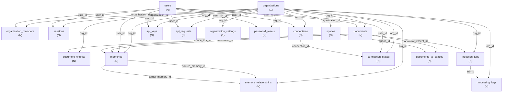

# Data Model Reference - Supermemory

**Purpose:** Única fonte de verdade para arquitetura de dados
**Last Updated:** 2025-10-25
**Version:** 1.0

---

## 📋 Table of Contents

1. [Core Tables](#core-tables)
2. [Data Relationships](#data-relationships)
3. [Column Specifications](#column-specifications)
4. [Enums & Constants](#enums--constants)
5. [Validation Rules](#validation-rules)
6. [Multi-Tenancy Design](#multi-tenancy-design)
7. [Query Patterns](#query-patterns)
8. [Code Generation Rules](#code-generation-rules)

---

## Core Tables

### 1. **organizations**
Purpose: Multi-tenant container for all data
RLS: ✅ ENABLED

| Column | Type | Nullable | Default | Notes |
|--------|------|----------|---------|-------|
| id | uuid | ❌ | gen_random_uuid() | Primary Key |
| slug | text | ❌ | - | Unique identifier for org |
| name | text | ❌ | - | Display name |
| metadata | jsonb | ❌ | {} | Custom data storage |
| created_at | timestamptz | ❌ | now() | Creation timestamp |

**Invariants:**
- slug must be unique and URL-safe
- slug cannot be changed after creation
- Every record in the system has organization_id OR org_id FK

---

### 2. **users**
Purpose: User accounts across organizations
RLS: ✅ ENABLED

| Column | Type | Nullable | Default | Notes |
|--------|------|----------|---------|-------|
| id | uuid | ❌ | gen_random_uuid() | Primary Key |
| email | text | ❌ | - | Unique, for login |
| hashed_password | text | ✅ | NULL | Scrypt hash, 64-byte |
| name | text | ✅ | NULL | Display name |
| image_url | text | ✅ | NULL | Avatar/profile image |
| metadata | jsonb | ❌ | {} | Custom user data |
| created_at | timestamptz | ❌ | now() | Account creation |
| updated_at | timestamptz | ❌ | now() | Last modification |

**Invariants:**
- email must be unique
- email must be valid email format
- hashed_password must use scrypt (64-byte derived key)
- Users can belong to multiple organizations (via organization_members)

---

### 3. **organization_members**
Purpose: User-to-organization mapping
RLS: ✅ ENABLED

| Column | Type | Nullable | Default | Notes |
|--------|------|----------|---------|-------|
| id | uuid | ❌ | gen_random_uuid() | Primary Key |
| organization_id | uuid | ❌ | - | FK → organizations.id |
| user_id | uuid | ❌ | - | FK → users.id |
| role | text | ❌ | 'member' | owner, admin, member |
| is_owner | boolean | ❌ | false | Quick flag for owner check |
| created_at | timestamptz | ❌ | now() | Joined organization at |

**Invariants:**
- One user can have only ONE role per organization
- At least one owner per organization (enforce in app)
- is_owner = true ⟺ role = 'owner'
- Composite unique index: (organization_id, user_id)

---

### 4. **sessions**
Purpose: User session tracking for authentication
RLS: ✅ ENABLED

| Column | Type | Nullable | Default | Notes |
|--------|------|----------|---------|-------|
| id | uuid | ❌ | gen_random_uuid() | Primary Key |
| user_id | uuid | ❌ | - | FK → users.id |
| organization_id | uuid | ✅ | NULL | FK → organizations.id |
| session_token | text | ❌ | - | HTTP-only cookie value |
| expires_at | timestamptz | ❌ | - | 7-day expiry |
| created_at | timestamptz | ❌ | now() | Session start |

**Invariants:**
- session_token must be unique
- session_token must be cryptographically random
- session_token length = 32+ bytes
- Expired sessions should be cleaned up (TTL job)
- Every request must validate session in middleware

---

### 5. **spaces**
Purpose: Projects/workspaces for organizing documents
RLS: ❌ DISABLED (app-layer filtering)

| Column | Type | Nullable | Default | Notes |
|--------|------|----------|---------|-------|
| id | uuid | ❌ | gen_random_uuid() | Primary Key |
| organization_id | uuid | ❌ | - | FK → organizations.id |
| container_tag | text | ❌ | - | Unique slug for space |
| name | text | ✅ | NULL | Display name |
| description | text | ✅ | NULL | Space description |
| visibility | text | ❌ | 'private' | private, shared, public |
| is_experimental | boolean | ❌ | false | Feature flag |
| metadata | jsonb | ❌ | {} | Custom space metadata |
| content_text_index | jsonb | ❌ | {} | Full-text search index |
| index_size | numeric | ✅ | NULL | Size of stored index |
| created_at | timestamptz | ❌ | now() | Creation time |
| updated_at | timestamptz | ❌ | now() | Last update |

**Invariants:**
- container_tag must be unique per organization
- visibility ∈ {private, shared, public}
- container_tag must be URL-safe
- Documents associated via documents_to_spaces junction

---

### 6. **documents**
Purpose: Core content storage (notes, links, files)
RLS: ❌ DISABLED (app-layer filtering)

| Column | Type | Nullable | Default | Notes |
|--------|------|----------|---------|-------|
| id | uuid | ❌ | gen_random_uuid() | Primary Key |
| org_id | uuid | ❌ | - | FK → organizations.id |
| user_id | uuid | ❌ | - | FK → users.id |
| connection_id | uuid | ✅ | NULL | FK → connections.id |
| custom_id | text | ✅ | NULL | External reference ID |
| content_hash | text | ✅ | NULL | SHA256 of content |
| title | text | ✅ | NULL | Document title |
| content | text | ✅ | NULL | Raw content |
| summary | text | ✅ | NULL | AI-generated summary |
| url | text | ✅ | NULL | Source URL if applicable |
| source | text | ✅ | NULL | Source type (web, file, etc) |
| type | text | ❌ | 'text' | text, link, file, email |
| status | text | ❌ | 'unknown' | See DocumentStatus enum |
| metadata | jsonb | ✅ | NULL | Document-specific data |
| processing_metadata | jsonb | ✅ | NULL | Processing pipeline data |
| raw | jsonb | ✅ | NULL | Raw extraction output |
| og_image | text | ✅ | NULL | Open Graph image URL |
| token_count | integer | ✅ | NULL | LLM token count |
| word_count | integer | ✅ | NULL | Word count |
| chunk_count | integer | ❌ | 0 | Number of chunks created |
| average_chunk_size | integer | ✅ | NULL | Average chunk size |
| summary_embedding | vector | ✅ | NULL | Summary embedding (1536d) |
| summary_embedding_model | text | ✅ | NULL | Embedding model used |
| summary_embedding_new | vector | ✅ | NULL | New embedding (migration) |
| summary_embedding_model_new | text | ✅ | NULL | New embedding model |
| created_at | timestamptz | ❌ | now() | Creation time |
| updated_at | timestamptz | ❌ | now() | Last update |
| search_vector | tsvector | ✅ | NULL | PostgreSQL FTS vector |

**Invariants:**
- org_id is REQUIRED (enforces org isolation)
- status ∈ {unknown, queued, extracting, chunking, embedding, indexing, done, failed}
- type ∈ {text, link, file, email}
- content_hash prevents duplicate processing
- created_at ≤ updated_at
- Exactly one document with given content_hash per org

---

### 7. **documents_to_spaces**
Purpose: Many-to-many junction: documents ↔ spaces
RLS: ❌ DISABLED (app-layer filtering)

| Column | Type | Nullable | Default | Notes |
|--------|------|----------|---------|-------|
| document_id | uuid | ❌ | - | FK → documents.id |
| space_id | uuid | ❌ | - | FK → spaces.id |

**Invariants:**
- Primary key: (document_id, space_id)
- Both documents and spaces must exist
- Both must be in same organization (enforce in app)
- One document can be in multiple spaces
- One space can have multiple documents

---

### 8. **document_chunks**
Purpose: Tokenized segments of documents for embedding
RLS: ❌ DISABLED (app-layer filtering)

| Column | Type | Nullable | Default | Notes |
|--------|------|----------|---------|-------|
| id | uuid | ❌ | gen_random_uuid() | Primary Key |
| document_id | uuid | ❌ | - | FK → documents.id |
| org_id | uuid | ❌ | - | FK → organizations.id |
| content | text | ❌ | - | Chunk text content |
| embedded_content | text | ✅ | NULL | Content sent to embedding API |
| type | text | ❌ | 'text' | text, heading, code, table |
| position | integer | ✅ | NULL | Order within document |
| metadata | jsonb | ✅ | NULL | Chunk-specific data |
| embedding | vector | ✅ | NULL | Embedding vector (1536d) |
| embedding_model | text | ✅ | NULL | Model used for embedding |
| embedding_new | vector | ✅ | NULL | New embedding (migration) |
| embedding_new_model | text | ✅ | NULL | New embedding model |
| created_at | timestamptz | ❌ | now() | Creation time |
| fts | tsvector | ✅ | NULL | PostgreSQL FTS vector |

**Invariants:**
- org_id must match document.org_id
- position must be sequential (0-indexed)
- embedding dimension = 1536 (Gemini default)
- One chunk per logical segment of document

---

### 9. **memories**
Purpose: Semantic memory/long-term storage of knowledge
RLS: ❌ DISABLED (app-layer filtering)

| Column | Type | Nullable | Default | Notes |
|--------|------|----------|---------|-------|
| id | uuid | ❌ | gen_random_uuid() | Primary Key |
| document_id | uuid | ✅ | NULL | FK → documents.id |
| space_id | uuid | ✅ | NULL | FK → spaces.id |
| org_id | uuid | ❌ | - | FK → organizations.id |
| user_id | uuid | ✅ | NULL | FK → users.id |
| content | text | ❌ | - | Memory content |
| metadata | jsonb | ✅ | NULL | Memory-specific metadata |
| memory_embedding | vector | ✅ | NULL | Embedding (1536d) |
| memory_embedding_model | text | ✅ | NULL | Embedding model |
| memory_embedding_new | vector | ✅ | NULL | New embedding (migration) |
| memory_embedding_new_model | text | ✅ | NULL | New model |
| is_latest | boolean | ❌ | true | Is current version |
| version | integer | ❌ | 1 | Version number |
| is_inference | boolean | ❌ | false | AI-generated? |
| is_forgotten | boolean | ❌ | false | Marked as forgotten |
| forget_after | timestamptz | ✅ | NULL | Auto-forget date |
| forget_reason | text | ✅ | NULL | Why forgotten |
| source_count | integer | ❌ | 1 | Number of sources |
| created_at | timestamptz | ❌ | now() | Creation time |
| updated_at | timestamptz | ❌ | now() | Last update |

**Invariants:**
- org_id is REQUIRED
- At most one memory per document with is_latest = true
- version starts at 1, increments on update
- is_forgotten = true → forget_reason must be set
- forget_after in future → scheduled deletion

---

### 10. **memory_relationships**
Purpose: Graph edges between memories (semantic links)
RLS: ✅ ENABLED

| Column | Type | Nullable | Default | Notes |
|--------|------|----------|---------|-------|
| id | uuid | ❌ | gen_random_uuid() | Primary Key |
| org_id | uuid | ❌ | - | FK → organizations.id |
| source_memory_id | uuid | ❌ | - | FK → memories.id |
| target_memory_id | uuid | ❌ | - | FK → memories.id |
| relationship_type | text | ❌ | - | related, references, contradicts |
| metadata | jsonb | ✅ | NULL | Relationship metadata |
| created_at | timestamptz | ❌ | now() | Creation time |

**Invariants:**
- org_id must match both memories' org_id
- source_memory_id ≠ target_memory_id
- relationship_type ∈ {related, references, contradicts, similar, extends}
- Creates directed graph structure
- Multiple edges between same pair allowed (different types)

---

### 11. **api_keys**
Purpose: API authentication for external access
RLS: ✅ ENABLED

| Column | Type | Nullable | Default | Notes |
|--------|------|----------|---------|-------|
| id | uuid | ❌ | gen_random_uuid() | Primary Key |
| org_id | uuid | ❌ | - | FK → organizations.id |
| user_id | uuid | ✅ | NULL | FK → users.id |
| name | text | ❌ | - | Display name |
| prefix | text | ✅ | NULL | First 4 chars of key |
| secret_hash | text | ❌ | - | Scrypt hash of secret |
| token_hint | text | ❌ | - | Last 4 chars of key |
| metadata | jsonb | ❌ | {} | Key metadata |
| last_used_at | timestamptz | ✅ | NULL | Last usage time |
| expires_at | timestamptz | ✅ | NULL | Expiration date |
| revoked_at | timestamptz | ✅ | NULL | Revocation timestamp |
| created_at | timestamptz | ❌ | now() | Creation time |
| updated_at | timestamptz | ❌ | now() | Last update |

**Invariants:**
- secret_hash is Scrypt (never store plaintext)
- prefix + token_hint format: SM_xxx...yyy
- revoked_at set = key is invalid
- expires_at past = key is expired
- One API key per name per organization

---

### 12. **connections**
Purpose: OAuth integrations (Google Drive, Notion, etc)
RLS: ✅ ENABLED

| Column | Type | Nullable | Default | Notes |
|--------|------|----------|---------|-------|
| id | uuid | ❌ | gen_random_uuid() | Primary Key |
| org_id | uuid | ❌ | - | FK → organizations.id |
| user_id | uuid | ✅ | NULL | FK → users.id |
| provider | text | ❌ | - | google_drive, notion, onedrive |
| email | text | ✅ | NULL | Connected email |
| document_limit | integer | ❌ | 10000 | Max docs to sync |
| container_tags | text[] | ✅ | NULL | Target spaces |
| access_token | text | ✅ | NULL | OAuth access token |
| refresh_token | text | ✅ | NULL | OAuth refresh token |
| expires_at | timestamptz | ✅ | NULL | Token expiration |
| metadata | jsonb | ✅ | NULL | Provider-specific data |
| created_at | timestamptz | ❌ | now() | Creation time |

**Invariants:**
- provider ∈ {google_drive, notion, onedrive}
- access_token must be encrypted at rest
- refresh_token must be encrypted at rest
- expires_at must be in future (sync checks this)

---

### 13. **organization_settings**
Purpose: Organization-level configuration
RLS: ✅ ENABLED

| Column | Type | Nullable | Default | Notes |
|--------|------|----------|---------|-------|
| id | uuid | ❌ | gen_random_uuid() | Primary Key |
| org_id | uuid | ❌ | - | FK → organizations.id (unique) |
| should_llm_filter | boolean | ❌ | false | Enable content filtering |
| filter_prompt | text | ✅ | NULL | Custom filter instructions |
| include_items | text[] | ✅ | NULL | Items to include |
| exclude_items | text[] | ✅ | NULL | Items to exclude |
| google_drive_custom_key_enabled | boolean | ❌ | false | Use org's OAuth keys |
| google_drive_client_id | text | ✅ | NULL | Custom client ID |
| google_drive_client_secret | text | ✅ | NULL | Custom client secret |
| notion_custom_key_enabled | boolean | ❌ | false | Use org's OAuth keys |
| notion_client_id | text | ✅ | NULL | Custom client ID |
| notion_client_secret | text | ✅ | NULL | Custom client secret |
| onedrive_custom_key_enabled | boolean | ❌ | false | Use org's OAuth keys |
| onedrive_client_id | text | ✅ | NULL | Custom client ID |
| onedrive_client_secret | text | ✅ | NULL | Custom client secret |
| updated_at | timestamptz | ❌ | now() | Last configuration change |

**Invariants:**
- One settings record per organization
- If custom key enabled → client_id and client_secret required
- Secrets must be encrypted at rest

---

### 14. **ingestion_jobs**
Purpose: Document processing pipeline jobs
RLS: ✅ ENABLED

| Column | Type | Nullable | Default | Notes |
|--------|------|----------|---------|-------|
| id | uuid | ❌ | gen_random_uuid() | Primary Key |
| document_id | uuid | ❌ | - | FK → documents.id |
| org_id | uuid | ❌ | - | FK → organizations.id |
| status | text | ❌ | 'queued' | queued, running, done, failed |
| attempts | integer | ❌ | 0 | Retry count |
| payload | jsonb | ✅ | NULL | Job input data |
| error_message | text | ✅ | NULL | Failure reason |
| created_at | timestamptz | ❌ | now() | Job creation |
| updated_at | timestamptz | ❌ | now() | Last status change |

**Invariants:**
- status ∈ {queued, running, done, failed}
- attempts < 5 (max retries)
- status = done ⟺ error_message is NULL
- status = failed ⟹ error_message is NOT NULL
- Exactly one job per document

---

### 15. **processing_logs**
Purpose: Audit trail for document processing
RLS: ✅ ENABLED

| Column | Type | Nullable | Default | Notes |
|--------|------|----------|---------|-------|
| id | uuid | ❌ | gen_random_uuid() | Primary Key |
| job_id | uuid | ❌ | - | FK → ingestion_jobs.id |
| stage | text | ❌ | - | extracting, chunking, embedding |
| status | text | ❌ | - | running, success, error |
| message | text | ✅ | NULL | Log message |
| metadata | jsonb | ✅ | NULL | Stage-specific data |
| created_at | timestamptz | ❌ | now() | Log timestamp |
| org_id | uuid | ❌ | - | FK → organizations.id |

**Invariants:**
- org_id must match job's org_id
- stage ∈ {extracting, chunking, embedding, summarizing}
- status ∈ {running, success, error}
- Immutable (never updated, only inserted)

---

### 16. **connection_states**
Purpose: OAuth state tracking during connection setup
RLS: ✅ ENABLED

| Column | Type | Nullable | Default | Notes |
|--------|------|----------|---------|-------|
| id | uuid | ❌ | gen_random_uuid() | Primary Key |
| state_token | text | ❌ | - | OAuth state parameter (unique) |
| provider | text | ❌ | - | google_drive, notion, onedrive |
| org_id | uuid | ❌ | - | FK → organizations.id |
| user_id | uuid | ❌ | - | FK → users.id |
| connection_id | uuid | ✅ | NULL | FK → connections.id |
| document_limit | integer | ✅ | NULL | Document sync limit |
| redirect_url | text | ✅ | NULL | Return URL |
| metadata | jsonb | ✅ | NULL | Additional data |
| container_tags | text[] | ✅ | NULL | Target spaces |
| expires_at | timestamptz | ❌ | - | State expiration (5 min) |
| created_at | timestamptz | ❌ | now() | Creation time |

**Invariants:**
- state_token must be unique and cryptographically random
- expires_at = created_at + 5 minutes
- Cleaned up after OAuth callback
- one state per provider per user

---

### 17. **api_requests**
Purpose: API call auditing and cost tracking
RLS: ✅ ENABLED

| Column | Type | Nullable | Default | Notes |
|--------|------|----------|---------|-------|
| id | uuid | ❌ | gen_random_uuid() | Primary Key |
| org_id | uuid | ❌ | - | FK → organizations.id |
| user_id | uuid | ✅ | NULL | FK → users.id |
| key_id | uuid | ✅ | NULL | FK → api_keys.id |
| request_type | text | ❌ | - | search, chat, ingest, etc |
| status_code | integer | ❌ | - | HTTP status |
| duration_ms | integer | ✅ | NULL | Response time |
| input | jsonb | ✅ | NULL | Request payload |
| output | jsonb | ✅ | NULL | Response data |
| original_tokens | integer | ✅ | NULL | Input token count |
| final_tokens | integer | ✅ | NULL | Total tokens used |
| tokens_saved | integer | ✅ | NULL | Cached tokens saved |
| cost_saved_usd | numeric | ✅ | NULL | Cost reduction |
| model | text | ✅ | NULL | LLM model used |
| provider | text | ✅ | NULL | google, xai, openai |
| conversation_id | text | ✅ | NULL | Chat session ID |
| context_modified | boolean | ❌ | false | Context was rewritten |
| metadata | jsonb | ✅ | NULL | Additional data |
| origin | text | ❌ | 'api' | api, web, extension |
| created_at | timestamptz | ❌ | now() | Request time |

**Invariants:**
- org_id is REQUIRED
- request_type ∈ {search, chat, ingest, embed, summarize}
- status_code in [200, 201, 400, 401, 403, 404, 500, 503]
- Immutable (never updated, only inserted)

---

### 18. **password_resets**
Purpose: Password reset token management
RLS: ✅ ENABLED

| Column | Type | Nullable | Default | Notes |
|--------|------|----------|---------|-------|
| id | uuid | ❌ | gen_random_uuid() | Primary Key |
| org_id | uuid | ✅ | NULL | FK → organizations.id |
| user_id | uuid | ❌ | - | FK → users.id |
| token_hash | text | ❌ | - | Scrypt hash (unique) |
| requested_from | inet | ✅ | NULL | IP address |
| expires_at | timestamptz | ❌ | - | 24-hour expiration |
| used_at | timestamptz | ✅ | NULL | When reset was used |
| created_at | timestamptz | ❌ | now() | Request creation |

**Invariants:**
- token_hash must be unique
- expires_at = created_at + 24 hours
- used_at is set when token is used
- Once used_at is set, token is invalid
- One active reset per user

---

## Data Relationships



---

## Column Specifications

### Data Types

| Type | Range | Notes |
|------|-------|-------|
| uuid | - | Always gen_random_uuid() |
| text | - | UTF-8, no length limit in schema |
| integer | -2147483648 to 2147483647 | 32-bit |
| boolean | true, false | Not null |
| timestamp with time zone | 4713 BC to 294276 AD | Always UTC |
| jsonb | - | Must be valid JSON |
| vector | 1536 dimensions | Gemini embeddings |
| tsvector | - | PostgreSQL full-text search |
| inet | - | IP address |
| numeric | - | Arbitrary precision (money, rates) |
| ARRAY (text[]) | - | text array, max 1000 items |

### Timestamps

**Rule:** All timestamp columns in UTC

```typescript
// CORRECT
created_at: new Date().toISOString()  // ISO 8601
expires_at: new Date(Date.now() + 7*24*60*60*1000).toISOString()

// WRONG
created_at: new Date()  // Local timezone
created_at: Date.now()  // Milliseconds, not ISO string
```

### Organization Isolation

**Rule:** Every record MUST have organization context

```typescript
// CORRECT - document with org_id
INSERT INTO documents (id, org_id, user_id, title, content)
VALUES (gen_random_uuid(), $1, $2, $3, $4)

// WRONG - document without org_id
INSERT INTO documents (id, user_id, title, content)
VALUES (gen_random_uuid(), $1, $2, $3)
// RLS blocks this: org_id IS NOT NULL violation
```

---

## Enums & Constants

### DocumentStatus

```typescript
export enum DocumentStatus {
  Unknown = "unknown",      // Initial state
  Queued = "queued",        // In processing queue
  Extracting = "extracting", // Extracting content
  Chunking = "chunking",    // Splitting into chunks
  Embedding = "embedding",  // Generating embeddings
  Indexing = "indexing",    // Storing in database
  Done = "done",            // Successfully processed
  Failed = "failed",        // Processing failed
}
```

### DocumentType

```typescript
export enum DocumentType {
  Text = "text",            // Plain text note
  Link = "link",            // Web link/URL
  File = "file",            // Uploaded file (PDF, DOCX, etc)
  Email = "email",          // Email content
}
```

### ConnectionProvider

```typescript
export enum ConnectionProvider {
  GoogleDrive = "google_drive",
  Notion = "notion",
  OneDrive = "onedrive",
}
```

### OrganizationRole

```typescript
export enum OrgRole {
  Owner = "owner",          // Full access, can delete org
  Admin = "admin",          // Can manage members and settings
  Member = "member",        // Can create/edit own documents
}
```

### VisibilityLevel

```typescript
export enum Visibility {
  Private = "private",      // Only accessible to owner
  Shared = "shared",        // Shared with org members
  Public = "public",        // Publicly listed
}
```

### RelationshipType

```typescript
export enum RelationshipType {
  Related = "related",
  References = "references",
  Contradicts = "contradicts",
  Similar = "similar",
  Extends = "extends",
}
```

---

## Validation Rules

### Per-Table Rules

#### organizations
- `slug`: Match `/^[a-z0-9-]+$/`, 3-50 chars
- `name`: 1-255 chars, non-empty
- `metadata`: Valid JSON object

#### users
- `email`: Valid RFC 5322 email format
- `name`: 0-255 chars
- `image_url`: Valid URL if present
- `hashed_password`: Exactly 64 bytes, hex-encoded (Scrypt)

#### documents
- `title`: 0-1000 chars
- `content`: 0-1,000,000 chars
- `summary`: 0-5000 chars
- `url`: Valid URL if present
- `type`: Must be DocumentType enum value
- `status`: Must be DocumentStatus enum value
- `content_hash`: Exactly 64 chars (SHA256), lowercase hex
- `chunk_count`: ≥ 0
- `token_count`: ≥ 0
- `summary_embedding`: Exactly 1536 dimensions if present

#### sessions
- `session_token`: Exactly 32+ bytes, base64url-encoded
- `expires_at`: Must be in future

#### api_keys
- `secret_hash`: Exactly 64 bytes, hex-encoded (Scrypt)
- `prefix`: Exactly 4 chars if present
- `token_hint`: Exactly 4 chars

---

## Multi-Tenancy Design

### Core Principle
**Every record must belong to exactly one organization**

### Implementation

#### Hard Enforcement (Database)
- RLS policies on 13 tables enforce org_id presence
- Foreign key constraints ensure referential integrity
- INSERT/UPDATE policies require org_id IS NOT NULL

#### Soft Enforcement (Application)
- Session middleware extracts organizationId
- Every query filters by `.eq("org_id", organizationId)`
- Cannot accidentally query cross-organization data

### Query Pattern

```typescript
// MANDATORY FILTER
const query = client
  .from("documents")
  .select("*")
  .eq("org_id", organizationId)  // ← ALWAYS REQUIRED
  .eq("status", "done")

// WRONG - missing org_id filter
const query = client
  .from("documents")
  .select("*")  // ❌ No org_id filter!
  .eq("status", "done")
```

---

## Query Patterns

### SELECT Queries

```typescript
// Single record
const { data } = await client
  .from("documents")
  .select("*")
  .eq("org_id", orgId)
  .eq("id", documentId)
  .single()

// List with pagination
const { data, count } = await client
  .from("documents")
  .select("*", { count: "exact" })
  .eq("org_id", orgId)
  .eq("status", "done")
  .order("created_at", { ascending: false })
  .range(0, 49)  // Page 0, 50 per page

// Search with text
const { data } = await client
  .from("documents")
  .select("*")
  .eq("org_id", orgId)
  .ilike("title", `%${query}%`)

// Vector search
const { data } = await client
  .rpc("match_document_chunks", {
    query_embedding: embedding,
    match_threshold: 0.5,
    match_count: 10,
    org_id: orgId,
  })
```

### INSERT Queries

```typescript
// Single record - MUST include org_id
const { data } = await client
  .from("documents")
  .insert({
    id: crypto.randomUUID(),
    org_id: organizationId,  // ← REQUIRED
    user_id: userId,
    title: "My Note",
    content: "Note content",
    type: "text",
    status: "done",
  })
  .select()
  .single()

// Batch insert
const { data } = await client
  .from("document_chunks")
  .insert(chunks.map(chunk => ({
    id: crypto.randomUUID(),
    document_id: documentId,
    org_id: organizationId,  // ← REQUIRED
    content: chunk.text,
    type: "text",
    position: chunk.index,
  })))
  .select()
```

### UPDATE Queries

```typescript
// Update single field
const { data } = await client
  .from("documents")
  .update({ status: "done" })
  .eq("org_id", organizationId)
  .eq("id", documentId)
  .select()

// Update multiple fields
const { data } = await client
  .from("documents")
  .update({
    title: "Updated Title",
    summary: "New summary",
    updated_at: new Date().toISOString(),
  })
  .eq("org_id", organizationId)
  .eq("id", documentId)
  .select()
```

### DELETE Queries

```typescript
// Delete single
const { data } = await client
  .from("documents")
  .delete()
  .eq("org_id", organizationId)
  .eq("id", documentId)

// Delete multiple
const { data } = await client
  .from("documents")
  .delete()
  .eq("org_id", organizationId)
  .in("id", documentIds)
```

---

## Code Generation Rules

### When Generating Code, Always:

1. ✅ **Include org_id in every SELECT query**
   ```typescript
   .eq("org_id", organizationId)
   ```

2. ✅ **Include org_id in every INSERT**
   ```typescript
   { org_id: organizationId, ... }
   ```

3. ✅ **Filter UPDATE/DELETE by org_id**
   ```typescript
   .eq("org_id", organizationId)
   .eq("id", recordId)
   ```

4. ✅ **Use correct enum values**
   ```typescript
   status: "done",  // Not "completed" or other variant
   type: "text",   // Not "plain_text"
   ```

5. ✅ **Validate foreign keys exist**
   ```typescript
   // Before inserting document_chunk:
   const doc = await getDocument(documentId, orgId)
   if (!doc) throw new Error("Document not found")
   ```

6. ✅ **Use transaction for multi-table changes**
   ```typescript
   const { data } = await client.rpc("create_document_with_spaces", {
     org_id: organizationId,
     ...payload
   })
   ```

7. ✅ **Timestamp in ISO 8601**
   ```typescript
   created_at: new Date().toISOString()
   expires_at: new Date(Date.now() + 7*24*60*60*1000).toISOString()
   ```

8. ✅ **Handle NULL fields explicitly**
   ```typescript
   // Correct
   { title: title || null, summary: summary || null }

   // Wrong
   { title: title, summary: summary }  // Fails if undefined
   ```

### Never:

- ❌ Query without `.eq("org_id", organizationId)`
- ❌ Use hardcoded status values (use enums)
- ❌ Insert record without org_id
- ❌ Forget to validate foreign keys
- ❌ Mix JavaScript Date with ISO strings
- ❌ Assume NULL vs empty string are equivalent
- ❌ Create orphaned records (always set org_id)

---

## Summary Table

| Property | Value |
|----------|-------|
| **Total Tables** | 18 |
| **RLS Enabled** | 13 |
| **RLS Disabled** | 5 (app-layer) |
| **Total Columns** | 200+ |
| **Foreign Keys** | 40+ |
| **Enums** | 6 |
| **Organization Isolation** | ✅ Enforced |
| **Default Timestamps** | ✅ UTC |
| **Embeddings** | ✅ 1536D vectors |

---

**This is the authoritative reference for Supermemory data architecture.**
**All code generation must adhere to these specifications.**
**Questions? Check this document first.**
