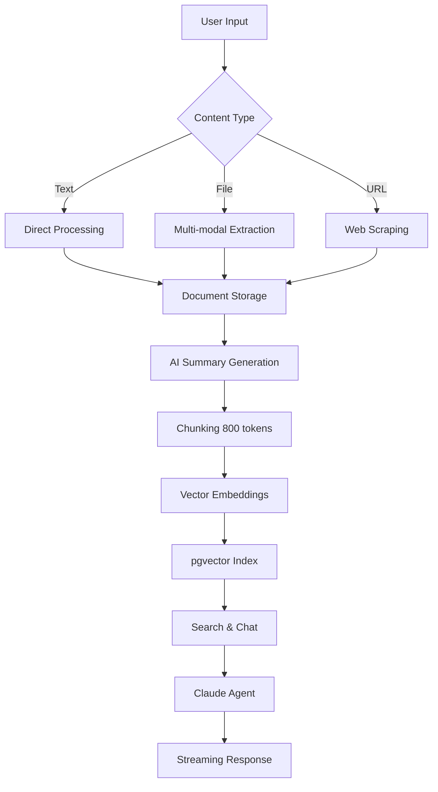

# Supermemory - AI-Powered Memory & Knowledge Management

> **Version 2.0** - A complete self-hosted AI memory layer with visual organization, advanced editing, and intelligent search.

[](https://github.com/guilhermexp/supermemory)
[](https://railway.app)
[](LICENSE)

## 🌟 What's New in v2.0

### Major Features
- ✨ **Infinity Canvas** - Visual, spatial organization of memories with drag-and-drop
- 📝 **Rich Text Editor** - Advanced markdown editor with tables, images, and inline formatting
- 🎯 **Memory Editor** - Full-featured editing with auto-save and offline support
- 🤖 **Claude Agent SDK** - Upgraded chat system with tool use and streaming
- 🔍 **Enhanced Search** - Improved hybrid search with better relevance

[View Complete Changelog →](ai_changelog/CHANGELOG.md)

---

## 🚀 Quick Start

### Prerequisites
- **Bun** ≥ 1.2.17 or **Node.js** ≥ 20
- **Supabase** account with pgvector extension
- **Google Gemini API** key (or alternative AI provider)

### Installation

```bash
# 1. Clone repository
git clone https://github.com/guilhermexp/supermemory.git
cd supermemory

# 2. Install dependencies
bun install

# 3. Configure environment
cp apps/api/.env.local.example apps/api/.env.local
cp apps/web/.env.example apps/web/.env.local

# Edit the .env files with your credentials

# 4. Start development servers
bun run dev
```

Open http://localhost:3000 and create your account.

[View Detailed Setup Guide →](docs/setup/INSTALLATION.md)

---

## 📋 Features

### Core Functionality
- ✅ **Multi-modal ingestion** - Text, PDFs, images, audio, video, code repositories
- ✅ **Vector search** - Semantic search with pgvector and embeddings
- ✅ **Hybrid search** - Combined vector + text search with reranking
- ✅ **Streaming chat** - Real-time AI responses with context awareness
- ✅ **Multi-tenant** - Organization-based data isolation
- ✅ **API authentication** - JWT-based auth + API keys

### Visual Organization
- 🎨 **Infinity Canvas** - Spatial arrangement of memory cards
- 🔗 **Drag-and-drop** - Intuitive card positioning
- 📊 **Visual clustering** - Group related memories
- 🎯 **Focus mode** - Zoom and pan controls

### Content Management
- 📝 **Rich markdown editor** - Full-featured WYSIWYG editing
- 🖼️ **Image handling** - Upload, paste, drag-and-drop
- 📊 **Tables & lists** - Complex formatting support
- 💾 **Auto-save** - Never lose your work
- 📱 **Responsive design** - Works on all devices

### AI-Powered Features
- 🤖 **Claude 3.5 Sonnet** - Advanced reasoning and tool use
- 🔧 **Custom tools** - Database search with MCP integration
- 💬 **Conversation history** - Full context preservation
- 🎯 **Smart retrieval** - Automatic context fetching

### Integrations
- 🔌 **OAuth connections** - Google Drive, Notion, OneDrive
- 🌐 **Browser extension** - Quick save from any webpage
- 📡 **GitHub sync** - Repository ingestion
- 🔄 **Webhook support** - Real-time updates

---

## 🏗️ Architecture

### Stack
- **Frontend**: Next.js 16 + React 19 + Turbopack
- **Backend**: Bun + Hono (REST API)
- **Database**: Supabase Postgres + pgvector
- **Storage**: Supabase Storage
- **AI**: Claude 3.5 Sonnet + Google Gemini
- **Search**: Vector similarity + hybrid ranking

### Data Flow



### Key Components

| Component | Location | Purpose |
|-----------|----------|---------|
| **Infinity Canvas** | `apps/web/components/canvas/` | Visual memory organization |
| **Rich Editor** | `apps/web/components/ui/rich-editor/` | Advanced content editing |
| **Memory Editor** | `apps/web/components/editor/` | Full editing experience |
| **Claude Agent** | `apps/api/src/services/claude-agent.ts` | AI chat with tools |
| **Hybrid Search** | `apps/api/src/services/hybrid-search.ts` | Search orchestration |
| **Content Extractor** | `apps/api/src/services/extractor.ts` | Multi-modal processing |

[View System Architecture →](docs/architecture/SYSTEM_ARCHITECTURE.md)

---

## 📖 Documentation

### For Users
- [Quick Start Guide](docs/setup/QUICK_START.md)
- [Feature Guides](docs/features/)
- [Deployment Guide](docs/deployment/RAILWAY.md)

### For Developers
- [API Documentation](docs/api/OVERVIEW.md)
- [Contributing Guide](docs/development/CONTRIBUTING.md)
- [Development Setup](docs/development/SETUP.md)
- [Testing Guide](docs/development/TESTING.md)

### Technical Reference
- [System Architecture](docs/architecture/SYSTEM_ARCHITECTURE.md)
- [Data Model](docs/architecture/DATA_MODEL.md)
- [Search System](docs/architecture/SEARCH_SYSTEM.md)
- [Database Migrations](docs/migrations/DATABASE.md)

---

## 🚢 Deployment

### Railway (Recommended)

This application is production-ready on Railway:

```bash
# Automatic deployment from GitHub
1. Connect Railway to your GitHub repository
2. Create two services: API + Web
3. Set environment variables
4. Deploy
```

**Environment Variables:**
```ini
# API Service
SUPABASE_URL=https://your-project.supabase.co
SUPABASE_SERVICE_ROLE_KEY=your_key
SUPABASE_ANON_KEY=your_key
AUTH_SECRET=32_character_secret
GOOGLE_API_KEY=your_gemini_key
ANTHROPIC_API_KEY=your_claude_key

# Web Service
NEXT_PUBLIC_BACKEND_URL=""  # Empty for relative URLs
NEXT_PUBLIC_APP_URL=${{RAILWAY_PUBLIC_DOMAIN}}
```

[Complete Deployment Guide →](docs/deployment/RAILWAY.md)

### Self-Hosting

Deploy on your own infrastructure:

```bash
# Build services
cd apps/api && bun install && bun run start
cd apps/web && bun install && bun run build && bun run start
```

[Self-Hosting Guide →](docs/deployment/SELF_HOSTING.md)

---

## 🛠️ Development

### Project Structure

```
supermemory/
├── apps/
│   ├── api/                    # Backend API (Bun + Hono)
│   │   ├── src/
│   │   │   ├── routes/         # API endpoints
│   │   │   ├── services/       # Business logic
│   │   │   └── middleware/     # Auth, rate limiting
│   │   └── migrations/         # Database migrations
│   │
│   ├── web/                    # Frontend (Next.js 16)
│   │   ├── app/                # App router pages
│   │   ├── components/
│   │   │   ├── canvas/         # Infinity canvas
│   │   │   ├── editor/         # Memory editor
│   │   │   ├── ui/             # UI components
│   │   │   └── views/          # Page views
│   │   └── stores/             # Zustand state management
│   │
│   ├── docs/                   # Mintlify documentation
│   └── browser-extension/      # WXT browser extension
│
├── packages/
│   ├── lib/                    # Shared utilities
│   ├── ui/                     # Shared React components
│   ├── validation/             # Zod schemas
│   └── hooks/                  # Shared React hooks
│
├── docs/                       # Technical documentation
├── ai_docs/                    # AI-generated analysis
├── ai_specs/                   # Feature specifications
└── db/                         # Database scripts
```

### Development Commands

```bash
# Start all services
bun run dev                     # API + Web
bun run dev:all                 # API + Web + Docs

# Individual services
bun run --cwd apps/api dev      # API only (port 4000)
bun run --cwd apps/web dev      # Web only (port 3000)
bun run --cwd apps/docs dev     # Docs only (port 3003)

# Build & test
bun run build                   # Build all apps
bun run check-types             # Type checking
bun run format-lint             # Format & lint
bun test                        # Run tests
```

### Contributing

We welcome contributions! Please see:
- [Contributing Guide](docs/development/CONTRIBUTING.md)
- [Code of Conduct](CODE_OF_CONDUCT.md)
- [Development Setup](docs/development/SETUP.md)

---

## 📊 Performance

### Benchmarks

| Operation | Latency | Notes |
|-----------|---------|-------|
| Document ingestion | 2-5s | Includes embedding generation |
| Vector search | 50-200ms | With pgvector IVFFlat index |
| Hybrid search | 200-500ms | Including reranking |
| Chat response (first token) | 500ms-1s | Streaming starts immediately |
| Canvas render | <100ms | 100+ cards with smooth pan/zoom |

### Scale

- **Documents**: Tested with 10,000+ documents
- **Embeddings**: 1536-dimensional vectors
- **Index type**: IVFFlat (pgvector)
- **Concurrent users**: Scales horizontally on Railway

---

## 🔐 Security

- ✅ **Row-level security** (RLS) on all Supabase tables
- ✅ **Session-based auth** with secure cookies
- ✅ **API key rotation** supported
- ✅ **CORS protection** with allowed origins
- ✅ **Rate limiting** per user/IP
- ✅ **Input validation** with Zod schemas

---

## 🗺️ Roadmap

### v2.1 (Q1 2026)
- [ ] Real-time collaboration on canvas
- [ ] Mobile native apps (iOS/Android)
- [ ] Advanced graph visualization
- [ ] Custom AI model support

### v2.2 (Q2 2026)
- [ ] Voice input and search
- [ ] OCR improvements
- [ ] Workflow automation
- [ ] Team workspaces

[View Full Roadmap →](docs/ROADMAP.md)

---

## 💬 Support

- **Documentation**: [docs/](docs/)
- **Issues**: [GitHub Issues](https://github.com/guilhermexp/supermemory/issues)
- **Discussions**: [GitHub Discussions](https://github.com/guilhermexp/supermemory/discussions)

---

## 📜 License

This project is licensed under the MIT License - see [LICENSE](LICENSE) file for details.

---

## 🙏 Acknowledgments

Built with:
- [Anthropic Claude](https://www.anthropic.com/) - AI chat and reasoning
- [Google Gemini](https://ai.google.dev/) - Embeddings and vision
- [Supabase](https://supabase.com/) - Database and storage
- [Railway](https://railway.app/) - Deployment platform
- [Next.js](https://nextjs.org/) - React framework
- [Bun](https://bun.sh/) - JavaScript runtime

---

**Maintainer**: [@guilhermexp](https://github.com/guilhermexp)
**Repository**: https://github.com/guilhermexp/supermemory
**Version**: 2.0.0 (claudenewagent branch)
