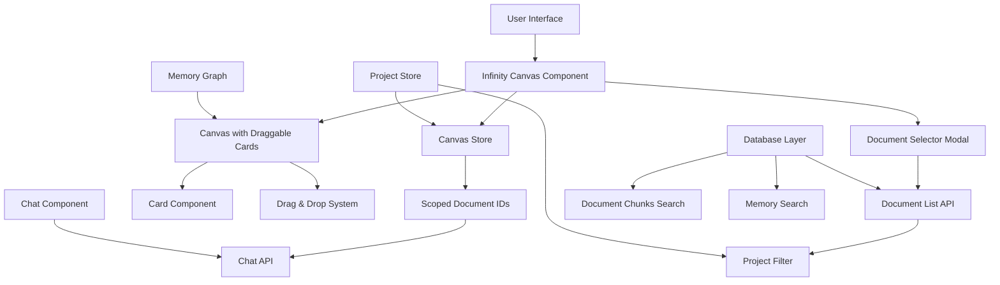
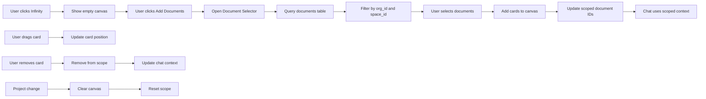
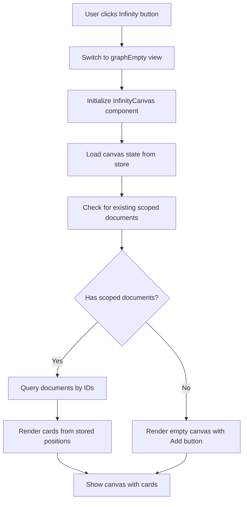
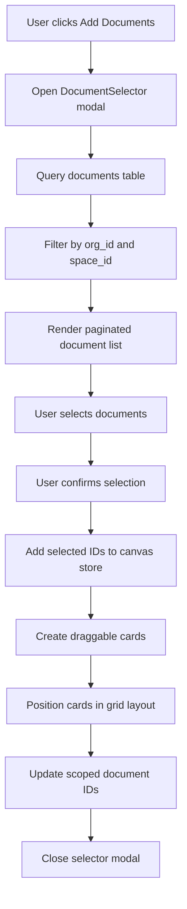
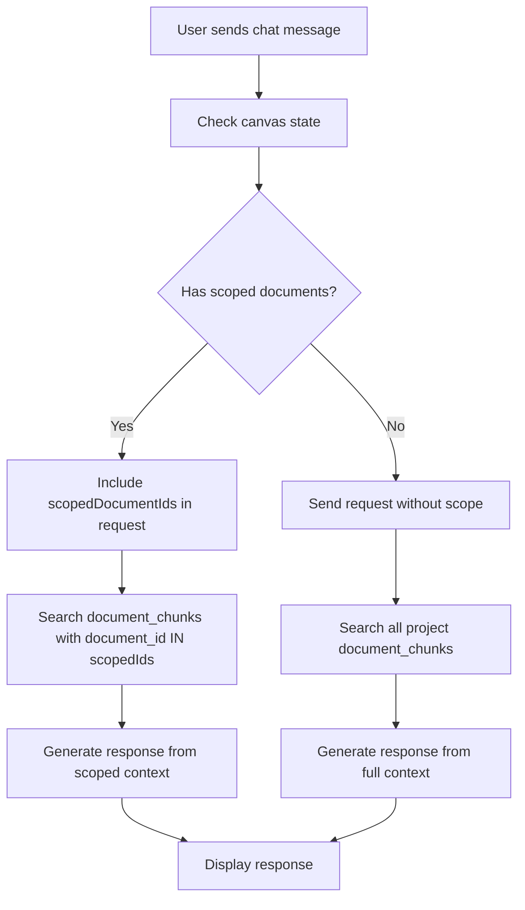
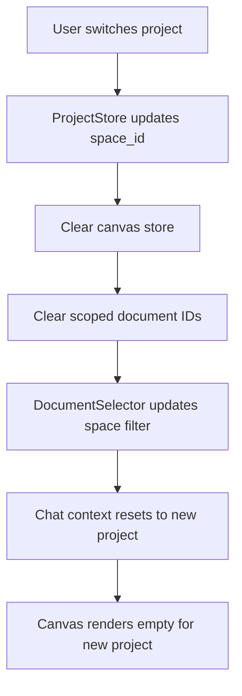

# Design Document: Infinity Canvas

## Overview

O Infinity Canvas é uma funcionalidade que permite aos usuários selecionar documentos específicos de um projeto (space) e organizá-los em um canvas infinito, onde cada documento se torna um card arrastável. O chat responderá exclusivamente com base nos documentos presentes no canvas, criando um escopo de conversa dinâmico e isolado por projeto.

## Architecture Design

### System Architecture Diagram



### Data Flow Diagram



## Component Design

### InfinityCanvas Component
- **Responsibilities**: 
  - Renderizar o canvas vazio ou com cards
  - Gerenciar o estado do seletor de documentos
  - Coordenar a comunicação entre sub-componentes
- **Interfaces**: 
  - `onAddDocuments(documentIds: string[])`
  - `onRemoveDocument(documentId: string)`
  - `onCardPositionChange(documentId: string, x: number, y: number)`
- **Dependencies**: CanvasStore, DocumentSelector, DraggableCard, MemoryGraph

### DocumentSelector Component
- **Responsibilities**:
  - Exibir lista paginada de documentos do projeto atual
  - Suportar multi-seleção via checkboxes
  - Reutilizar componentes visuais da MemoryListView
- **Interfaces**:
  - `onSelectionChange(selectedIds: string[])`
  - `onConfirm(selectedIds: string[])`
  - `onCancel()`
- **Dependencies**: MemoryListView components, useProject hook, Supabase client

### DraggableCard Component
- **Responsibilities**:
  - Renderizar preview do documento
  - Implementar drag & drop
  - Manter estado de posição
- **Interfaces**:
  - `onPositionChange(x: number, y: number)`
  - `onRemove()`
  - `document: DocumentWithMemories`
- **Dependencies**: @dnd-kit, existing card components

## Data Model

### Canvas State Management

```typescript
interface CanvasState {
  // Document IDs placed on canvas
  placedDocumentIds: string[]
  // Document IDs currently scoped for chat
  scopedDocumentIds: string[]
  // Card positions {documentId: {x, y}}
  cardPositions: Record<string, {x: number, y: number}>
  
  // Actions
  setPlacedDocumentIds: (ids: string[]) => void
  addPlacedDocuments: (ids: string[]) => void
  removePlacedDocument: (id: string) => void
  clearCanvas: () => void
  setScopedDocumentIds: (ids: string[]) => void
  updateCardPosition: (id: string, x: number, y: number) => void
}
```

### Enhanced Chat Request Schema

```typescript
interface ChatRequest {
  messages: Message[]
  // New field for scoped document IDs
  scopedDocumentIds?: string[]
  projectId: string  // space_id from spaces table
  orgId: string      // org_id from organizations table
  metadata?: Record<string, any>
}
```

### Database Integration Points

#### Document Query Pattern
```typescript
// Query documents for selector (filtered by space/project)
const getDocumentsForSelector = async (orgId: string, spaceId: string) => {
  const { data } = await supabase
    .from("documents")
    .select(`
      id,
      custom_id,
      title,
      summary,
      url,
      type,
      status,
      created_at,
      updated_at,
      token_count,
      word_count,
      og_image,
      document_chunks(count)
    `)
    .eq("org_id", orgId)  // Mandatory org isolation
    .eq("status", "done")   // Only processed documents
    .order("updated_at", { ascending: false })
  
  return data
}
```

#### Scoped Search Pattern
```typescript
// Search only within scoped documents
const searchScopedDocuments = async (
  orgId: string, 
  scopedDocumentIds: string[], 
  query: string
) => {
  const { data } = await supabase
    .from("document_chunks")
    .select(`
      id,
      content,
      position,
      document_id,
      documents!inner(
        id,
        title,
        custom_id,
        org_id
      )
    `)
    .eq("org_id", orgId)
    .in("document_id", scopedDocumentIds)  // Scope restriction
    .textSearch("fts", query)  // Full-text search
    .order("created_at", { ascending: false })
  
  return data
}
```

## Business Process

### Process 1: Opening Infinity Canvas



### Process 2: Adding Documents to Canvas



### Process 3: Chat with Scoped Documents



### Process 4: Project Switching



## Database Schema Considerations

### Current Schema Utilization
- **documents table**: Primary source for document metadata
- **document_chunks table**: Used for scoped search functionality
- **spaces table**: Represents projects (space_id = project_id)
- **memories table**: Could be extended for canvas-specific metadata

### No Schema Changes Required
The current schema supports the Infinity Canvas functionality without modifications:

1. **Document Selection**: Uses existing `documents` table with `org_id` and `space_id` filtering
2. **Scoped Search**: Leverages `document_chunks` table with `document_id` filtering
3. **Project Isolation**: Uses existing `spaces` table and multi-tenancy patterns
4. **Chat Scoping**: Extends existing chat API with document ID filtering

### Optional Future Extensions
If persistence of canvas state is needed, could add:
```sql
-- Optional: canvas_states table for persistent canvas layouts
CREATE TABLE canvas_states (
  id uuid PRIMARY KEY DEFAULT gen_random_uuid(),
  org_id uuid NOT NULL REFERENCES organizations(id),
  space_id uuid NOT NULL REFERENCES spaces(id),
  user_id uuid NOT NULL REFERENCES users(id),
  document_ids uuid[] NOT NULL DEFAULT '{}',
  card_positions jsonb NOT NULL DEFAULT '{}',
  created_at timestamptz NOT NULL DEFAULT now(),
  updated_at timestamptz NOT NULL DEFAULT now(),
  UNIQUE(org_id, space_id, user_id)
);
```

## Error Handling Strategy

### Canvas State Management
- **Error**: Falha ao carregar estado do canvas
- **Recovery**: Iniciar com estado limpo, logar erro para debug
- **User Feedback**: Toast message informando sobre reset do canvas

### Document Loading
- **Error**: Falha ao carregar lista de documentos
- **Recovery**: Retry automático com exponential backoff
- **User Feedback**: Skeleton loading + error message com retry

### Database Query Errors
- **Error**: Falha em query com scopedDocumentIds
- **Recovery**: Fallback para busca sem escopo, logar erro
- **User Feedback**: Notificação sobre escopo temporariamente desabilitado

### Chat Scoping
- **Error**: Documentos no escopo não encontrados
- **Recovery**: Remover IDs inválidos do escopo automaticamente
- **User Feedback**: Notificação sutil sobre documentos removidos

### Drag & Drop
- **Error**: Falha ao salvar posição do card
- **Recovery**: Manter posição em memória, retry em background
- **User Feedback**: Nenhum (silent retry)

## Integration Points

### Database Integration
- **Document Queries**: Filter by `org_id` and `space_id` following multi-tenancy
- **Scoped Search**: Use `document_chunks` with `document_id IN (...)` filtering
- **Chat API**: Extend existing `/chat` endpoint with document scoping
- **No Schema Changes**: Leverage existing tables and relationships

### MemoryGraph Integration
- Reutilizar componentes existentes do MemoryGraph
- Aproveitar sistema de zoom/pan do canvas
- Manter consistência visual com graph mode

### Chat Integration
- Modificar API endpoint `/chat` para aceitar `scopedDocumentIds`
- Atualizar frontend para passar escopo do canvas
- Manter backward compatibility (sem escopo = comportamento atual)

### Project Store Integration
- Usar `useProject()` para filtrar documentos por `space_id`
- Limpar canvas automaticamente ao trocar projeto
- Isolar estado por projeto no CanvasStore

## Performance Considerations

### Database Optimization
- **Scoped Queries**: Use `IN` clause with indexed `document_id` field
- **Chunk Search**: Leverage existing `fts` (full-text search) vector
- **Query Patterns**: Follow established multi-tenancy filtering patterns

### Canvas Rendering
- Virtualização para grandes números de cards
- Lazy loading de conteúdo dos cards
- Debounce de posições durante drag

### State Management
- Persistir apenas IDs e posições essenciais
- Evitar re-renders desnecessários
- Usar React.memo para componentes pesados

### API Optimization
- Batch requests para múltiplos documentos
- Cache de resultados de busca por escopo
- Streaming de respostas do chat mantidas

## Testing Strategy

### Unit Tests
- CanvasStore actions e estado
- Component rendering com diferentes estados
- Drag & drop interactions
- Database query patterns

### Integration Tests
- Fluxo completo de seleção e adição de documentos
- Chat com escopo vs sem escopo
- Troca de projeto e isolamento de estado
- Database query filtering by org_id and space_id

### E2E Tests
- User journey completo: adicionar documentos → conversar → trocar projeto
- Performance com grande número de cards
- Mobile responsiveness e touch interactions
- Multi-tenancy isolation verification