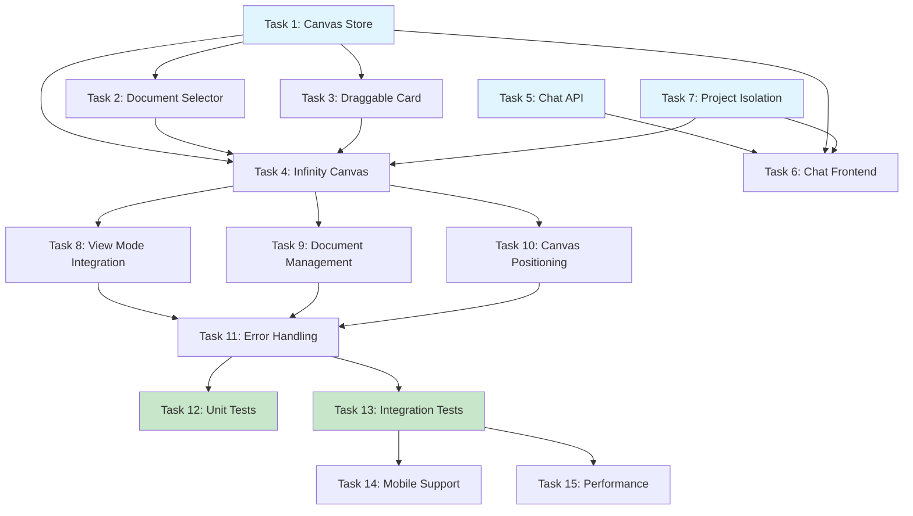

# Implementation Plan

- [x] 1. Create Canvas Store enhancements and types
  - Extend existing CanvasStore with card positions and persistence
  - Add TypeScript types for canvas state management
  - Implement actions for scoped document management
  - _Requirements: 1.1, 2.1, 3.1_

- [x] 2. Implement Document Selector Modal component
  - Create DocumentSelector modal with multi-selection checkboxes
  - Integrate with existing document list API (org_id and space_id filtering)
  - Reuse MemoryListView pagination and visual components
  - Add search and filtering capabilities
  - _Requirements: 1.1, 1.2, 1.3, 5.1, 5.2_

- [x] 3. Create Draggable Card component
  - Implement DraggableCard component using @dnd-kit
  - Reuse existing card/preview components from MemoryListView
  - Add drag handles and visual feedback
  - Implement position tracking and state updates
  - _Requirements: 2.1, 2.2, 5.1_

- [x] 4. Build Infinity Canvas main component
  - Create InfinityCanvas component as wrapper for all canvas functionality
  - Implement empty state with "Add Documents" button
  - Add canvas area with drag & drop zone
  - Integrate with MemoryGraph zoom/pan capabilities
  - _Requirements: 2.1, 2.2, 2.3_

- [x] 5. Update Chat API for scoped document support
  - Modify chat.ts endpoint to accept scopedDocumentIds parameter
  - Implement scoped search in document_chunks table
  - Add database query filtering by document_id IN (scoped_ids)
  - Maintain backward compatibility for existing chat behavior
  - _Requirements: 3.1, 3.2, 3.3, 3.4, 3.5_

- [x] 6. Integrate Chat frontend with canvas scoping
  - Update chat component to read scopedDocumentIds from CanvasStore
  - Pass scoped IDs to chat API requests
  - Handle empty scope fallback to global behavior
  - Update chat UI to show scoped context indicator
  - _Requirements: 3.1, 3.2, 3.3, 3.4, 3.5_

- [x] 7. Implement project isolation and state management
  - Connect CanvasStore with ProjectStore for project switching
  - Clear canvas state when project changes
  - Filter document selector by current project (space_id)
  - Ensure proper org_id filtering throughout the flow
  - _Requirements: 4.1, 4.2, 4.3, 4.4, 4.5_

- [x] 8. Integrate Infinity Canvas with existing view modes
  - Modify page.tsx to handle Infinity mode alongside graph/graphEmpty/list
  - Update ViewModeContext to include "infinity" mode
  - Connect Infinity button to show InfinityCanvas component
  - Ensure smooth transitions between view modes
  - _Requirements: 1.1, 2.1, 4.1_

- [x] 9. Add document management operations
  - Implement remove document from canvas functionality
  - Add bulk document operations (clear all, remove selected)
  - Update scoped document IDs when documents are removed
  - Handle document deletion from canvas
  - _Requirements: 2.5, 3.4, 3.5_

- [ ] 10. Implement canvas positioning and layout
  - Add grid-based initial positioning for new cards (done)
  - Implement collision detection to prevent overlapping (pending)
  - Add canvas boundaries and infinite scrolling (basic scroll area done)
  - Store and restore card positions in CanvasStore (done)
  - _Requirements: 2.2, 2.3, 2.4_

- [ ] 11. Add error handling and loading states
  - Implement loading skeletons for document selector (done)
  - Add error boundaries for canvas operations (pending)
  - Handle API failures gracefully with fallbacks (done)
  - Add user feedback for operations (toasts, notifications) (done)
  - _Requirements: Error handling throughout all features_

- [ ] 12. Create unit tests for core functionality
  - Test CanvasStore actions and state management
  - Test DocumentSelector component with multi-selection
  - Test DraggableCard drag & drop behavior
  - Test chat scoping with different document sets
  - _Requirements: Testing coverage for all implemented features_

- [ ] 13. Implement integration tests
  - Test complete flow: add documents → chat → remove documents
  - Test project switching and state isolation
  - Test API integration with scoped document filtering
  - Test database query patterns with org_id and space_id filtering
  - _Requirements: End-to-end verification of all requirements_

- [ ] 14. Add mobile responsiveness and touch support
  - Optimize drag & drop for touch devices (done)
  - Adjust modal layouts for mobile screens (done)
  - Implement touch-friendly card interactions (done)
  - Test canvas behavior on mobile devices (pending)
  - _Requirements: Mobile compatibility across all features_

- [ ] 15. Performance optimization and cleanup
  - Implement virtualization for large numbers of cards
  - Add debouncing for position updates during drag
  - Optimize database queries with proper indexing
  - Add memory leak prevention and cleanup
  - _Requirements: Performance optimization for all components_

## Tasks Dependency Diagram

## Total Tasks: 15
**Estimated Time**: 40-50 hours
**Success Metrics**: All acceptance criteria met, comprehensive test coverage, mobile responsive, performant with 100+ cards
