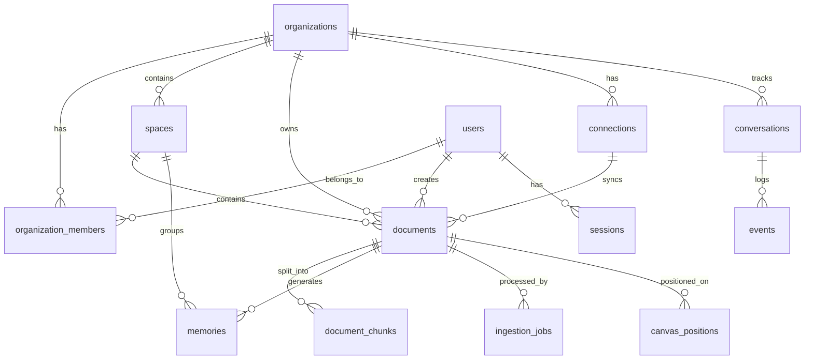

# AI Quickstart: Supermemory

**Last Analysis Date:** 2025-12-08 04:50:00 UTC
**Git Branch:** main
**Git Status:** clean
**Fork Status:** Fork of `supermemoryai/supermemory` (upstream tracked)

## Project Overview

Supermemory is an AI-powered personal knowledge management system that ingests documents, URLs, and files, extracts structured memories, and enables semantic search with Claude AI agents. It features an infinity canvas for visual knowledge organization and integrates with third-party services (Google Drive, Notion, OneDrive).

**Core Value Proposition:** Save anything, search semantically, chat with your knowledge base using Claude AI.

## Architecture Overview

```
                                    [Browser Extension]
                                           |
[Next.js Frontend] <----> [Hono API Backend] <----> [Supabase PostgreSQL]
      |                          |                         |
      |                    [Claude Agent SDK]        [pgvector embeddings]
      |                          |
      |                    [Ingestion Worker]
      |                          |
      +----------------> [MarkItDown Service]
                         (Python Flask - Doc conversion)
```

### Monorepo Structure

```
supermemory/
  apps/
    api/              # Hono backend (TypeScript) - Port 4000
    web/              # Next.js 16 frontend - Port 3001
    browser-extension/ # WXT browser extension
    markitdown/       # Python Flask document converter - Port 5000
  packages/
    lib/              # Shared utilities, React Query hooks, API client
    ui/               # Shadcn/Radix UI components
    validation/       # Zod schemas (SINGLE SOURCE OF TRUTH for types)
  supabase/
    migrations/       # Database migrations
  db/                 # Database utilities and backfill scripts
```

## Data Model



### Core Entities

| Entity | Purpose | Key Fields |
|--------|---------|------------|
| **organizations** | Multi-tenant isolation | `id`, `slug`, `name`, `metadata` |
| **users** | User accounts | `id`, `email`, `password_hash`, `name` |
| **organization_members** | User-org relationship | `organization_id`, `user_id`, `role`, `is_owner` |
| **spaces** | Projects/knowledge containers | `id`, `org_id`, `container_tag`, `name`, `visibility` |
| **documents** | Ingested content | `id`, `org_id`, `title`, `content`, `status`, `summary`, `url`, `type`, `summary_embedding` |
| **document_chunks** | Document fragments for RAG | `id`, `document_id`, `content`, `embedding`, `chunk_index` |
| **memories** | Extracted knowledge/inferences | `id`, `document_id`, `content`, `memory_embedding`, `is_inference`, `is_latest` |
| **conversations** | Claude Agent chat sessions | `id`, `org_id`, `sdk_session_id`, `title` |
| **events** | Conversation event logs | `id`, `conversation_id`, `event_type`, `role`, `content`, `tool_use_id` |
| **connections** | Third-party integrations | `id`, `org_id`, `provider`, `email`, `container_tags`, `expires_at` |
| **ingestion_jobs** | Async processing queue | `id`, `document_id`, `status`, `attempts`, `error_message` |
| **canvas_positions** | Infinity canvas layout | `id`, `document_id`, `x`, `y` |

### Document Status Flow

```
unknown -> queued -> extracting -> chunking -> embedding -> indexing -> done
                                                                    \-> failed
```

### Embedding Dimensions

- All embeddings use **1536 dimensions** (OpenAI text-embedding-ada-002 compatible)
- Vector index: `ivfflat` with cosine similarity (`vector_cosine_ops`)

## Tech Stack

| Layer | Technology | Version |
|-------|------------|---------|
| **Runtime** | Bun | 1.2.17 |
| **Package Manager** | Bun | 1.2.17 |
| **Monorepo** | Turborepo | 2.6.0 |
| **Backend Framework** | Hono | 4.10.2 |
| **Frontend Framework** | Next.js | 16.0.0 |
| **UI Library** | React | 19.1.0 |
| **Database** | Supabase (PostgreSQL + pgvector) | - |
| **ORM** | Raw Supabase client | 2.76.1 |
| **State Management** | Zustand | 5.0.7 |
| **Data Fetching** | TanStack React Query | 5.81.2 |
| **Validation** | Zod | 4.1.12 |
| **Styling** | TailwindCSS | 3.4.0 |
| **UI Components** | Radix UI + Shadcn | - |
| **AI SDK** | Claude Agent SDK | 0.1.14 |
| **Embeddings** | Google text-embedding-004 (default) | - |
| **Document Processing** | MarkItDown (Python) | 0.1.3 |
| **Browser Extension** | WXT | - |

## Setup

### Prerequisites

```bash
# Required
node >= 20
bun >= 1.2.17
python >= 3.11  # For markitdown service

# Database
# Supabase project (cloud or local via supabase CLI)
```

### Environment Variables

Create `.env.local` in root or app-specific directories:

```bash
# Required - Supabase
SUPABASE_URL=https://your-project.supabase.co
SUPABASE_SERVICE_ROLE_KEY=your-service-role-key
SUPABASE_ANON_KEY=your-anon-key  # REQUIRED for RLS enforcement

# Required - AI
ANTHROPIC_API_KEY=your-anthropic-key

# Optional - Embeddings
GOOGLE_API_KEY=your-google-key
EMBEDDING_MODEL=text-embedding-004
EMBEDDING_DIMENSION=1536

# Optional - Enhanced Features
COHERE_API_KEY=your-cohere-key      # For reranking
EXA_API_KEY=your-exa-key            # For web search
OPENROUTER_API_KEY=your-key         # Fallback LLM provider
VOYAGE_API_KEY=your-voyage-key      # Alternative embeddings

# Frontend
NEXT_PUBLIC_APP_URL=http://localhost:3001
NEXT_PUBLIC_API_URL=http://localhost:4000

# CORS
ALLOWED_ORIGINS=http://localhost:3000,http://localhost:3001
```

### Installation

```bash
# Clone and install
git clone https://github.com/guilhermexp/supermemory.git
cd supermemory
bun install

# Set up database (run migrations)
# Option 1: Via Supabase CLI
supabase db push

# Option 2: Manually apply migrations from supabase/migrations/

# Start development
bun run dev
```

### Running Individual Services

```bash
# API (Hono backend)
cd apps/api && bun run dev

# Web (Next.js frontend)
cd apps/web && bun run dev

# Ingestion Worker (separate process)
cd apps/api && bun run ingest:worker

# MarkItDown (Python document converter)
cd apps/markitdown
python -m venv .venv && source .venv/bin/activate
pip install -r requirements.txt
python server.py
```

## Key Workflows

### 1. Authentication Flow

```
[User] -> POST /api/auth/sign-in -> [Session created in sessions table]
       -> Cookie: sm_session=<token>
       -> All subsequent requests include cookie
       -> Middleware resolves session via resolveSession()
       -> Sets c.var.session = { organizationId, userId }
```

**Key Files:**
- `/apps/api/src/session.ts` - Session resolution
- `/apps/api/src/middleware/auth.ts` - requireAuth middleware
- `/apps/api/src/routes/auth.ts` - Auth endpoints

### 2. Document Ingestion Pipeline

```
[Add Document] -> POST /v3/documents
    |
    v
[Create document with status='queued']
    |
    v
[Ingestion Worker polls ingestion_jobs table]
    |
    v
[Extraction Phase]
    |- URL: Fetch + parse HTML (Puppeteer/muppet)
    |- File: Convert via MarkItDown service
    |- Text: Direct processing
    |
    v
[Chunking Phase] -> Split into ~500 token chunks
    |
    v
[Embedding Phase] -> Generate embeddings (Google/Voyage)
    |
    v
[Summarization Phase] -> Generate summary + memory
    |
    v
[Status = 'done'] -> Document searchable
```

**Key Files:**
- `/apps/api/src/services/ingestion.ts` - Main ingestion logic
- `/apps/api/src/services/orchestration/` - Orchestrator pattern
- `/apps/api/src/worker/ingestion-worker.ts` - Background worker
- `/apps/api/src/services/markitdown.ts` - Document conversion client

### 3. Search Flow (Hybrid Search)

```
[User Query] -> POST /v3/search/hybrid
    |
    v
[Generate query embedding]
    |
    v
[Parallel Search]
    |- Vector search (cosine similarity on document_chunks.embedding)
    |- Keyword search (PostgreSQL full-text search)
    |
    v
[Merge & Rerank] (optional Cohere reranking)
    |
    v
[Return results with scores]
```

**Key Files:**
- `/apps/api/src/services/hybrid-search.ts`
- `/apps/api/src/routes/search.ts`

### 4. Chat with Claude Agent

```
[User Message] -> POST /chat/v2
    |
    v
[Load conversation history from events table]
    |
    v
[Create Claude Agent SDK session]
    |- Tools: search_memories, get_document, add_memory, etc.
    |- System prompt with org context
    |
    v
[Stream response back to client]
    |
    v
[Store events in events table]
```

**Key Files:**
- `/apps/api/src/services/claude-agent.ts`
- `/apps/api/src/services/claude-agent-tools.ts`
- `/apps/api/src/routes/chat-v2.ts`

### 5. RLS (Row Level Security) Pattern

**Critical Security Pattern:**

```typescript
// ALWAYS use scoped client for user-facing queries
const supabase = createScopedSupabase(organizationId, userId);

// This sets headers that RLS policies check:
// x-kortix-organization: <org_id>
// x-kortix-user: <user_id>
```

**RLS Policy Example (from migrations):**
```sql
CREATE POLICY "Users can only see their org's documents"
ON documents FOR SELECT
USING (org_id = current_setting('request.headers')::json->>'x-kortix-organization');
```

**Key File:** `/apps/api/src/supabase.ts`

## API Endpoints (v3)

| Method | Endpoint | Purpose |
|--------|----------|---------|
| POST | `/api/auth/sign-in` | Authentication |
| POST | `/api/auth/sign-up` | Registration |
| GET | `/api/auth/session` | Get current session |
| GET | `/v3/projects` | List spaces/projects |
| POST | `/v3/projects` | Create space |
| POST | `/v3/documents` | Add document |
| POST | `/v3/documents/file` | Upload file |
| POST | `/v3/documents/list` | List documents |
| GET | `/v3/documents/:id` | Get document |
| PATCH | `/v3/documents/:id` | Update document |
| DELETE | `/v3/documents/:id` | Delete document |
| POST | `/v3/search` | Vector search |
| POST | `/v3/search/hybrid` | Hybrid search (vector + keyword) |
| POST | `/chat/v2` | Chat with Claude |
| GET | `/v3/conversations` | List conversations |
| GET | `/v3/conversations/:id` | Get conversation |
| POST | `/v3/connections/list` | List integrations |
| POST | `/v3/canvas/:projectId` | Save canvas state |
| GET | `/v3/canvas/:projectId` | Get canvas state |

## Important Patterns

### 1. Validation Schemas (Single Source of Truth)

All types are defined in `packages/validation/data-model.ts`:

```typescript
import { DocumentSchema, MemorySchema } from '@repo/validation/data-model';

// Use for runtime validation
const doc = DocumentSchema.parse(data);

// Use for TypeScript types
type Document = z.infer<typeof DocumentSchema>;
```

### 2. React Query Hooks

```typescript
// From packages/lib/queries.ts
import { useDeleteDocument, fetchSubscriptionStatus } from '@repo/lib/queries';

// Optimistic updates built-in
const deleteDoc = useDeleteDocument(selectedProject);
```

### 3. API Client

```typescript
// From packages/lib/api.ts
import { $fetch } from '@repo/lib/api';

// Automatic error handling, auth headers
const response = await $fetch('@get/documents/:id', { id: docId });
```

### 4. Zustand Stores

```typescript
// From apps/web/stores/
import { useChatStore } from '@/stores/chat';
import { useCanvasStore } from '@/stores/canvas';
```

## Database Indexes (Performance Critical)

Recent optimizations added these composite indexes:

```sql
-- Most common query pattern
CREATE INDEX idx_documents_org_status_created
ON documents(org_id, status, created_at DESC NULLS LAST);

-- Memory retrieval per document
CREATE INDEX idx_memories_document_created
ON memories(document_id, created_at DESC NULLS LAST);

-- Vector similarity search (ivfflat)
CREATE INDEX idx_chunks_embedding
ON document_chunks USING ivfflat (embedding vector_cosine_ops);

-- Materialized view for dashboard stats
CREATE MATERIALIZED VIEW mv_org_document_stats AS
SELECT org_id, COUNT(*) as total_documents, ...
```

## Local Modifications (Fork-Specific)

This is a fork of `supermemoryai/supermemory`. Key modifications:

1. **Database Performance (d1646182):**
   - Reduced frontend polling by ~95% (longer staleTime, refetchOnWindowFocus)
   - Added RLS policies to all tables
   - Optimized database indexes with composite indexes
   - Added materialized views for hot queries

2. **RLS Security Enforcement:**
   - Made `SUPABASE_ANON_KEY` required (not optional)
   - All user-facing queries use scoped client with org/user headers

3. **AI Actions Context Menu:**
   - Added canvas AI actions for right-click context menu

## Testing

```bash
# API tests
cd apps/api && bun test

# Web tests
cd apps/web && bun test

# Run specific test file
bun test src/routes/documents.test.ts
```

## Deployment

The project is configured for Railway deployment:

- `railway.toml` and `nixpacks.toml` in root and apps
- Each service deploys independently
- MarkItDown runs as separate Python service

## Troubleshooting

### Common Issues

1. **"Unauthorized" on all requests:**
   - Check `sm_session` cookie is being sent
   - Verify session exists in `sessions` table
   - Check `expires_at` hasn't passed

2. **RLS blocking queries:**
   - Ensure using `createScopedSupabase()` not `supabaseAdmin`
   - Check headers are set correctly
   - Verify RLS policies in Supabase dashboard

3. **Documents stuck in "processing":**
   - Check ingestion worker is running (`bun run ingest:worker`)
   - Check `ingestion_jobs` table for errors
   - Document timeout monitor auto-cancels after 1 hour

4. **Embeddings failing:**
   - Check `GOOGLE_API_KEY` or `VOYAGE_API_KEY` is set
   - Verify embedding dimension matches (1536)

## Change Log

| Date | Summary |
|------|---------|
| 2025-12-08 | Initial ai_quickstart.md created with full codebase analysis |

---

*Generated by AI Codebase Analyzer*
