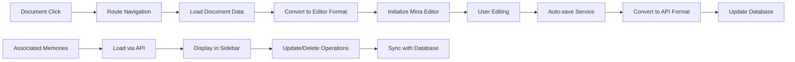
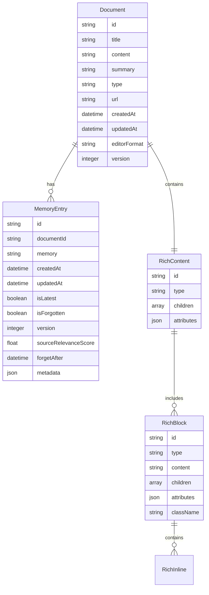
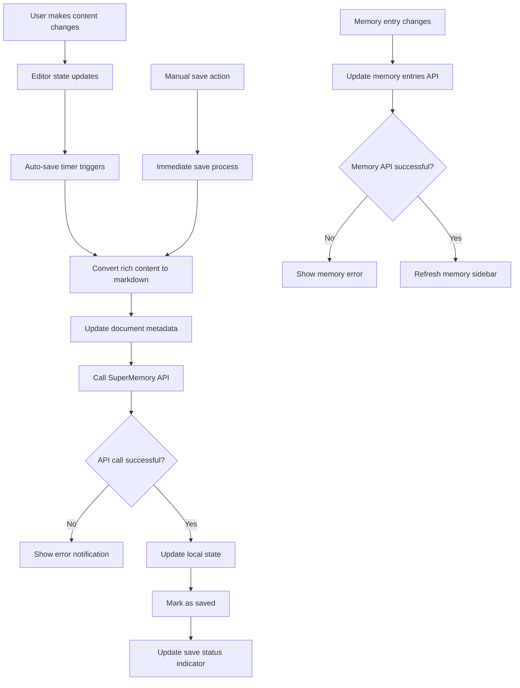
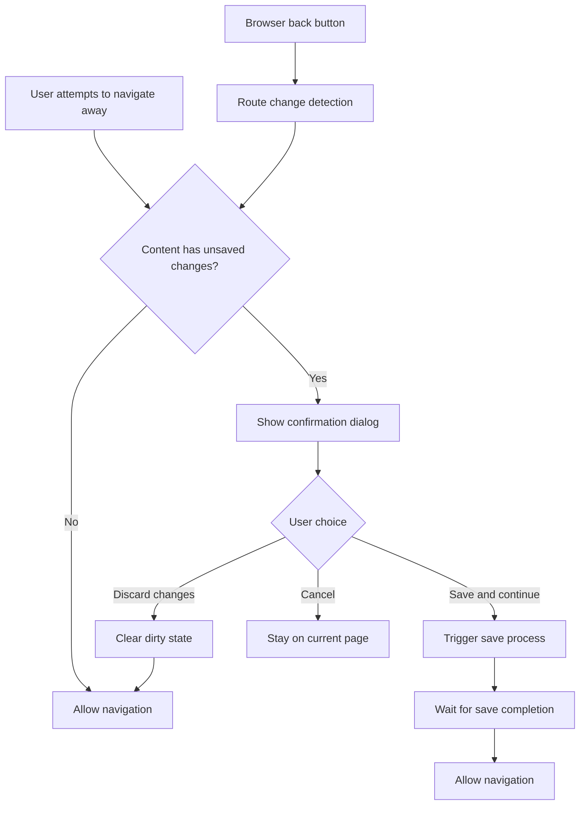
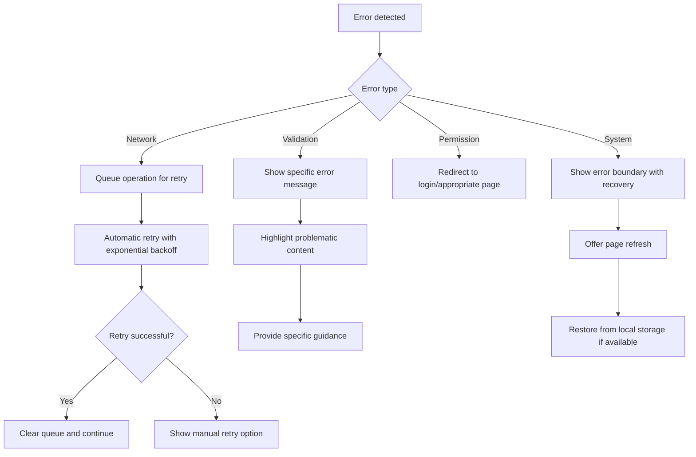

# Design Document: Cards to Full Markdown Pages

## Overview

This design document outlines the transformation of SuperMemory's memory cards from a side panel detail view to full-page, rich markdown editor pages using the Mina Rich Editor. The solution will replace the current Sheet/Drawer implementation with a comprehensive full-screen editing experience while maintaining data integrity and backward compatibility.

## Architecture Design

### System Architecture Diagram

```mermaid
graph TB
    A[User clicks memory card] --> B[Next.js Router]
    B --> C[/memory/[id]/edit page]
    C --> D[MemoryEditor Component]
    D --> E[Mina Rich Editor]
    D --> F[MemoryEntries Sidebar]
    D --> G[Save/Load Service]
    G --> H[SuperMemory API]
    H --> I[Database]
    
    J[Existing MemoryListView] --> K[handleOpenDetails]
    K --> L[router.push('/memory/[id]/edit')]
    
    M[Image Upload] --> N[Custom Upload Handler]
    N --> O[SuperMemory Storage]
    
    P[Content Conversion] --> Q[Markdown ↔ Rich Content]
    Q --> D
```

### Data Flow Diagram



## Component Design

### Component A: MemoryEditor Page Component

**Location:** `apps/web/app/memory/[id]/edit/page.tsx`

**Responsibilities:**
- Server-side data fetching for document and associated memories
- Route parameter validation and error handling
- Integration with Mina Rich Editor
- Save/load orchestration

**Interfaces:**
```typescript
interface MemoryEditorProps {
  params: { id: string }
  searchParams: { [key: string]: string | string[] | undefined }
}

interface DocumentWithMemories {
  id: string
  title: string
  content: string
  summary?: string
  type: string
  url?: string
  createdAt: string
  memoryEntries: MemoryEntry[]
}
```

**Dependencies:**
- SuperMemory API client
- Mina Rich Editor components
- MemoryEntries sidebar component
- Error boundary components

### Component B: RichEditorWrapper

**Location:** `apps/web/components/editor/rich-editor-wrapper.tsx`

**Responsibilities:**
- Wrap Mina Rich Editor with SuperMemory-specific functionality
- Handle content conversion between markdown and rich format
- Manage save state and auto-save operations
- Integrate image upload with SuperMemory storage

**Interfaces:**
```typescript
interface RichEditorWrapperProps {
  document: DocumentWithMemories
  onSave: (content: string, metadata: EditorMetadata) => Promise<void>
  onMemoryUpdate: (memories: MemoryEntry[]) => Promise<void>
  readOnly?: boolean
}

interface EditorMetadata {
  lastModified: string
  version: number
  wordCount: number
  characterCount: number
}
```

### Component C: MemoryEntriesSidebar

**Location:** `apps/web/components/editor/memory-entries-sidebar.tsx`

**Responsibilities:**
- Display associated memories in a collapsible sidebar
- Allow creation, editing, and deletion of memory entries
- Maintain real-time sync with main document
- Provide filtering and search capabilities

**Interfaces:**
```typescript
interface MemoryEntriesSidebarProps {
  documentId: string
  memories: MemoryEntry[]
  onMemoryCreate: (memory: CreateMemoryRequest) => Promise<void>
  onMemoryUpdate: (id: string, updates: Partial<MemoryEntry>) => Promise<void>
  onMemoryDelete: (id: string) => Promise<void>
  isOpen: boolean
  onToggle: () => void
}
```

### Component D: NavigationHeader

**Location:** `apps/web/components/editor/navigation-header.tsx`

**Responsibilities:**
- Provide navigation controls (back to list, save status)
- Display document metadata and actions
- Handle unsaved changes warnings
- Mobile-responsive navigation

**Interfaces:**
```typescript
interface NavigationHeaderProps {
  document: DocumentWithMemories
  saveStatus: 'saved' | 'saving' | 'unsaved' | 'error'
  onSave: () => Promise<void>
  onBack: () => void
  isMobile: boolean
}
```

## Data Models

### Core Data Structure Definitions

```typescript
// Enhanced Document model for editor
interface EditorDocument extends DocumentWithMemories {
  editorContent?: RichContent
  lastModified: string
  version: number
  isDirty: boolean
}

// Rich content structure for Mina Editor
interface RichContent {
  id: string
  type: 'container'
  children: RichBlock[]
  attributes: Record<string, unknown>
}

interface RichBlock {
  id: string
  type: 'p' | 'h1' | 'h2' | 'h3' | 'h4' | 'h5' | 'h6' | 'code' | 'blockquote' | 'li'
  content?: string
  children?: RichInline[]
  attributes?: Record<string, unknown>
  className?: string
}

interface RichInline {
  content: string
  bold?: boolean
  italic?: boolean
  underline?: boolean
  elementType?: 'h1' | 'h2' | 'h3' | 'code'
  className?: string
}

// Memory entry with editor integration
interface MemoryEntry {
  id: string
  documentId: string
  memory: string
  createdAt: string
  updatedAt: string
  isLatest: boolean
  isForgotten: boolean
  version: number
  sourceRelevanceScore?: number
  forgetAfter?: string
  metadata?: Record<string, unknown>
}

// API request/response types
interface CreateMemoryRequest {
  documentId: string
  memory: string
  metadata?: Record<string, unknown>
}

interface UpdateDocumentRequest {
  id: string
  content: string
  summary?: string
  metadata?: {
    editorFormat?: 'rich' | 'markdown'
    lastModified?: string
    version?: number
  }
}
```

### Data Model Diagrams



## Business Process

### Process 1: Document Loading and Editor Initialization

```mermaid
flowchart TD
    A[User navigates to /memory/[id]/edit] --> B[Page component loads]
    B --> C[Validate document ID]
    C --> D{Document exists?}
    D -->|No| E[Show 404 error]
    D -->|Yes| F[Fetch document data]
    F --> G[Fetch associated memories]
    G --> H[Convert content to editor format]
    H --> I[Initialize EditorProvider]
    I --> J[Render Mina Rich Editor]
    J --> K[Load MemoryEntries sidebar]
    K --> L[Set up auto-save service]
    L --> M[Editor ready for user interaction]
```

### Process 2: Content Saving and Synchronization



### Process 3: Navigation and Unsaved Changes Handling



## Error Handling Strategy

### Error Categories and Handling

1. **Document Loading Errors**
   - 404: Document not found → Show friendly 404 page with navigation back to list
   - 500: Server error → Show error message with retry option
   - Network error → Show offline indicator and retry automatically

2. **Save Operation Errors**
   - Validation errors: Highlight problematic content and show specific messages
   - Network failures: Queue save operation and retry when connection restored
   - Permission errors: Show access denied message and redirect if needed

3. **Editor Initialization Errors**
   - Content conversion failures: Fall back to plain text with warning
   - Component mounting errors: Show error boundary with recovery options

4. **Memory Entry Errors**
   - Creation failures: Show inline error and allow retry
   - Update conflicts: Show conflict resolution dialog
   - Deletion errors: Show error and maintain entry in UI

### Recovery Mechanisms



## Implementation Details

### Technology Stack Integration

**Mina Rich Editor Integration:**
- Install via shadcn CLI: `npx shadcn@latest add https://ui-v4-livid.vercel.app/r/styles/new-york-v4/rich-editor.json`
- Configure ThemeProvider wrapper for dark mode support
- Implement custom image upload handler for SuperMemory storage

**Next.js Routing:**
- Dynamic route: `app/memory/[id]/edit/page.tsx`
- Server-side data fetching with `getDocumentWithMemories`
- Error boundaries for route-level error handling

**State Management:**
- React state for editor content and save status
- Zustand for global editor state if needed
- Local storage for backup and recovery

### Content Conversion Strategy

**Markdown to Rich Content:**
```typescript
function convertMarkdownToRichContent(markdown: string): RichContent {
  // Parse markdown using react-markdown
  // Convert to Mina Editor block structure
  // Preserve formatting, links, and images
}
```

**Rich Content to Markdown:**
```typescript
function convertRichContentToMarkdown(content: RichContent): string {
  // Use Mina's serializeToHTML as intermediate
  // Convert HTML back to markdown
  // Preserve structure and formatting
}
```

### Performance Optimizations

- **Code Splitting:** Lazy load Mina Rich Editor components
- **Image Optimization:** Implement progressive loading and compression
- **Auto-save Throttling:** Debounce save operations to prevent excessive API calls
- **Memory Management:** Efficient handling of large documents with virtualization

## Testing Strategy

### Unit Tests

- **Content Conversion:** Test markdown ↔ rich content conversion accuracy
- **API Integration:** Test save/load operations with mock responses
- **Component Logic:** Test editor wrapper and sidebar component behavior

### Integration Tests

- **End-to-End Flow:** Test complete edit-save-navigate cycle
- **Error Scenarios:** Test error handling and recovery mechanisms
- **Performance:** Test load times with large documents

### User Acceptance Tests

- **Mobile Responsiveness:** Test editor functionality on mobile devices
- **Accessibility:** Test keyboard navigation and screen reader compatibility
- **Cross-browser:** Test compatibility across major browsers

## Security Considerations

### Content Security

- **Input Sanitization:** Sanitize all user inputs before processing
- **XSS Prevention:** Implement content security policies and input validation
- **Image Upload Security:** Validate file types and implement virus scanning

### Data Protection

- **Authentication:** Ensure all operations require proper authentication
- **Authorization:** Validate user permissions for document access
- **Data Encryption:** Encrypt sensitive data in transit and at rest

## Migration Strategy

### Phase 1: Parallel Implementation
- Implement new editor alongside existing Sheet/Drawer
- Add feature flag to toggle between implementations
- Test new functionality with subset of users

### Phase 2: Gradual Migration
- Enable new editor for all users
- Monitor performance and user feedback
- Collect usage analytics and error reports

### Phase 3: Cleanup
- Remove old Sheet/Drawer implementation
- Clean up unused components and dependencies
- Update documentation and user guides

## Success Metrics

### Performance Metrics
- Page load time: < 3 seconds for average documents
- Save operation time: < 1 second for typical content
- Mobile performance: Smooth interaction on 3G networks

### User Experience Metrics
- User engagement: Increase in time spent editing
- Feature adoption: Percentage of users using rich editing features
- Error rate: < 1% of operations result in errors

### Business Metrics
- Content creation: Increase in document edits per user
- User retention: Improved retention rates for active editors
- Support tickets: Reduction in editing-related support requests