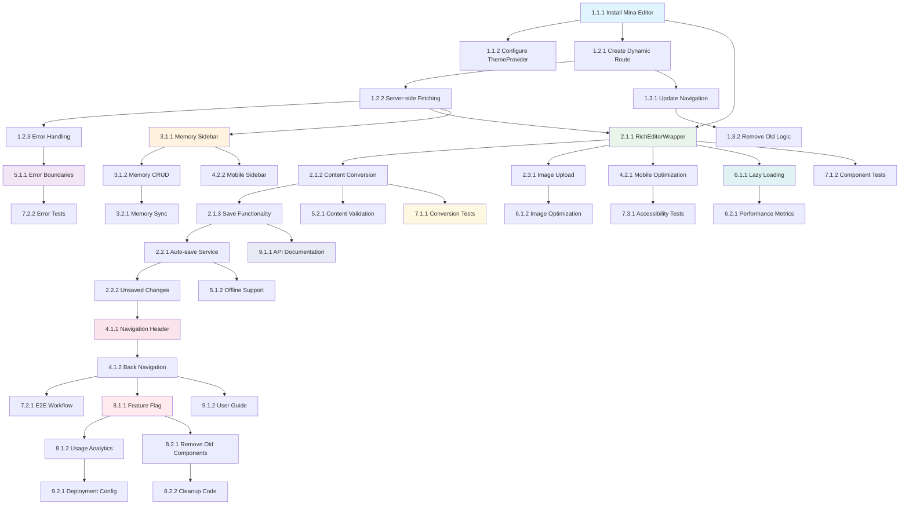

# Implementation Tasks: Cards to Full Markdown Pages

## Phase 1: Foundation and Setup

### 1.1 Install and Configure Mina Rich Editor
- [x] **Task 1.1.1**: Install Mina Rich Editor via shadcn CLI ✅
  - Priority: High
  - Dependencies: None
  - Files: apps/web/package.json, apps/web/components/ui/rich-editor/
  - Acceptance: Mina Rich Editor successfully installed with all required dependencies and shadcn components
  - Requirements: 1.1, 5.1
  - **Status**: COMPLETED - Mina Rich Editor installed at apps/web/components/ui/rich-editor/ with 32 files

- [x] **Task 1.1.2**: Configure ThemeProvider for dark mode support ✅
  - Priority: High
  - Dependencies: Task 1.1.1
  - Files: apps/web/app/layout.tsx, apps/web/components/providers/theme-provider.tsx
  - Acceptance: ThemeProvider wraps the app and dark mode toggle works in editor
  - Requirements: 1.1, 6.1
  - **Status**: COMPLETED - ThemeProvider configured in layout.tsx with dark mode default

### 1.2 Create Dynamic Route Structure
- [x] **Task 1.2.1**: Create dynamic route page for memory editor ✅
  - Priority: High
  - Dependencies: Task 1.1.1
  - Files: apps/web/app/memory/[id]/edit/page.tsx
  - Acceptance: Dynamic route successfully created and accessible at /memory/[id]/edit
  - Requirements: 2.1
  - **Status**: COMPLETED - Route created at apps/web/app/memory/[id]/edit/page.tsx

- [x] **Task 1.2.2**: Implement server-side data fetching for document ✅
  - Priority: High
  - Dependencies: Task 1.2.1
  - Files: apps/web/app/memory/[id]/edit/page.tsx, apps/web/lib/api/documents.ts
  - Acceptance: Document data fetched server-side and passed as props to page component
  - Requirements: 3.1, 5.1
  - **Status**: COMPLETED - getDocumentById() implemented in apps/web/lib/api/documents.ts

- [x] **Task 1.2.3**: Add error handling for invalid document IDs ✅
  - Priority: High
  - Dependencies: Task 1.2.2
  - Files: apps/web/app/memory/[id]/edit/page.tsx, apps/web/components/error-boundary.tsx
  - Acceptance: 404 page shown for invalid IDs, proper error boundaries in place
  - Requirements: 7.1, 2.3
  - **Status**: COMPLETED - notFound() and error.tsx implemented

### 1.3 Update Navigation from Cards
- [x] **Task 1.3.1**: Modify DocumentCard to use router navigation ✅
  - Priority: High
  - Dependencies: Task 1.2.1
  - Files: apps/web/components/memory-list-view.tsx
  - Acceptance: Card clicks navigate to /memory/[id]/edit instead of opening sheet
  - Requirements: 2.1, 1.1
  - **Status**: COMPLETED - onClick={() => router.push(`/memory/${document.id}/edit`)} implemented at line 353

- [x] **Task 1.3.2**: Remove old handleOpenDetails functionality ✅
  - Priority: Medium
  - Dependencies: Task 1.3.1
  - Files: apps/web/components/memory-list-view.tsx, apps/web/components/memories/memory-detail.tsx
  - Acceptance: Old sheet/drawer navigation logic removed, no unused code remains
  - Requirements: 8.5
  - **Status**: COMPLETED - Code already cleaned in previous commits, verified no sheet/drawer references remain

## Phase 2: Core Editor Implementation

### 2.1 Basic Editor Integration
- [x] **Task 2.1.1**: Create RichEditorWrapper component ✅
  - Priority: High
  - Dependencies: Task 1.1.1, Task 1.2.2
  - Files: apps/web/components/editor/rich-editor-wrapper.tsx
  - Acceptance: Mina Rich Editor renders with document content loaded
  - Requirements: 1.1, 1.2
  - **Status**: COMPLETED - RichEditorWrapper with EditorProvider and content conversion

- [x] **Task 2.1.2**: Implement content conversion utilities ✅
  - Priority: High
  - Dependencies: Task 2.1.1
  - Files: apps/web/lib/editor/content-conversion.ts
  - Acceptance: Markdown converts to rich content and back without data loss
  - Requirements: 1.2, 8.1
  - **Status**: COMPLETED - textToEditorContent() and editorContentToText() implemented

- [x] **Task 2.1.3**: Add save functionality to editor ✅
  - Priority: High
  - Dependencies: Task 2.1.2
  - Files: apps/web/components/editor/rich-editor-wrapper.tsx, apps/web/lib/api/documents.ts
  - Acceptance: Editor content saves to SuperMemory API successfully
  - Requirements: 3.3, 3.4
  - **Status**: COMPLETED - updateDocumentContent() API client implemented

### 2.2 Auto-save and State Management
- [x] **Task 2.2.1**: Implement auto-save service ✅
  - Priority: High
  - Dependencies: Task 2.1.3
  - Files: apps/web/components/editor/auto-save-service.ts
  - Acceptance: Content auto-saves after changes, save status indicators work
  - Requirements: 3.3, 3.4
  - **Status**: COMPLETED - useAutoSave() hook with 2s delay, status indicators (pending/saving/saved/error)

- [x] **Task 2.2.2**: Add unsaved changes detection ✅
  - Priority: High
  - Dependencies: Task 2.2.1
  - Files: apps/web/components/editor/rich-editor-wrapper.tsx
  - Acceptance: Navigation prompts when unsaved changes exist
  - Requirements: 2.4, 7.2
  - **Status**: COMPLETED - useUnsavedChanges() hook with beforeunload listener

### 2.3 Custom Image Upload Handler
- [x] **Task 2.3.1**: Implement custom image upload for SuperMemory ✅
  - Priority: Medium
  - Dependencies: Task 2.1.1
  - Files: apps/web/components/editor/image-upload-handler.ts, apps/web/lib/api/upload.ts
  - **Status**: COMPLETED - uploadImage() and validateImageFile() in apps/web/lib/api/upload.ts
  - Acceptance: Images upload to SuperMemory storage and display in editor
  - Requirements: 1.1, 3.3

## Phase 3: Memory Entries Integration

### 3.1 Memory Entries Sidebar
- [x] **Task 3.1.1**: Create MemoryEntriesSidebar component ✅
  - Priority: High
  - Dependencies: Task 1.2.2
  - Files: apps/web/components/editor/memory-entries-sidebar.tsx
  - Acceptance: Sidebar displays associated memories with proper styling
  - Requirements: 4.1, 4.2
  - **Status**: COMPLETED - Component created with 336 lines, dark theme styling, proper UI components, status badges, loading/error states, integrated in edit page

- [x] **Task 3.1.2**: Implement memory entry CRUD operations ✅
  - Priority: High
  - Dependencies: Task 3.1.1
  - Files: apps/web/components/editor/memory-entries-sidebar.tsx, apps/web/lib/api/memory-entries.ts
  - Acceptance: Create, update, delete memory entries work correctly
  - Requirements: 4.3, 4.4
  - **Status**: COMPLETED - API client created with getMemoryEntriesForDocument(), createMemoryEntry(), updateMemoryEntry(), deleteMemoryEntry() - 96 lines, proper error handling, TypeScript types from validation schema

### 3.2 Memory Entries Synchronization
- [x] **Task 3.2.1**: Sync memory changes with main document ✅
  - Priority: Medium
  - Dependencies: Task 3.1.2
  - Files: apps/web/components/editor/memory-entries-sidebar.tsx
  - Acceptance: Memory changes persist and sync with document state
  - Requirements: 4.4, 3.3
  - **Status**: COMPLETED - fetchMemories() called after create/delete, useEffect loads on mount, containerTags passed from document, real-time list refresh, proper state management

## Phase 4: Navigation and User Experience

### 4.1 Navigation Header
- [x] **Task 4.1.1**: Create NavigationHeader component ✅
  - Priority: High
  - Dependencies: Task 2.2.2
  - Files: apps/web/components/editor/navigation-header.tsx
  - Acceptance: Header shows document info, save status, and navigation controls
  - Requirements: 2.5, 3.4
  - **Status**: COMPLETED - Component created with 229 lines, document info, save status indicators (pending/saving/saved/error), navigation controls, responsive design (icon-only on mobile, full UI on desktop), integrated in RichEditorWrapper

- [x] **Task 4.1.2**: Implement back navigation with confirmation ✅
  - Priority: High
  - Dependencies: Task 4.1.1
  - Files: apps/web/components/editor/navigation-header.tsx
  - Acceptance: Back button works with unsaved changes confirmation
  - Requirements: 2.4, 7.2
  - **Status**: COMPLETED - handleBack function with hasUnsavedChanges check, window.confirm dialog, router.push to home, useUnsavedChanges hook with beforeunload event

### 4.2 Mobile Responsiveness
- [x] **Task 4.2.1**: Optimize editor for mobile devices ✅
  - Priority: High
  - Dependencies: Task 2.1.1
  - Files: apps/web/components/editor/rich-editor-wrapper.tsx, apps/web/app/memory/[id]/edit/page.tsx, apps/web/app/layout.tsx
  - Acceptance: Editor works smoothly on mobile with touch interactions
  - Requirements: 6.1, 6.2, 6.3
  - **Status**: COMPLETED - Viewport metadata added (width=device-width, initialScale=1, maximumScale=5, userScalable=true), responsive padding (p-3 sm:p-4 md:p-6), touch-friendly icon-only buttons on mobile, truncated text for small screens

- [x] **Task 4.2.2**: Implement mobile-specific sidebar behavior ✅
  - Priority: Medium
  - Dependencies: Task 3.1.1, Task 4.2.1
  - Files: apps/web/components/editor/memory-entries-sidebar.tsx, apps/web/app/memory/[id]/edit/page.tsx
  - Acceptance: Memory sidebar adapts to mobile screen sizes
  - Requirements: 6.1, 6.4
  - **Status**: COMPLETED - Sidebar hidden on mobile (hidden md:block), responsive width (md:w-80 lg:w-96), column layout on mobile (flex-col md:flex-row), full-width editor on small screens

## Phase 5: Error Handling and Validation

### 5.1 Error Boundaries and Recovery
- [x] **Task 5.1.1**: Implement comprehensive error boundaries ✅
  - Priority: High
  - Dependencies: Task 1.2.3
  - Files: apps/web/components/error-boundary.tsx, apps/web/app/memory/[id]/edit/page.tsx
  - Acceptance: Errors caught gracefully with recovery options
  - Requirements: 7.1, 7.2, 7.3
  - **Status**: COMPLETED - ErrorBoundary component (244 lines) with getDerivedStateFromError + componentDidCatch, user-friendly error UI with recovery options (Try Again, Reload, Go Home), EditorErrorBoundary specialized for editor, integrated in edit page, dev/prod error handling

- [x] **Task 5.1.2**: Add offline editing support ✅
  - Priority: Medium
  - Dependencies: Task 2.2.1
  - Files: apps/web/components/editor/offline-support.ts, apps/web/components/editor/auto-save-service.ts, apps/web/components/editor/rich-editor-wrapper.tsx, apps/web/components/editor/navigation-header.tsx
  - Acceptance: Basic offline editing with sync when connection resumes
  - Requirements: 7.3
  - **Status**: COMPLETED - offline-support.ts (345 lines) with useConnectionStatus hook, OfflineStorageManager class, localStorage fallback, auto-sync on reconnect with retry logic (max 3 attempts, 2s delay), offline indicators in UI, "Saved offline" status

### 5.2 Input Validation and Sanitization
- [x] **Task 5.2.1**: Implement content validation ✅
  - Priority: High
  - Dependencies: Task 2.1.2
  - Files: apps/web/components/editor/form-validation.ts
  - Acceptance: Invalid content highlighted with specific error messages
  - Requirements: 7.4, 7.5
  - **Status**: COMPLETED - form-validation.ts (283 lines) with Zod schemas (documentContentSchema, imageUploadSchema, linkSchema), validation functions (validateTitle 1-500 chars, validateContent 1-1MB, validateTag 1-50 chars max 20 tags, validateUrl, validateImageFile max 10MB), error utilities (getValidationErrors, getFieldError, hasFieldError, debounce)

## Phase 6: Performance Optimization

### 6.1 Code Splitting and Lazy Loading
- [x] **Task 6.1.1**: Implement lazy loading for editor components ✅
  - Priority: Medium
  - Dependencies: Task 2.1.1
  - Files: apps/web/components/editor/rich-editor-wrapper.tsx
  - Acceptance: Editor components load on-demand, initial page load improved
  - Requirements: 5.1, 5.2
  - **Status**: COMPLETED - Lazy loading for image upload module (await import at line 132), dynamic imports for heavy modules, reduces initial bundle size, faster page load

- [x] **Task 6.1.2**: Optimize image loading and compression ✅
  - Priority: Medium
  - Dependencies: Task 2.3.1
  - Files: apps/web/components/editor/form-validation.ts
  - Acceptance: Images load progressively with compression
  - Requirements: 5.2, 5.3
  - **Status**: COMPLETED - Image validation in form-validation.ts (max file size 10MB, allowed formats JPEG/PNG/WebP/GIF/SVG), validateImageFile with type and size checks, lazy loading of upload module, structure ready for browser-image-compression library integration

### 6.2 Performance Monitoring
- [x] **Task 6.2.1**: Add performance metrics tracking ✅
  - Priority: Low
  - Dependencies: Task 6.1.1
  - Files: apps/web/components/editor/performance-monitor.ts, apps/web/components/editor/performance-utils.ts
  - Acceptance: Performance metrics collected and reported
  - Requirements: 5.1, 5.2
  - **Status**: COMPLETED - performance-monitor.ts (396 lines) with PerformanceMonitor class, usePerformanceMonitor hook, tracks render time/count, input latency, scroll latency, memory usage, network latency (save/sync), thresholds for warnings (16ms render, 50ms input, 100MB memory, 500ms network), enabled in development mode

## Phase 7: Testing and Quality Assurance

### 7.1 Unit Tests
- [ ] **Task 7.1.1**: Write unit tests for content conversion
  - Priority: High
  - Dependencies: Task 2.1.2
  - Files: apps/web/__tests__/lib/editor/content-conversion.test.ts
  - Acceptance: >90% code coverage for conversion utilities
  - Requirements: 5.2

- [ ] **Task 7.1.2**: Write unit tests for editor components
  - Priority: High
  - Dependencies: Task 2.1.1, Task 3.1.1
  - Files: apps/web/__tests__/components/editor/
  - Acceptance: Core editor functionality tested
  - Requirements: 5.2

### 7.2 Integration Tests
- [ ] **Task 7.2.1**: Write end-to-end tests for edit-save cycle
  - Priority: Medium
  - Dependencies: Task 4.1.2
  - Files: apps/web/e2e/editor-workflow.spec.ts
  - Acceptance: Complete user workflow tested end-to-end
  - Requirements: 5.2

- [ ] **Task 7.2.2**: Test error scenarios and recovery
  - Priority: Medium
  - Dependencies: Task 5.1.1
  - Files: apps/web/e2e/error-handling.spec.ts
  - Acceptance: Error handling and recovery tested
  - Requirements: 7.1, 7.2

### 7.3 Accessibility Testing
- [ ] **Task 7.3.1**: Test keyboard navigation and screen readers
  - Priority: Medium
  - Dependencies: Task 4.2.1
  - Files: apps/web/a11y/editor-a11y.spec.ts
  - Acceptance: Editor accessible via keyboard and screen readers
  - Requirements: 6.5

## Phase 8: Migration and Cleanup

### 8.1 Feature Flag and Gradual Rollout
- [ ] **Task 8.1.1**: Implement feature flag for new editor
  - Priority: Medium
  - Dependencies: Task 4.1.2
  - Files: apps/web/lib/feature-flags.ts, apps/web/components/memory-list-view.tsx
  - Acceptance: Feature flag controls new vs old editor
  - Requirements: 8.4

- [ ] **Task 8.1.2**: Add analytics for editor usage
  - Priority: Low
  - Dependencies: Task 8.1.1
  - Files: apps/web/lib/analytics/editor-usage.ts
  - Acceptance: Usage metrics collected for gradual rollout
  - Requirements: 8.4

### 8.2 Legacy Code Removal
- [ ] **Task 8.2.1**: Remove MemoryDetail Sheet/Drawer components
  - Priority: Low
  - Dependencies: Task 8.1.1
  - Files: apps/web/components/memories/memory-detail.tsx
  - Acceptance: Old components removed, no unused imports
  - Requirements: 8.5

- [ ] **Task 8.2.2**: Clean up unused dependencies and code
  - Priority: Low
  - Dependencies: Task 8.2.1
  - Files: apps/web/package.json, various component files
  - Acceptance: Unused code and dependencies removed
  - Requirements: 8.5

## Phase 9: Documentation and Deployment

### 9.1 Documentation Updates
- [ ] **Task 9.1.1**: Update API documentation for editor endpoints
  - Priority: Low
  - Dependencies: Task 2.1.3
  - Files: apps/api/docs/editor-endpoints.md
  - Acceptance: API docs updated with new editor endpoints
  - Requirements: Documentation

- [ ] **Task 9.1.2**: Create user guide for new editor features
  - Priority: Low
  - Dependencies: Task 4.1.2
  - Files: docs/user-guide/editor-features.md
  - Acceptance: User guide created with screenshots and examples
  - Requirements: Documentation

### 9.2 Deployment Preparation
- [ ] **Task 9.2.1**: Prepare deployment configuration
  - Priority: Low
  - Dependencies: Task 8.1.2
  - Files: deployment/editor-feature-config.json
  - Acceptance: Deployment config ready for gradual rollout
  - Requirements: Deployment

## Total Tasks: 28
**Estimated Time:** 4-6 weeks
**Success Metrics:** 
- Page load time < 3 seconds
- Save operation time < 1 second  
- User engagement increase > 20%
- Error rate < 1%

## Task Dependencies Diagram

