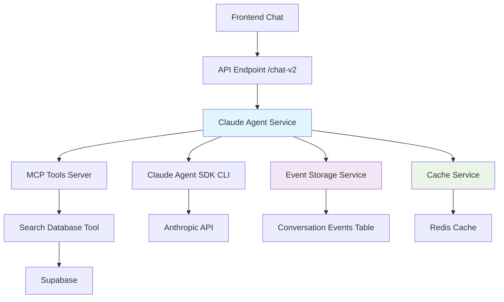
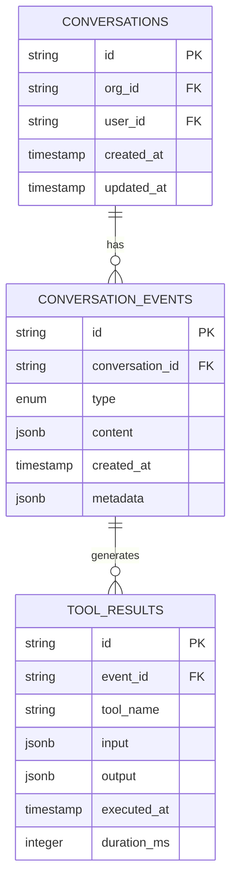
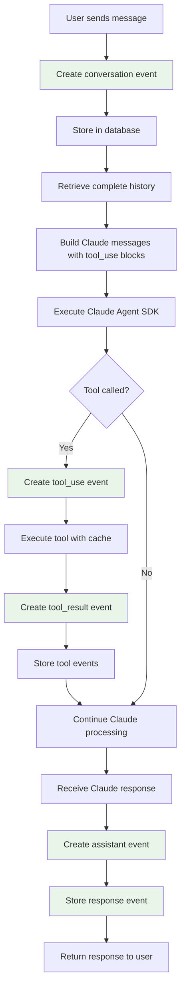
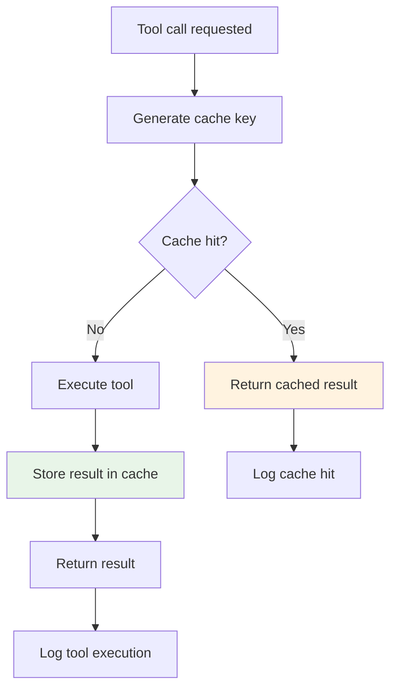

# Design Document: Claude Agent SDK Fixes

## Overview

Este design descreve a arquitetura para implementar correções críticas no Claude Agent SDK, removendo workarounds e estabelecendo uma implementação robusta com histórico completo, testes automatizados e performance otimizada.

## Architecture Design

### System Architecture Diagram



### Data Flow Diagram


## Component Design

### Component A: Event Storage Service

**Responsibilities:**
- Armazenar eventos completos da conversação
- Reconstruir histórico com tool_use blocks
- Gerenciar ciclo de vida dos eventos

**Interfaces:**
```typescript
interface ConversationEvent {
  id: string
  conversationId: string
  type: 'user' | 'assistant' | 'tool_result'
  timestamp: Date
  content: any
  metadata?: Record<string, any>
}

interface EventStorageService {
  storeEvent(event: ConversationEvent): Promise<void>
  getConversationHistory(conversationId: string): Promise<ConversationEvent[]>
  buildClaudeHistory(events: ConversationEvent[]): Promise<ClaudeMessage[]>
}
```

**Dependencies:**
- Supabase client para persistência
- ConversationEvents table (nova)

### Component B: Enhanced Claude Agent Service

**Responsibilities:**
- Gerenciar execução do Claude Agent SDK
- Construir histórico completo sem workarounds
- Processar eventos e respostas

**Interfaces:**
```typescript
interface ClaudeAgentService {
  executeWithHistory(params: {
    conversationId: string
    newMessage: string
    client: SupabaseClient
    orgId: string
  }): Promise<AgentResponse>
}
```

**Dependencies:**
- EventStorageService
- MCP Tools Server
- Cache Service

### Component C: MCP Tools Server (Enhanced)

**Responsibilities:**
- Prover tools customizadas com cache
- Logging otimizado para produção
- Error handling robusto

**Interfaces:**
```typescript
interface ToolCache {
  get<T>(key: string): Promise<T | null>
  set<T>(key: string, value: T, ttl?: number): Promise<void>
}

interface EnhancedToolsServer {
  createCachedTools(cache: ToolCache): SdkMcpServer
}
```

**Dependencies:**
- Redis para cache
- Zod para validação
- Supabase para dados

## Data Models

### Core Data Structure Definitions

```typescript
// Evento de Conversação
interface ConversationEvent {
  id: string
  conversationId: string
  type: 'user' | 'assistant' | 'tool_result'
  timestamp: Date
  content: {
    type: 'text' | 'tool_use' | 'tool_result'
    text?: string
    tool_use_id?: string
    name?: string
    input?: Record<string, any>
    output?: any
  }
  metadata?: {
    model?: string
    tokens?: number
    duration?: number
  }
}

// Mensagem Claude Completa
interface ClaudeMessage {
  role: 'user' | 'assistant'
  content: Array<{
    type: 'text' | 'tool_use' | 'tool_result'
    text?: string
    id?: string
    name?: string
    input?: Record<string, any>
    tool_use_id?: string
    content?: any
  }>
}

// Resposta do Agent
interface AgentResponse {
  text: string
  parts: AgentPart[]
  events: any[]
  conversationId: string
  metadata: {
    tokensUsed: number
    duration: number
    toolsUsed: string[]
  }
}
```

### Data Model Diagrams



## Business Process

### Process 1: Complete Message Flow



### Process 2: Cache-Enhanced Tool Execution



## Error Handling Strategy

### Error Categories and Handling

1. **Tool Execution Errors**
   - Log erro sem informações sensíveis
   - Retornar mensagem amigável ao usuário
   - Não armazenar em cache

2. **Cache Failures**
   - Fallback para execução direta
   - Log warning em produção
   - Continuar operação normalmente

3. **History Reconstruction Errors**
   - Fallback para histórico parcial (user-only)
   - Log erro detalhado para debugging
   - Alertar administrador

4. **SDK Communication Errors**
   - Retry automático com exponential backoff
   - Fallback para resposta genérica
   - Log completo para investigação

### Error Recovery Mechanisms

```typescript
interface ErrorHandler {
  handleToolError(error: Error, context: ToolContext): Promise<ToolResult>
  handleCacheError(error: Error): Promise<void>
  handleHistoryError(error: Error, conversationId: string): Promise<ClaudeMessage[]>
  handleSDKError(error: Error): Promise<AgentResponse>
}
```

## Testing Strategy

### Unit Tests

```typescript
describe('EventStorageService', () => {
  test('should store conversation event')
  test('should retrieve complete history')
  test('should build Claude messages with tool_use blocks')
  test('should handle corrupted events gracefully')
})

describe('CachedToolExecution', () => {
  test('should cache tool results')
  test('should return cached results on repeat calls')
  test('should handle cache misses')
  test('should invalidate cache appropriately')
})
```

### Integration Tests

```typescript
describe('Claude Agent Integration', () => {
  test('should maintain complete conversation context')
  test('should execute tools with caching')
  test('should handle multiple tool calls in conversation')
  test('should recover from tool failures')
})
```

### E2E Tests

```typescript
describe('Chat Flow E2E', () => {
  test('complete conversation with search tool')
  test('conversation persistence across page refresh')
  test('performance with cached results')
})
```

## Implementation Details

### Technology Stack

- **Backend**: Next.js API Routes
- **Database**: Supabase (PostgreSQL)
- **Cache**: Redis (via Upstash)
- **SDK**: @anthropic-ai/claude-agent-sdk
- **Validation**: Zod schemas
- **Testing**: Jest + Supertest

### Key Algorithms

#### History Reconstruction Algorithm

```typescript
function buildClaudeHistory(events: ConversationEvent[]): ClaudeMessage[] {
  const messages: ClaudeMessage[] = []
  const toolResults = new Map<string, any>()
  
  for (const event of events.sort((a, b) => a.timestamp.getTime() - b.timestamp.getTime())) {
    switch (event.type) {
      case 'user':
        messages.push({
          role: 'user',
          content: [{ type: 'text', text: event.content.text }]
        })
        break
        
      case 'assistant':
        const content = [
          { type: 'text', text: event.content.text }
        ]
        
        // Add tool_use blocks if available
        if (event.content.toolUses) {
          for (const toolUse of event.content.toolUses) {
            content.push({
              type: 'tool_use',
              id: toolUse.id,
              name: toolUse.name,
              input: toolUse.input
            })
          }
        }
        
        messages.push({ role: 'assistant', content })
        break
        
      case 'tool_result':
        // Will be added when processing next assistant message
        toolResults.set(event.content.tool_use_id, event.content.output)
        break
    }
  }
  
  return messages
}
```

#### Cache Key Generation

```typescript
function generateCacheKey(toolName: string, input: Record<string, any>): string {
  const normalizedInput = JSON.stringify(input, Object.keys(input).sort())
  const hash = crypto.createHash('sha256').update(normalizedInput).digest('hex')
  return `tool:${toolName}:${hash}`
}
```

## Security Considerations

### Authentication & Authorization
- Validar orgId em todas as operações
- Isolar dados por conversação
- Rate limiting por usuário

### Data Protection
- Sanitizar logs para remover informações sensíveis
- Encriptar dados de cache se necessário
- Retention policy para eventos antigos

### Input Validation
- Validar todos os inputs com Zod schemas
- Sanitizar conteúdo antes de armazenar
- Limitar tamanho de mensagens e conversas

## Performance Optimizations

### Caching Strategy
- **Tool Results**: TTL de 5 minutos para buscas
- **Conversation History**: Cache em memória para sessões ativas
- **Frequent Queries**: Cache de queries populares

### Database Optimizations
- Índices em conversation_id e timestamp
- Partitioning por data para eventos antigos
- Connection pooling para Supabase

### Memory Management
- Limitar tamanho do histórico enviado
- Streaming para conversas longas
- Cleanup automático de cache expirado

## Deployment Considerations

### Environment Variables
```bash
# Cache Configuration
REDIS_URL=redis://localhost:6379
CACHE_TTL_TOOL_RESULTS=300
CACHE_TTL_CONVERSATION=600

# Logging
LOG_LEVEL=info
ENABLE_DEBUG_LOGS=false

# Performance
MAX_HISTORY_LENGTH=50
TOOL_EXECUTION_TIMEOUT=30000
```

### Migration Path
1. Create new tables (conversations, conversation_events)
2. Migrate existing conversations if needed
3. Deploy new services alongside existing
4. Switch traffic to new implementation
5. Remove old code and workarounds

### Monitoring & Observability
- Metrics: cache hit rate, tool execution time, conversation length
- Alerts: high error rates, cache failures, long response times
- Logging: structured logs with correlation IDs