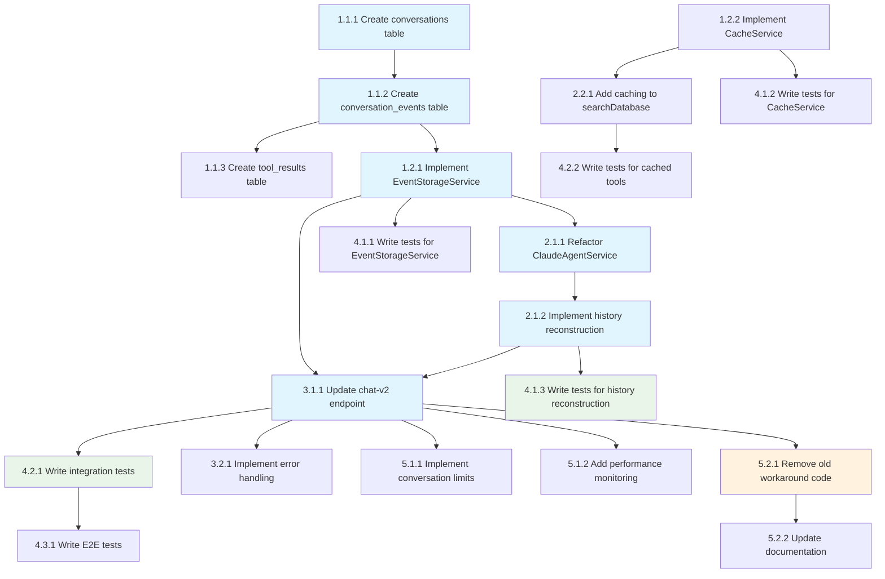

# Implementation Tasks: Claude Agent SDK Fixes

## Phase 1: Foundation Setup

### 1.1 Database Schema Updates
- **Task 1.1.1**: Create conversations table
  - Agent: Claude
  - Priority: High
  - Dependencies: None
  - Files: apps/api/src/migrations/001_create_conversations.sql
  - Acceptance: Migration runs successfully, table created with proper indexes
  - Requirements: 2.1, 3.3

- **Task 1.1.2**: Create conversation_events table
  - Agent: Claude
  - Priority: High
  - Dependencies: Task 1.1.1
  - Files: apps/api/src/migrations/002_create_conversation_events.sql
  - Acceptance: Migration runs successfully, table created with proper indexes
  - Requirements: 2.1, 3.3

- **Task 1.1.3**: Create tool_results table
  - Agent: Claude
  - Priority: Medium
  - Dependencies: Task 1.1.2
  - Files: apps/api/src/migrations/003_create_tool_results.sql
  - Acceptance: Migration runs successfully, table created with proper indexes
  - Requirements: 2.1, 3.3

### 1.2 Core Services
- **Task 1.2.1**: Implement EventStorageService
  - Agent: Claude
  - Priority: High
  - Dependencies: Task 1.1.2
  - Files: apps/api/src/services/event-storage.ts
  - Acceptance: Service stores and retrieves events correctly, builds Claude history with tool_use blocks
  - Requirements: 2.1, 4.1

- **Task 1.2.2**: Implement CacheService
  - Agent: Claude
  - Priority: Medium
  - Dependencies: None
  - Files: apps/api/src/services/cache.ts
  - Acceptance: Service connects to Redis, implements get/set with TTL, handles failures gracefully
  - Requirements: 2.4, 4.4

## Phase 2: Enhanced Claude Agent Service

### 2.1 Core Agent Implementation
- **Task 2.1.1**: Refactor ClaudeAgentService for complete history
  - Agent: Claude
  - Priority: High
  - Dependencies: Task 1.2.1
  - Files: apps/api/src/services/claude-agent.ts
  - Acceptance: Service uses complete history without user-only filter, maintains conversation context
  - Requirements: 2.1, 4.1

- **Task 2.1.2**: Implement history reconstruction algorithm
  - Agent: Claude
  - Priority: High
  - Dependencies: Task 2.1.1
  - Files: apps/api/src/services/history-reconstruction.ts
  - Acceptance: Algorithm correctly rebuilds Claude messages with tool_use blocks from stored events
  - Requirements: 2.1, 4.1

### 2.2 Enhanced MCP Tools
- **Task 2.2.1**: Add caching to searchDatabase tool
  - Agent: Claude
  - Priority: Medium
  - Dependencies: Task 1.2.2
  - Files: apps/api/src/services/claude-agent-tools.ts
  - Acceptance: Tool uses cache for repeat queries, cache hit rate > 30% in tests
  - Requirements: 2.4, 4.4

- **Task 2.2.2**: Remove debug logs from tools
  - Agent: Claude
  - Priority: Medium
  - Dependencies: Task 2.2.1
  - Files: apps/api/src/services/claude-agent-tools.ts
  - Acceptance: Production logs contain only essential information, no debug console.log statements
  - Requirements: 2.2, 4.2

## Phase 3: API Integration

### 3.1 Endpoint Updates
- **Task 3.1.1**: Update chat-v2 endpoint to use complete history
  - Agent: Claude
  - Priority: High
  - Dependencies: Task 2.1.2
  - Files: apps/api/src/routes/chat-v2.ts
  - Acceptance: Endpoint stores all events, retrieves complete history, no user-only filter
  - Requirements: 2.1, 4.1

- **Task 3.1.2**: Add conversation management endpoints
  - Agent: Claude
  - Priority: Medium
  - Dependencies: Task 3.1.1
  - Files: apps/api/src/routes/conversations.ts
  - Acceptance: Endpoints create/retrieve conversations, handle conversation IDs properly
  - Requirements: 2.1

### 3.2 Error Handling
- **Task 3.2.1**: Implement comprehensive error handling
  - Agent: Claude
  - Priority: Medium
  - Dependencies: Task 3.1.1
  - Files: apps/api/src/services/error-handler.ts
  - Acceptance: Service handles all error categories, provides meaningful responses, logs appropriately
  - Requirements: 3.2

## Phase 4: Testing & Validation

### 4.1 Unit Tests
- **Task 4.1.1**: Write tests for EventStorageService
  - Agent: Droid
  - Priority: High
  - Dependencies: Task 1.2.1
  - Files: apps/api/src/__tests__/services/event-storage.test.ts
  - Acceptance: Tests cover all methods, edge cases, error scenarios, >90% coverage
  - Requirements: 2.3, 4.3

- **Task 4.1.2**: Write tests for CacheService
  - Agent: Droid
  - Priority: Medium
  - Dependencies: Task 1.2.2
  - Files: apps/api/src/__tests__/services/cache.test.ts
  - Acceptance: Tests cover cache operations, TTL, failures, >90% coverage
  - Requirements: 2.3, 4.3

- **Task 4.1.3**: Write tests for history reconstruction
  - Agent: Droid
  - Priority: High
  - Dependencies: Task 2.1.2
  - Files: apps/api/src/__tests__/services/history-reconstruction.test.ts
  - Acceptance: Tests cover reconstruction algorithm, edge cases, >90% coverage
  - Requirements: 2.3, 4.3

### 4.2 Integration Tests
- **Task 4.2.1**: Write integration tests for complete chat flow
  - Agent: Droid
  - Priority: High
  - Dependencies: Task 3.1.1
  - Files: apps/api/src/__tests__/integration/chat-flow.test.ts
  - Acceptance: Tests validate complete conversation with tool calls, history persistence
  - Requirements: 2.3, 4.3

- **Task 4.2.2**: Write tests for cached tool execution
  - Agent: Droid
  - Priority: Medium
  - Dependencies: Task 2.2.1
  - Files: apps/api/src/__tests__/integration/cached-tools.test.ts
  - Acceptance: Tests validate cache hit/miss behavior, performance improvement
  - Requirements: 2.3, 4.3, 4.4

### 4.3 E2E Tests
- **Task 4.3.1**: Write E2E tests for chat interface
  - Agent: Droid
  - Priority: Medium
  - Dependencies: Task 4.2.1
  - Files: apps/e2e/tests/chat-complete-history.spec.ts
  - Acceptance: Tests validate complete user journey, conversation persistence across refresh
  - Requirements: 2.3, 4.3

## Phase 5: Performance & Monitoring

### 5.1 Performance Optimization
- **Task 5.1.1**: Implement conversation history limits
  - Agent: Claude
  - Priority: Medium
  - Dependencies: Task 2.1.2
  - Files: apps/api/src/services/conversation-limiter.ts
  - Acceptance: Service limits history to prevent memory issues, maintains recent context
  - Requirements: 3.1

- **Task 5.1.2**: Add performance monitoring
  - Agent: Claude
  - Priority: Low
  - Dependencies: Task 3.1.1
  - Files: apps/api/src/services/monitoring.ts
  - Acceptance: Service tracks response times, cache hit rates, tool execution metrics
  - Requirements: 3.1

### 5.2 Cleanup & Documentation
- **Task 5.2.1**: Remove old workaround code
  - Agent: Claude
  - Priority: Medium
  - Dependencies: Task 3.1.1
  - Files: apps/api/src/services/claude-agent.ts
  - Acceptance: All user-only filter code removed, clean implementation without workarounds
  - Requirements: 2.2

- **Task 5.2.2**: Update documentation
  - Agent: Claude
  - Priority: Low
  - Dependencies: Task 5.2.1
  - Files: claude_code_agent_docs/IMPLEMENTATION_STATUS.md
  - Acceptance: Documentation reflects new implementation, includes troubleshooting guide
  - Requirements: 2.2

## Dependencies Graph

## Total Tasks: 18
**Estimated Time:** 3-4 days
**Success Metrics:** 
- Complete conversation history without workarounds
- Cache hit rate > 30% for repeat queries
- Test coverage > 90%
- Production logs clean of debug statements
- Response time < 2 seconds for tool calls
<!-- ORCHESTRATOR-TASKS-SYNC START -->
## Orchestrator Task Status

- [ ] **1.1.1** — Create conversations table
  - Status: pending
  - Atualizado: 2025-10-27T17:46:33.791783+00:00
  - Assistente: não atribuído
- [ ] **1.1.2** — Create conversation_events table
  - Status: pending
  - Atualizado: 2025-10-27T17:46:57.284049+00:00
  - Assistente: não atribuído
- [ ] **1.1.3** — Create tool_results table
  - Status: pending
  - Atualizado: 2025-10-27T17:47:07.445535+00:00
  - Assistente: não atribuído
- [ ] **1.2.1** — Implement EventStorageService
  - Status: pending
  - Atualizado: 2025-10-27T17:47:09.562317+00:00
  - Assistente: não atribuído
- [ ] **1.2.2** — Implement CacheService
  - Status: pending
  - Atualizado: 2025-10-27T17:47:11.844567+00:00
  - Assistente: não atribuído
- [ ] **2.1.1** — Refactor ClaudeAgentService for complete history
  - Status: pending
  - Atualizado: 2025-10-27T17:47:14.111771+00:00
  - Assistente: não atribuído
- [ ] **2.1.2** — Implement history reconstruction algorithm
  - Status: pending
  - Atualizado: 2025-10-27T17:47:17.133159+00:00
  - Assistente: não atribuído
- [ ] **2.2.1** — Add caching to searchDatabase tool
  - Status: pending
  - Atualizado: 2025-10-27T17:47:18.916131+00:00
  - Assistente: não atribuído
- [ ] **2.2.2** — Remove debug logs from tools
  - Status: pending
  - Atualizado: 2025-10-27T17:47:20.677220+00:00
  - Assistente: não atribuído
- [ ] **3.1.1** — Update chat-v2 endpoint to use complete history
  - Status: pending
  - Atualizado: 2025-10-27T17:47:22.512208+00:00
  - Assistente: não atribuído
- [ ] **3.1.2** — Add conversation management endpoints
  - Status: pending
  - Atualizado: 2025-10-27T17:47:26.850862+00:00
  - Assistente: não atribuído
- [ ] **3.2.1** — Implement comprehensive error handling
  - Status: pending
  - Atualizado: 2025-10-27T17:47:29.043749+00:00
  - Assistente: não atribuído
- [ ] **4.1.1** — Write tests for EventStorageService
  - Status: pending
  - Atualizado: 2025-10-27T17:47:30.878511+00:00
  - Assistente: não atribuído
- [ ] **4.1.2** — Write tests for CacheService
  - Status: pending
  - Atualizado: 2025-10-27T17:47:32.729871+00:00
  - Assistente: não atribuído
- [ ] **4.1.3** — Write tests for history reconstruction
  - Status: pending
  - Atualizado: 2025-10-27T17:47:34.485156+00:00
  - Assistente: não atribuído
- [ ] **4.2.1** — Write integration tests for complete chat flow
  - Status: pending
  - Atualizado: 2025-10-27T17:47:36.199103+00:00
  - Assistente: não atribuído
- [ ] **4.2.2** — Write tests for cached tool execution
  - Status: pending
  - Atualizado: 2025-10-27T17:47:38.153090+00:00
  - Assistente: não atribuído
- [ ] **4.3.1** — Write E2E tests for chat interface
  - Status: pending
  - Atualizado: 2025-10-27T17:47:39.791642+00:00
  - Assistente: não atribuído
- [ ] **5.1.1** — Implement conversation history limits
  - Status: pending
  - Atualizado: 2025-10-27T17:47:41.661456+00:00
  - Assistente: não atribuído
- [ ] **5.1.2** — Add performance monitoring
  - Status: pending
  - Atualizado: 2025-10-27T17:47:43.343300+00:00
  - Assistente: não atribuído
- [ ] **5.2.1** — Remove old workaround code
  - Status: pending
  - Atualizado: 2025-10-27T17:47:45.016505+00:00
  - Assistente: não atribuído
- [ ] **5.2.2** — Update documentation
  - Status: pending
  - Atualizado: 2025-10-27T17:47:46.774054+00:00
  - Assistente: não atribuído
- [ ] **batch-execution** — Task batch-execution
  - Status: running
  - Atualizado: 2025-10-27T17:48:25.128047+00:00
  - Assistente: Droid (terminal e40f354e-c2d3-4af5-bbb1-8c8918673dee) — comando: droid -- "Auto-generated task for batch-execution"
<!-- ORCHESTRATOR-TASKS-SYNC END -->
