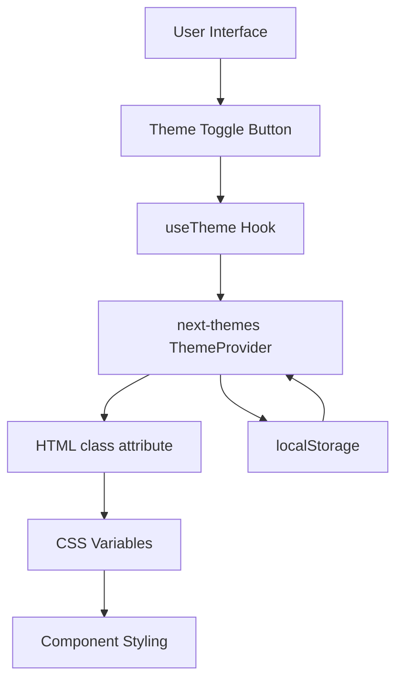
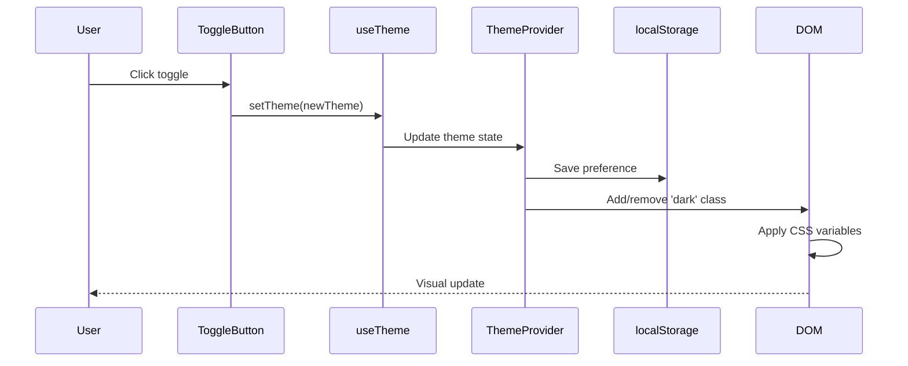
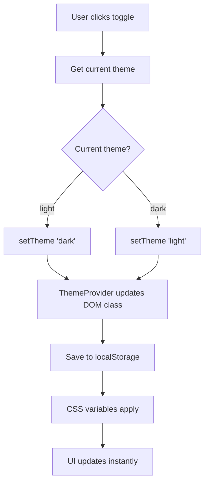
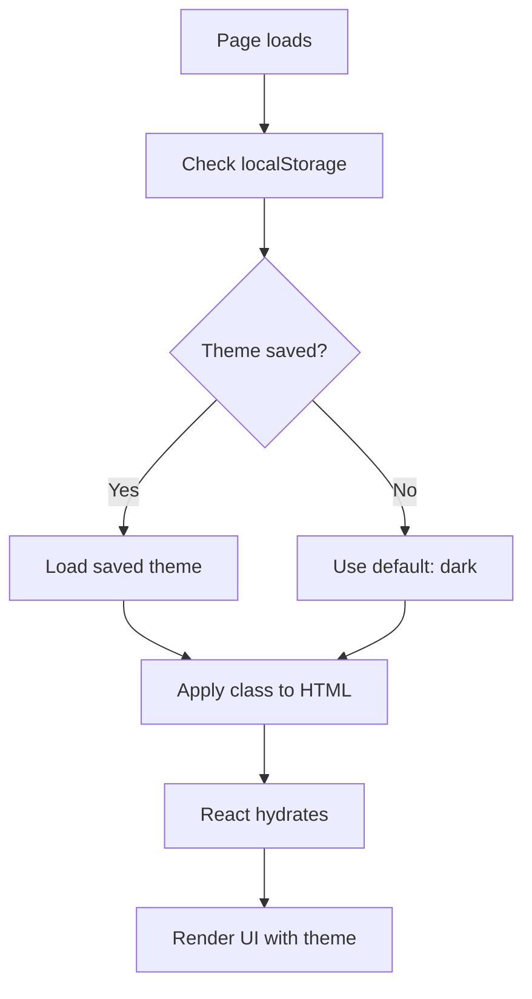

# Design: Dark Mode Toggle

## 1. Overview

This design implements a theme toggle button that allows users to switch between light and dark modes. The implementation leverages the existing next-themes infrastructure and ensures the dark mode matches the visual aesthetic of the Connect AI Modal.

## 2. Architecture Design

### 2.1 System Architecture



### 2.2 Data Flow



## 3. Component Design

### 3.1 Theme Toggle Button Component

**Location**: `apps/web/components/theme-toggle.tsx`

**Responsibilities**:
- Render a button with appropriate icon (sun/moon)
- Use the `useTheme` hook from next-themes
- Toggle between 'light' and 'dark' themes
- Provide visual feedback on current theme
- Handle loading state during hydration

**Interface**:
```typescript
interface ThemeToggleProps {
  className?: string
  showLabel?: boolean
}

export function ThemeToggle({ className, showLabel = false }: ThemeToggleProps)
```

**Dependencies**:
- `next-themes` (useTheme hook)
- `lucide-react` (Sun, Moon icons)
- `@ui/components/button` (Button component)

### 3.2 Integration Points

**Menu Component** (`apps/web/components/menu.tsx`):
- Add ThemeToggle to the menu items list
- Position after existing menu items or in a dedicated settings section

**Mobile Considerations**:
- Include toggle in mobile menu panel
- Ensure touch-friendly tap target (min 44x44px)

## 4. Data Models

### 4.1 Theme State

The theme state is managed by next-themes ThemeProvider:

```typescript
type Theme = 'light' | 'dark'

interface ThemeState {
  theme: Theme | undefined        // Current theme
  setTheme: (theme: Theme) => void  // Theme setter
  resolvedTheme: Theme | undefined  // Resolved theme (never 'system')
}
```

### 4.2 localStorage Schema

```typescript
{
  "theme": "dark" | "light"  // User's theme preference
}
```

## 5. Styling Strategy

### 5.1 CSS Variables (Already Defined)

The application uses CSS custom properties defined in `packages/ui/globals.css`:

**Light Mode** (`:root`):
```css
--background: oklch(1 0 0)
--foreground: oklch(0.141 0.005 285.823)
--border: oklch(0.92 0.004 286.32)
/* ... other variables */
```

**Dark Mode** (`.dark`):
```css
--background: oklch(0.141 0.005 285.823)
--foreground: oklch(0.985 0 0)
--border: oklch(1 0 0 / 10%)
/* ... other variables */
```

### 5.2 Dark Mode Color Matching

To ensure dark mode matches the Connect AI Modal, the existing `.dark` class variables already provide:

- Dark backgrounds: `--background: oklch(0.141 0.005 285.823)`
- Light text: `--foreground: oklch(0.985 0 0)`
- Transparent borders: `--border: oklch(1 0 0 / 10%)`
- Muted elements: `--muted: oklch(0.274 0.006 286.033)`

These match the modal's aesthetic using:
- `bg-background` → dark background
- `text-foreground` → white text
- `border` → white/10 opacity borders

### 5.3 Toggle Button Styling

```typescript
// Light mode icon
<Sun className="h-[1.2rem] w-[1.2rem] rotate-0 scale-100 transition-all dark:-rotate-90 dark:scale-0" />

// Dark mode icon
<Moon className="absolute h-[1.2rem] w-[1.2rem] rotate-90 scale-0 transition-all dark:rotate-0 dark:scale-100" />
```

## 6. Business Process

### 6.1 Theme Toggle Flow



### 6.2 Initial Load Flow



## 7. Implementation Details

### 7.1 File Changes Required

**New Files**:
1. `apps/web/components/theme-toggle.tsx` - Theme toggle button component

**Modified Files**:
1. `apps/web/components/menu.tsx` - Add theme toggle to menu
2. (Optional) `apps/web/app/page.tsx` - Add theme toggle to main page header if needed

### 7.2 Component Implementation Pseudocode

```typescript
// apps/web/components/theme-toggle.tsx
"use client"

import { Moon, Sun } from "lucide-react"
import { useTheme } from "next-themes"
import { useEffect, useState } from "react"
import { Button } from "@ui/components/button"

export function ThemeToggle({ className, showLabel = false }) {
  const { theme, setTheme } = useTheme()
  const [mounted, setMounted] = useState(false)

  // Prevent hydration mismatch
  useEffect(() => setMounted(true), [])

  if (!mounted) {
    return <Button variant="ghost" size="icon" className={className} />
  }

  const toggleTheme = () => {
    setTheme(theme === "dark" ? "light" : "dark")
  }

  return (
    <Button
      variant="ghost"
      size={showLabel ? "default" : "icon"}
      onClick={toggleTheme}
      className={className}
    >
      <Sun className="h-[1.2rem] w-[1.2rem] rotate-0 scale-100 transition-all dark:-rotate-90 dark:scale-0" />
      <Moon className="absolute h-[1.2rem] w-[1.2rem] rotate-90 scale-0 transition-all dark:rotate-0 dark:scale-100" />
      {showLabel && <span className="ml-2">{theme === "dark" ? "Light" : "Dark"} Mode</span>}
      <span className="sr-only">Toggle theme</span>
    </Button>
  )
}
```

### 7.3 Menu Integration

Add theme toggle to menu items in `apps/web/components/menu.tsx`:

```typescript
// Option 1: Add to menuItems array
{
  icon: Sun, // or custom icon component
  text: "Theme",
  key: "theme" as const,
  disabled: false,
}

// Option 2: Add as standalone button in menu render
<ThemeToggle className="..." showLabel={!isMobile} />
```

## 8. Error Handling

### 8.1 Hydration Mismatch Prevention

**Issue**: Server renders without knowing the theme, client hydrates with theme.

**Solution**: 
- Use `mounted` state to prevent rendering during SSR
- Show placeholder button until client-side hydration completes
- next-themes handles script injection to prevent FOUC (Flash of Unstyled Content)

### 8.2 localStorage Failures

**Issue**: localStorage might be unavailable (private browsing, storage full)

**Solution**:
- next-themes gracefully falls back to default theme
- No custom error handling needed as library handles this

## 9. Testing Strategy

### 9.1 Manual Testing Checklist

- [ ] Click toggle changes theme from light to dark
- [ ] Click toggle changes theme from dark to light
- [ ] Refresh page preserves theme choice
- [ ] Open in new tab uses saved theme
- [ ] Dark mode colors match Connect AI Modal
- [ ] No flash of unstyled content on page load
- [ ] Toggle works on mobile menu
- [ ] Toggle works on desktop
- [ ] Rapid clicking doesn't break the toggle
- [ ] Icons animate smoothly during transition

### 9.2 Visual Regression Testing

Compare screenshots:
- Light mode vs existing light theme
- Dark mode vs Connect AI Modal colors
- Theme transition smoothness

### 9.3 Browser Testing

Test on:
- Chrome/Edge (latest)
- Firefox (latest)
- Safari (latest)
- Mobile Safari (iOS)
- Mobile Chrome (Android)

## 10. Performance Considerations

### 10.1 Render Optimization

- Toggle button uses `useTheme` hook (minimal re-renders)
- CSS variables enable instant theme switching (no JS-based style recalculation)
- Icons use CSS transforms (GPU-accelerated)

### 10.2 Bundle Size Impact

- next-themes: ~3KB gzipped (already included)
- ThemeToggle component: <1KB
- Icons from lucide-react (already included)
- **Total new impact**: <1KB

## 11. Accessibility

### 11.1 ARIA Labels

```typescript
<Button aria-label="Toggle theme">
  <span className="sr-only">Toggle theme</span>
</Button>
```

### 11.2 Keyboard Navigation

- Button is keyboard accessible (Tab to focus, Enter/Space to activate)
- Focus visible styles applied via Tailwind's focus-visible

### 11.3 Screen Readers

- Current theme announced when changed
- Button purpose clearly labeled

## 12. Deployment

### 12.1 Migration Strategy

1. Create ThemeToggle component
2. Test in isolation
3. Integrate into Menu component
4. Deploy to staging
5. Verify theme persistence
6. Deploy to production

### 12.2 Rollback Plan

If issues arise:
- Remove ThemeToggle from Menu
- Users default to dark theme (current behavior)
- No data loss (theme preference in localStorage only)

## 13. Future Enhancements (Out of Scope)

- System theme detection
- Multiple theme variations (e.g., high contrast)
- Per-user theme preferences synced to backend
- Scheduled theme switching (day/night)
- Custom color picker for advanced users
