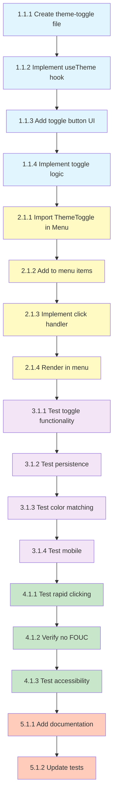

# Implementation Tasks: Dark Mode Toggle

## Phase 1: Component Creation

### 1.1 Create ThemeToggle Component

- [ ] **Task 1.1.1**: Create theme-toggle.tsx component file
  - Priority: High
  - Dependencies: None
  - Files: apps/web/components/theme-toggle.tsx
  - Acceptance: 
    - File created with proper client component directive
    - Component exports ThemeToggle function
    - TypeScript interface ThemeToggleProps defined with className and showLabel properties
  - Requirements: FR-1, FR-2

- [ ] **Task 1.1.2**: Implement useTheme hook integration
  - Priority: High
  - Dependencies: Task 1.1.1
  - Files: apps/web/components/theme-toggle.tsx
  - Acceptance:
    - Import useTheme from next-themes
    - Destructure theme and setTheme from hook
    - Add mounted state to prevent hydration mismatch
    - useEffect sets mounted to true on client side
  - Requirements: FR-2, FR-3

- [ ] **Task 1.1.3**: Add toggle button UI with icons
  - Priority: High
  - Dependencies: Task 1.1.2
  - Files: apps/web/components/theme-toggle.tsx
  - Acceptance:
    - Import Sun and Moon icons from lucide-react
    - Import Button component from @ui/components/button
    - Render Button with variant ghost and conditional size
    - Sun icon visible in light mode with rotation animation classes
    - Moon icon visible in dark mode with rotation animation classes
    - Add sr-only span for screen readers
    - Optional label text when showLabel prop is true
  - Requirements: FR-1, FR-5

- [ ] **Task 1.1.4**: Implement theme toggle logic
  - Priority: High
  - Dependencies: Task 1.1.3
  - Files: apps/web/components/theme-toggle.tsx
  - Acceptance:
    - Create toggleTheme function that calls setTheme
    - Toggle between light and dark based on current theme
    - Connect onClick handler to toggleTheme function
    - Return placeholder button during SSR hydration
  - Requirements: FR-2, FR-5

## Phase 2: Menu Integration

### 2.1 Add ThemeToggle to Menu Component

- [ ] **Task 2.1.1**: Import ThemeToggle in Menu component
  - Priority: High
  - Dependencies: Task 1.1.4
  - Files: apps/web/components/menu.tsx
  - Acceptance:
    - Add import statement for ThemeToggle component
    - Import placed with other component imports
  - Requirements: FR-1

- [ ] **Task 2.1.2**: Add theme toggle to menu items list
  - Priority: High
  - Dependencies: Task 2.1.1
  - Files: apps/web/components/menu.tsx
  - Acceptance:
    - Add theme item to menuItems array with Sun icon
    - Set key as theme
    - Set disabled to false
    - Text set to Theme or Dark Mode
  - Requirements: FR-1

- [ ] **Task 2.1.3**: Implement theme menu item click handler
  - Priority: High
  - Dependencies: Task 2.1.2
  - Files: apps/web/components/menu.tsx
  - Acceptance:
    - Update handleMenuItemClick to handle theme key
    - When theme key clicked render ThemeToggle or trigger theme change directly
    - Close mobile menu if on mobile
    - Maintain existing menu behavior for other items
  - Requirements: FR-1

- [ ] **Task 2.1.4**: Add ThemeToggle to menu render section
  - Priority: Medium
  - Dependencies: Task 2.1.3
  - Files: apps/web/components/menu.tsx
  - Acceptance:
    - Render ThemeToggle button in appropriate menu section
    - Pass showLabel prop based on desktop vs mobile
    - Apply appropriate className for styling consistency
    - Ensure button is visible and accessible on both mobile and desktop
  - Requirements: FR-1

## Phase 3: Testing and Validation

### 3.1 Manual Testing

- [ ] **Task 3.1.1**: Test theme toggle functionality
  - Priority: High
  - Dependencies: Task 2.1.4
  - Files: N/A (manual testing)
  - Acceptance:
    - Click toggle switches from light to dark mode
    - Click toggle switches from dark to light mode
    - Visual changes apply immediately
    - No console errors during toggle
    - Icons animate smoothly between states
  - Requirements: FR-2, FR-5

- [ ] **Task 3.1.2**: Test theme persistence
  - Priority: High
  - Dependencies: Task 3.1.1
  - Files: N/A (manual testing)
  - Acceptance:
    - Set theme to light and refresh page remains light
    - Set theme to dark and refresh page remains dark
    - Open new tab inherits saved theme
    - localStorage contains theme key with correct value
  - Requirements: FR-3

- [ ] **Task 3.1.3**: Test dark mode color matching
  - Priority: High
  - Dependencies: Task 3.1.2
  - Files: N/A (manual testing)
  - Acceptance:
    - Compare dark mode colors with Connect AI Modal
    - Backgrounds match modal background color
    - Borders match white/10 opacity style
    - Text colors match white/80 and white/60 opacity
    - Overall aesthetic is consistent with modal
  - Requirements: FR-4

- [ ] **Task 3.1.4**: Test mobile responsiveness
  - Priority: Medium
  - Dependencies: Task 3.1.3
  - Files: N/A (manual testing)
  - Acceptance:
    - Toggle accessible in mobile menu
    - Button tap target is at least 44x44 pixels
    - Toggle works correctly on touch devices
    - No layout issues on small screens
  - Requirements: FR-1

## Phase 4: Edge Cases and Polish

### 4.1 Handle Edge Cases

- [ ] **Task 4.1.1**: Test rapid clicking behavior
  - Priority: Medium
  - Dependencies: Task 3.1.4
  - Files: apps/web/components/theme-toggle.tsx
  - Acceptance:
    - Multiple rapid clicks handled gracefully
    - No visual glitches or state inconsistencies
    - Theme stays synchronized with localStorage
    - No memory leaks or performance degradation
  - Requirements: FR-2, FR-5

- [ ] **Task 4.1.2**: Verify no FOUC on page load
  - Priority: High
  - Dependencies: Task 4.1.1
  - Files: N/A (manual testing)
  - Acceptance:
    - Hard refresh shows no flash of wrong theme
    - Page loads directly with correct saved theme
    - No visible transition from default to saved theme
    - next-themes script prevents unstyled content flash
  - Requirements: FR-5

- [ ] **Task 4.1.3**: Test accessibility features
  - Priority: Medium
  - Dependencies: Task 4.1.2
  - Files: apps/web/components/theme-toggle.tsx
  - Acceptance:
    - Button accessible via keyboard Tab navigation
    - Enter or Space key activates toggle
    - Screen reader announces button purpose
    - Focus visible styles display correctly
    - ARIA labels present and accurate
  - Requirements: FR-1

## Phase 5: Documentation and Cleanup

### 5.1 Code Documentation

- [ ] **Task 5.1.1**: Add component documentation
  - Priority: Low
  - Dependencies: Task 4.1.3
  - Files: apps/web/components/theme-toggle.tsx
  - Acceptance:
    - JSDoc comments added to ThemeToggle component
    - Props interface documented
    - Usage examples in comments
    - Explanation of hydration mismatch prevention
  - Requirements: N/A (code quality)

- [ ] **Task 5.1.2**: Update test files if needed
  - Priority: Low
  - Dependencies: Task 5.1.1
  - Files: apps/web/components/tests/ (if exists)
  - Acceptance:
    - Unit tests written for ThemeToggle if test infrastructure exists
    - Tests cover toggle functionality
    - Tests cover hydration behavior
    - All tests pass
  - Requirements: N/A (code quality)

## Dependencies Graph

## Total Tasks: 17

**Estimated Time**: 3-4 hours

**Success Metrics**:
- All acceptance criteria met
- Theme toggle works reliably on all devices
- Dark mode colors match Connect AI Modal
- No performance issues or visual glitches
- Code is clean and well-documented
