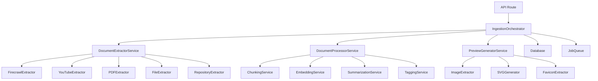
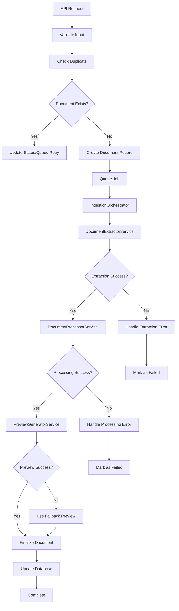
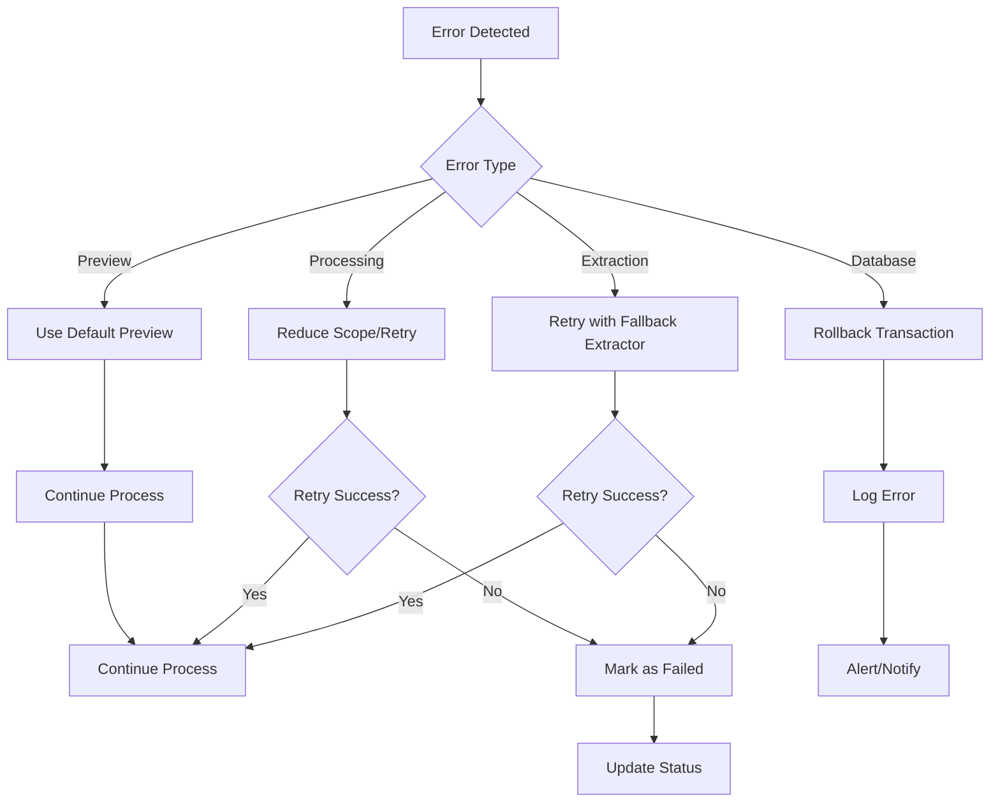

# Design: document-processing-refactor

## 1. Architecture Overview

### 1.1 High-Level Architecture


### 1.2 Component Structure
- **IngestionOrchestrator**: Orquestra todo o fluxo de ingestão
- **DocumentExtractorService**: Responsabilidade única de extrair conteúdo
- **DocumentProcessorService**: Responsabilidade única de processar e enriquecer
- **PreviewGeneratorService**: Responsabilidade única de gerar previews
- **Specialized Extractors**: Um por tipo de documento (URL, YouTube, PDF, etc.)

## 2. Service Architecture

### 2.1 Core Services

#### IngestionOrchestratorService
```typescript
interface IngestionOrchestratorService {
  processDocument(input: ProcessDocumentInput): Promise<ProcessingResult>
  queueDocument(input: QueueDocumentInput): Promise<JobResult>
  retryFailedDocument(documentId: string): Promise<void>
}
```

**Responsibilities:**
- Coordenar todo o fluxo de ingestão
- Gerenciar estado e transições
- Chamar serviços especializados na ordem correta
- Implementar circuit breakers e retry logic
- Garantir atomicidade das operações

#### DocumentExtractorService
```typescript
interface DocumentExtractorService {
  extract(input: ExtractionInput): Promise<ExtractionResult>
  extractFromUrl(url: string, metadata?: Metadata): Promise<ExtractionResult>
  extractFromFile(file: FileInput, metadata?: Metadata): Promise<ExtractionResult>
  extractFromYouTube(url: string, metadata?: Metadata): Promise<ExtractionResult>
  extractFromRepository(url: string, metadata?: Metadata): Promise<ExtractionResult>
}
```

**Responsibilities:**
- Responsabilidade única: extrair conteúdo bruto
- Delegar para extractors especializados
- Normalizar resultados de todos os extractors
- Implementar fallback chains
- Validar entrada e sanitizar saída

#### DocumentProcessorService
```typescript
interface DocumentProcessorService {
  process(extraction: ExtractionResult): Promise<ProcessedDocument>
  chunk(content: string): Promise<Chunk[]>
  generateEmbeddings(chunks: Chunk[]): Promise<number[][]>
  generateSummary(content: string): Promise<string>
  generateTags(content: string): Promise<string[]>
}
```

**Responsibilities:**
- Responsabilidade única: processar e enriquecer conteúdo
- Chunking inteligente
- Geração de embeddings (com fallback híbrido)
- Summarização e tagging
- Preparação para armazenamento

#### PreviewGeneratorService
```typescript
interface PreviewGeneratorService {
  generate(input: PreviewInput): Promise<PreviewResult>
  extractImage(extraction: ExtractionResult): Promise<string | null>
  generateSVG(extraction: ExtractionResult): Promise<string>
  getFavicon(url: string): Promise<string | null>
}
```

**Responsibilities:**
- Responsabilidade única: gerar previews visuais
- Extrair imagens de documentos
- Gerar SVGs para documentos sem imagem
- Obter favicons de URLs
- Cache de previews

### 2.2 Specialized Extractors

#### FirecrawlExtractor
```typescript
class FirecrawlExtractor implements DocumentExtractor {
  async extract(input: ExtractionInput): Promise<ExtractionResult> {
    // Lógica específica para URLs web
    // Fallback para scraping direto se Firecrawl falhar
  }
}
```

#### YouTubeExtractor
```typescript
class YouTubeExtractor implements DocumentExtractor {
  async extract(input: ExtractionInput): Promise<ExtractionResult> {
    // Lógica específica para YouTube
    // yt-dlp + transcrições
    // Fallback para metadata apenas
  }
}
```

#### PDFExtractor
```typescript
class PDFExtractor implements DocumentExtractor {
  async extract(input: ExtractionInput): Promise<ExtractionResult> {
    // Lógica específica para PDFs
    // Replicate OCR como primário
    // Fallback para text extraction
  }
}
```

#### FileExtractor
```typescript
class FileExtractor implements DocumentExtractor {
  async extract(input: ExtractionInput): Promise<ExtractionResult> {
    // Lógica para arquivos Office, texto, etc.
    // MarkItDown como primário
    // Fallback para parsing direto
  }
}
```

#### RepositoryExtractor
```typescript
class RepositoryExtractor implements DocumentExtractor {
  async extract(input: ExtractionInput): Promise<ExtractionResult> {
    // Lógica para repositórios GitHub
    // Estrutura de arquivos + README
  }
}
```

## 3. Data Models

### 3.1 Core Interfaces
```typescript
interface ExtractionInput {
  originalContent?: string
  url?: string | null
  type?: string | null
  metadata?: Record<string, unknown> | null
}

interface ExtractionResult {
  text: string
  title: string | null
  source: string
  url: string | null
  contentType: string | null
  raw: Record<string, unknown> | null
  wordCount: number
}

interface ProcessedDocument {
  content: string
  summary: string
  chunks: Chunk[]
  embeddings: number[][]
  tags: string[]
  metadata: Record<string, unknown>
}

interface Chunk {
  content: string
  position: number
  metadata: Record<string, unknown>
  embedding: number[]
}

interface PreviewResult {
  url: string
  source: string
  type: 'image' | 'svg' | 'favicon'
}
```

### 3.2 Error Handling Model
```typescript
interface ProcessingError {
  code: string
  message: string
  details?: Record<string, unknown>
  recoverable: boolean
  retryAfter?: number
}

interface ProcessingResult {
  success: boolean
  documentId?: string
  status: 'queued' | 'processing' | 'done' | 'failed'
  error?: ProcessingError
  metadata?: Record<string, unknown>
}
```

## 4. Business Process

### 4.1 Document Ingestion Flow


### 4.2 Error Recovery Flow


## 5. Implementation Strategy

### 5.1 Phase 1: Core Services (Week 1)
1. Criar `IngestionOrchestratorService`
2. Refatorar `DocumentExtractorService` com extractors especializados
3. Criar `DocumentProcessorService`
4. Criar `PreviewGeneratorService`

### 5.2 Phase 2: Integration (Week 2)
1. Integrar serviços no `documents.ts`
2. Implementar circuit breakers
3. Adicionar retry logic
4. Testes de integração

### 5.3 Phase 3: Optimization (Week 3)
1. Performance tuning
2. Cache implementation
3. Monitoring e logging
4. Documentação

## 6. Error Handling Strategy

### 6.1 Circuit Breaker Pattern
```typescript
class CircuitBreaker {
  private failures = 0
  private lastFailureTime = 0
  private state: 'closed' | 'open' | 'half-open' = 'closed'
  
  async execute<T>(operation: () => Promise<T>): Promise<T> {
    if (this.state === 'open') {
      if (Date.now() - this.lastFailureTime > this.timeout) {
        this.state = 'half-open'
      } else {
        throw new Error('Circuit breaker is open')
      }
    }
    
    try {
      const result = await operation()
      this.onSuccess()
      return result
    } catch (error) {
      this.onFailure()
      throw error
    }
  }
}
```

### 6.2 Retry Logic
```typescript
async function withRetry<T>(
  operation: () => Promise<T>,
  options: RetryOptions = {}
): Promise<T> {
  const { maxAttempts = 3, baseDelay = 1000 } = options
  
  for (let attempt = 1; attempt <= maxAttempts; attempt++) {
    try {
      return await operation()
    } catch (error) {
      if (attempt === maxAttempts) throw error
      
      const delay = baseDelay * Math.pow(2, attempt - 1)
      await new Promise(resolve => setTimeout(resolve, delay))
    }
  }
  
  throw new Error('Max retry attempts reached')
}
```

### 6.3 Fallback Chains
```typescript
class ExtractorChain {
  private extractors: DocumentExtractor[] = []
  
  async extract(input: ExtractionInput): Promise<ExtractionResult> {
    let lastError: Error
    
    for (const extractor of this.extractors) {
      try {
        return await extractor.extract(input)
      } catch (error) {
        lastError = error as Error
        continue
      }
    }
    
    throw new Error(`All extractors failed: ${lastError?.message}`)
  }
}
```

## 7. Testing Strategy

### 7.1 Unit Tests
- Cada service isoladamente
- Extractors especializados
- Error handling scenarios
- Fallback mechanisms

### 7.2 Integration Tests
- Fluxo completo de ingestão
- Error recovery
- Performance benchmarks
- Concurrent processing

### 7.3 Load Tests
- 100+ documentos simultâneos
- Memory usage monitoring
- Rate limiting compliance
- Database performance

## 8. Monitoring & Observability

### 8.1 Structured Logging
```typescript
interface LogEntry {
  timestamp: string
  level: 'info' | 'warn' | 'error'
  service: string
  operation: string
  documentId?: string
  duration?: number
  error?: string
  metadata?: Record<string, unknown>
}
```

### 8.2 Metrics
- Success/failure rates per extractor
- Processing time per document type
- Memory usage trends
- Error patterns and frequencies

### 8.3 Alerts
- High failure rates (>10%)
- Processing timeouts (>30s)
- Memory leaks detection
- Database connection issues

## 9. Migration Plan

### 9.1 Backward Compatibility
- Manter APIs existentes
- Gradual migration de endpoints
- Feature flags para new services
- Rollback capability

### 9.2 Data Migration
- Nenhuma mudança na estrutura do banco
- Migração apenas de lógica de negócio
- Preservação de dados existentes
- Testes de regressão completos

### 9.3 Deployment Strategy
1. Deploy new services alongside old ones
2. Gradual traffic shifting
3. Monitor metrics closely
4. Quick rollback if issues arise