# Tasks: document-processing-refactor

## Phase 1: Core Services Foundation

### 1.1 Create Core Service Interfaces
- **Task 1.1.1**: Create service interfaces and types
  - Agent: Claude
  - Priority: High
  - Dependencies: None
  - Files: apps/api/src/services/interfaces/document-processing.ts
  - Acceptance: All service interfaces defined with proper TypeScript types
  - Requirements: 2.1, 2.2

- **Task 1.1.2**: Create base service classes
  - Agent: Claude
  - Priority: High
  - Dependencies: Task 1.1.1
  - Files: apps/api/src/services/base/base-service.ts
  - Acceptance: Base service class with common functionality (logging, error handling)
  - Requirements: 2.1, 3.3

### 1.2 Create IngestionOrchestratorService
- **Task 1.2.1**: Implement IngestionOrchestratorService
  - Agent: Claude
  - Priority: High
  - Dependencies: Task 1.1.1, Task 1.1.2
  - Files: apps/api/src/services/orchestration/ingestion-orchestrator.ts
  - Acceptance: Service can orchestrate document processing flow
  - Requirements: 2.1, 2.2, 3.3

- **Task 1.2.2**: Add circuit breaker implementation
  - Agent: Claude
  - Priority: Medium
  - Dependencies: Task 1.2.1
  - Files: apps/api/src/services/orchestration/circuit-breaker.ts
  - Acceptance: Circuit breaker protects external service calls
  - Requirements: 3.3, 6.1

- **Task 1.2.3**: Add retry logic with exponential backoff
  - Agent: Claude
  - Priority: Medium
  - Dependencies: Task 1.2.1
  - Files: apps/api/src/services/orchestration/retry-handler.ts
  - Acceptance: Automatic retry with backoff for failed operations
  - Requirements: 3.3, 6.2

## Phase 2: DocumentExtractorService Refactoring

### 2.1 Create Specialized Extractors
- **Task 2.1.1**: Create FirecrawlExtractor for URLs
  - Agent: Claude
  - Priority: High
  - Dependencies: Task 1.1.1
  - Files: apps/api/src/services/extraction/firecrawl-extractor.ts
  - Acceptance: Reliable URL content extraction with fallback
  - Requirements: 2.5, 4.13

- **Task 2.1.2**: Create YouTubeExtractor for videos
  - Agent: Claude
  - Priority: High
  - Dependencies: Task 1.1.1
  - Files: apps/api/src/services/extraction/youtube-extractor.ts
  - Acceptance: Robust YouTube transcript extraction
  - Requirements: 2.5, 4.14

- **Task 2.1.3**: Create PDFExtractor for documents
  - Agent: Claude
  - Priority: High
  - Dependencies: Task 1.1.1
  - Files: apps/api/src/services/extraction/pdf-extractor.ts
  - Acceptance: PDF extraction with OCR fallback
  - Requirements: 2.5, 4.15

- **Task 2.1.4**: Create FileExtractor for office documents
  - Agent: Claude
  - Priority: High
  - Dependencies: Task 1.1.1
  - Files: apps/api/src/services/extraction/file-extractor.ts
  - Acceptance: DOCX/XLSX extraction with MarkItDown
  - Requirements: 2.5, 4.16

- **Task 2.1.5**: Create RepositoryExtractor for GitHub
  - Agent: Claude
  - Priority: Medium
  - Dependencies: Task 1.1.1
  - Files: apps/api/src/services/extraction/repository-extractor.ts
  - Acceptance: GitHub repository content extraction
  - Requirements: 2.5, 4.17

### 2.2 Create DocumentExtractorService
- **Task 2.2.1**: Implement DocumentExtractorService
  - Agent: Claude
  - Priority: High
  - Dependencies: Task 2.1.1, Task 2.1.2, Task 2.1.3, Task 2.1.4, Task 2.1.5
  - Files: apps/api/src/services/extraction/document-extractor.ts
  - Acceptance: Unified interface for all extraction types with fallback chains
  - Requirements: 2.1, 2.2, 2.5

- **Task 2.2.2**: Add extraction validation and sanitization
  - Agent: Claude
  - Priority: High
  - Dependencies: Task 2.2.1
  - Files: apps/api/src/services/extraction/extraction-validator.ts
  - Acceptance: Input validation and output sanitization for all extractors
  - Requirements: 3.3, 4.10

## Phase 3: DocumentProcessorService Implementation

### 3.1 Create Processing Services
- **Task 3.1.1**: Create ChunkingService
  - Agent: Claude
  - Priority: High
  - Dependencies: Task 1.1.1
  - Files: apps/api/src/services/processing/chunking-service.ts
  - Acceptance: Intelligent text chunking with overlap
  - Requirements: 2.2, 3.2

- **Task 3.1.2**: Create EmbeddingService
  - Agent: Claude
  - Priority: High
  - Dependencies: Task 1.1.1
  - Files: apps/api/src/services/processing/embedding-service.ts
  - Acceptance: Hybrid embedding strategy (Gemini + deterministic)
  - Requirements: 2.2, 3.2

- **Task 3.1.3**: Create SummarizationService
  - Agent: Claude
  - Priority: High
  - Dependencies: Task 1.1.1
  - Files: apps/api/src/services/processing/summarization-service.ts
  - Acceptance: AI-powered document summarization
  - Requirements: 2.2

- **Task 3.1.4**: Create TaggingService
  - Agent: Claude
  - Priority: Medium
  - Dependencies: Task 1.1.1
  - Files: apps/api/src/services/processing/tagging-service.ts
  - Acceptance: Automatic tag generation for documents
  - Requirements: 2.2

### 3.2 Create DocumentProcessorService
- **Task 3.2.1**: Implement DocumentProcessorService
  - Agent: Claude
  - Priority: High
  - Dependencies: Task 3.1.1, Task 3.1.2, Task 3.1.3, Task 3.1.4
  - Files: apps/api/src/services/processing/document-processor.ts
  - Acceptance: Complete document processing pipeline
  - Requirements: 2.1, 2.2, 3.2

## Phase 4: PreviewGeneratorService Implementation

### 4.1 Create Preview Services
- **Task 4.1.1**: Create ImageExtractor
  - Agent: Claude
  - Priority: High
  - Dependencies: Task 1.1.1
  - Files: apps/api/src/services/preview/image-extractor.ts
  - Acceptance: Extract preview images from documents
  - Requirements: 2.2, 2.5

- **Task 4.1.2**: Create SVGGenerator
  - Agent: Claude
  - Priority: High
  - Dependencies: Task 1.1.1
  - Files: apps/api/src/services/preview/svg-generator.ts
  - Acceptance: Generate SVG previews for documents without images
  - Requirements: 2.2, 2.5

- **Task 4.1.3**: Create FaviconExtractor
  - Agent: Claude
  - Priority: Medium
  - Dependencies: Task 1.1.1
  - Files: apps/api/src/services/preview/favicon-extractor.ts
  - Acceptance: Extract favicons from URLs as fallback
  - Requirements: 2.2, 2.5

### 4.2 Create PreviewGeneratorService
- **Task 4.2.1**: Implement PreviewGeneratorService
  - Agent: Claude
  - Priority: High
  - Dependencies: Task 4.1.1, Task 4.1.2, Task 4.1.3
  - Files: apps/api/src/services/preview/preview-generator.ts
  - Acceptance: Complete preview generation with fallbacks
  - Requirements: 2.1, 2.2, 2.5

## Phase 5: Integration and Migration

### 5.1 Update Existing Services
- **Task 5.1.1**: Refactor existing ingestion.ts to use new services
  - Agent: Claude
  - Priority: High
  - Dependencies: Task 1.2.1, Task 2.2.1, Task 3.2.1, Task 4.2.1
  - Files: apps/api/src/services/ingestion.ts
  - Acceptance: Old ingestion service uses new architecture
  - Requirements: 2.1, 3.3

- **Task 5.1.2**: Update existing extractor.ts to use new DocumentExtractorService
  - Agent: Claude
  - Priority: High
  - Dependencies: Task 2.2.1
  - Files: apps/api/src/services/extractor.ts
  - Acceptance: Legacy extractor delegates to new service
  - Requirements: 2.1, 2.2

- **Task 5.1.3**: Update existing preview.ts to use new PreviewGeneratorService
  - Agent: Claude
  - Priority: High
  - Dependencies: Task 4.2.1
  - Files: apps/api/src/services/preview.ts
  - Acceptance: Legacy preview uses new service
  - Requirements: 2.1, 2.2

### 5.2 Update API Routes
- **Task 5.2.1**: Update documents.ts route to use IngestionOrchestratorService
  - Agent: Claude
  - Priority: High
  - Dependencies: Task 5.1.1
  - Files: apps/api/src/routes/documents.ts
  - Acceptance: API route uses new orchestration service
  - Requirements: 2.1, 3.3

- **Task 5.2.2**: Add comprehensive input validation
  - Agent: Claude
  - Priority: High
  - Dependencies: Task 5.2.1
  - Files: apps/api/src/routes/documents.ts
  - Acceptance: Rigorous input validation prevents corrupted data
  - Requirements: 3.3, 4.10

### 5.3 Add Monitoring and Logging
- **Task 5.3.1**: Implement structured logging
  - Agent: Claude
  - Priority: Medium
  - Dependencies: Task 1.2.1
  - Files: apps/api/src/services/logging/structured-logger.ts
  - Acceptance: Consistent logging across all services
  - Requirements: 3.3, 8.1

- **Task 5.3.2**: Add performance monitoring
  - Agent: Claude
  - Priority: Medium
  - Dependencies: Task 5.3.1
  - Files: apps/api/src/services/monitoring/performance-monitor.ts
  - Acceptance: Track processing times and success rates
  - Requirements: 3.3, 8.2

## Phase 6: Testing and Validation

### 6.1 Unit Tests
- **Task 6.1.1**: Create unit tests for DocumentExtractorService
  - Agent: Droid
  - Priority: High
  - Dependencies: Task 2.2.1
  - Files: apps/api/src/services/extraction/__tests__/document-extractor.test.ts
  - Acceptance: All extraction scenarios tested
  - Requirements: 7.1

- **Task 6.1.2**: Create unit tests for DocumentProcessorService
  - Agent: Droid
  - Priority: High
  - Dependencies: Task 3.2.1
  - Files: apps/api/src/services/processing/__tests__/document-processor.test.ts
  - Acceptance: All processing scenarios tested
  - Requirements: 7.1

- **Task 6.1.3**: Create unit tests for PreviewGeneratorService
  - Agent: Droid
  - Priority: High
  - Dependencies: Task 4.2.1
  - Files: apps/api/src/services/preview/__tests__/preview-generator.test.ts
  - Acceptance: All preview scenarios tested
  - Requirements: 7.1

### 6.2 Integration Tests
- **Task 6.2.1**: Create integration tests for document ingestion flow
  - Agent: Droid
  - Priority: High
  - Dependencies: Task 5.2.1
  - Files: apps/api/src/routes/__tests__/documents-integration.test.ts
  - Acceptance: Complete ingestion flow tested
  - Requirements: 7.2

- **Task 6.2.2**: Create error handling tests
  - Agent: Droid
  - Priority: High
  - Dependencies: Task 5.2.1
  - Files: apps/api/src/services/__tests__/error-handling.test.ts
  - Acceptance: All error scenarios handled correctly
  - Requirements: 7.2

### 6.3 Performance Tests
- **Task 6.3.1**: Create performance benchmarks
  - Agent: Droid
  - Priority: Medium
  - Dependencies: Task 6.2.1
  - Files: apps/api/src/services/__tests__/performance-benchmarks.test.ts
  - Acceptance: Performance meets requirements
  - Requirements: 7.3

## Phase 7: Documentation and Cleanup

### 7.1 Code Documentation
- **Task 7.1.1**: Add comprehensive JSDoc comments
  - Agent: Claude
  - Priority: Medium
  - Dependencies: All previous tasks
  - Files: All service files
  - Acceptance: All public methods documented
  - Requirements: 6.2

- **Task 7.1.2**: Create service usage examples
  - Agent: Claude
  - Priority: Low
  - Dependencies: Task 7.1.1
  - Files: apps/api/docs/services-usage.md
  - Acceptance: Clear examples for each service
  - Requirements: 6.2

### 7.2 Cleanup
- **Task 7.2.1**: Remove duplicate code from legacy files
  - Agent: Claude
  - Priority: Medium
  - Dependencies: Task 5.1.2, Task 5.1.3
  - Files: apps/api/src/services/extractor.ts, apps/api/src/services/preview.ts, apps/api/src/services/ingestion.ts
  - Acceptance: Zero duplication of extraction logic, legacy files delegate to new services
  - Requirements: 2.1, 2.3

- **Task 7.2.2**: Update imports and dependencies
  - Agent: Claude
  - Priority: Medium
  - Dependencies: Task 7.2.1
  - Files: All service files
  - Acceptance: Clean import structure
  - Requirements: 2.1

## Dependencies Graph

```mermaid
graph TD
    T1_1_1[1.1.1 Interfaces] --> T1_1_2[1.1.2 Base Service]
    T1_1_1 --> T2_1_1[2.1.1 FirecrawlExtractor]
    T1_1_1 --> T2_1_2[2.1.2 YouTubeExtractor]
    T1_1_1 --> T2_1_3[2.1.3 PDFExtractor]
    T1_1_1 --> T2_1_4[2.1.4 FileExtractor]
    T1_1_1 --> T2_1_5[2.1.5 RepositoryExtractor]
    T1_1_1 --> T3_1_1[3.1.1 ChunkingService]
    T1_1_1 --> T3_1_2[3.1.2 EmbeddingService]
    T1_1_1 --> T3_1_3[3.1.3 SummarizationService]
    T1_1_1 --> T3_1_4[3.1.4 TaggingService]
    T1_1_1 --> T4_1_1[4.1.1 ImageExtractor]
    T1_1_1 --> T4_1_2[4.1.2 SVGGenerator]
    T1_1_1 --> T4_1_3[4.1.3 FaviconExtractor]
    
    T1_1_2 --> T1_2_1[1.2.1 IngestionOrchestrator]
    T1_2_1 --> T1_2_2[1.2.2 Circuit Breaker]
    T1_2_1 --> T1_2_3[1.2.3 Retry Logic]
    
    T2_1_1 --> T2_2_1[2.2.1 DocumentExtractorService]
    T2_1_2 --> T2_2_1
    T2_1_3 --> T2_2_1
    T2_1_4 --> T2_2_1
    T2_1_5 --> T2_2_1
    T2_2_1 --> T2_2_2[2.2.2 Validation]
    
    T3_1_1 --> T3_2_1[3.2.1 DocumentProcessorService]
    T3_1_2 --> T3_2_1
    T3_1_3 --> T3_2_1
    T3_1_4 --> T3_2_1
    
    T4_1_1 --> T4_2_1[4.2.1 PreviewGeneratorService]
    T4_1_2 --> T4_2_1
    T4_1_3 --> T4_2_1
    
    T1_2_1 --> T5_1_1[5.1.1 Refactor Ingestion]
    T2_2_1 --> T5_1_2[5.1.2 Refactor Extractor]
    T4_2_1 --> T5_1_3[5.1.3 Refactor Preview]
    T3_2_1 --> T5_1_1
    
    T5_1_1 --> T5_2_1[5.2.1 Update API Route]
    T5_1_2 --> T5_2_1
    T5_1_3 --> T5_2_1
    T5_2_1 --> T5_2_2[5.2.2 Add Validation]
    
    T5_2_1 --> T6_1_1[6.1.1 Unit Tests - Extractor]
    T5_2_1 --> T6_1_2[6.1.2 Unit Tests - Processor]
    T5_2_1 --> T6_1_3[6.1.3 Unit Tests - Preview]
    T5_2_1 --> T6_2_1[6.2.1 Integration Tests]
    T5_2_1 --> T6_2_2[6.2.2 Error Handling Tests]
    
    T6_2_1 --> T6_3_1[6.3.1 Performance Tests]
    
    T5_2_1 --> T7_1_1[7.1.1 Documentation]
    T7_1_1 --> T7_1_2[7.1.2 Usage Examples]
    
    T5_1_2 --> T7_2_1[7.2.1 Remove Duplicates]
    T5_1_3 --> T7_2_1
    T7_2_1 --> T7_2_2[7.2.2 Update Dependencies]
```

## Total Tasks: 32
**Estimated Time**: 3-4 weeks
**Success Metrics**: 
- Zero duplication of extraction code
- >95% success rate for all document types
- 30% improvement in processing time
- Complete backward compatibility
- Comprehensive test coverage
<!-- ORCHESTRATOR-TASKS-SYNC START -->
## Orchestrator Task Status

- [x] **T1.1.1** — Create service interfaces and types
  - Status: completed
  - Atualizado: 2025-11-04T15:19:51.993207+00:00
  - Assistente: Claude Code (terminal 73aa6f41-a8ea-45a2-9683-9ed2864435ad) — comando: claude --dangerously-skip-permissions "Task 1.1.1: Create service interfaces and types Create comprehensive TypeScript i...
- [x] **T1.1.2** — Task T1.1.2
  - Status: completed
  - Atualizado: 2025-11-04T15:29:40.281301+00:00
  - Assistente: Claude Code (terminal 73aa6f41-a8ea-45a2-9683-9ed2864435ad) — comando: claude --dangerously-skip-permissions "Execute all remaining Phase 1 tasks sequentially: Task 1.1.2: Create base service...
- [x] **T1.2.1** — Task T1.2.1
  - Status: completed
  - Atualizado: 2025-11-04T15:29:45.167295+00:00
  - Assistente: não atribuído
- [x] **T1.2.2** — Task T1.2.2
  - Status: completed
  - Atualizado: 2025-11-04T15:29:49.780931+00:00
  - Assistente: não atribuído
- [x] **T1.2.3** — Task T1.2.3
  - Status: completed
  - Atualizado: 2025-11-04T15:29:53.723045+00:00
  - Assistente: não atribuído
- [x] **T2.1.1** — Task T2.1.1
  - Status: completed
  - Atualizado: 2025-11-04T15:43:01.888607+00:00
  - Assistente: Claude Code (terminal 73aa6f41-a8ea-45a2-9683-9ed2864435ad) — comando: claude --dangerously-skip-permissions "Execute all Phase 2 tasks sequentially: Task 2.1.1: Create FirecrawlExtractor for...
- [x] **T2.1.2** — Task T2.1.2
  - Status: completed
  - Atualizado: 2025-11-04T15:43:09.778553+00:00
  - Assistente: não atribuído
- [x] **T2.1.3** — Task T2.1.3
  - Status: completed
  - Atualizado: 2025-11-04T15:43:14.413584+00:00
  - Assistente: não atribuído
- [x] **T2.1.4** — Task T2.1.4
  - Status: completed
  - Atualizado: 2025-11-04T15:43:20.302498+00:00
  - Assistente: não atribuído
- [x] **T2.1.5** — Task T2.1.5
  - Status: completed
  - Atualizado: 2025-11-04T15:43:25.356674+00:00
  - Assistente: não atribuído
- [x] **T2.2.1** — Task T2.2.1
  - Status: completed
  - Atualizado: 2025-11-04T15:43:29.131276+00:00
  - Assistente: não atribuído
- [x] **T2.2.2** — Task T2.2.2
  - Status: completed
  - Atualizado: 2025-11-04T15:43:36.111639+00:00
  - Assistente: não atribuído
- [x] **T3.1.1** — Task T3.1.1
  - Status: completed
  - Atualizado: 2025-11-04T15:54:38.656497+00:00
  - Assistente: Claude Code (terminal 73aa6f41-a8ea-45a2-9683-9ed2864435ad) — comando: claude --dangerously-skip-permissions "Execute all Phase 3 tasks sequentially: Task 3.1.1: Create ChunkingService Implem...
- [x] **T3.1.2** — Task T3.1.2
  - Status: completed
  - Atualizado: 2025-11-04T15:54:44.223105+00:00
  - Assistente: não atribuído
- [x] **T3.1.3** — Task T3.1.3
  - Status: completed
  - Atualizado: 2025-11-04T15:54:51.572842+00:00
  - Assistente: não atribuído
- [x] **T3.1.4** — Task T3.1.4
  - Status: completed
  - Atualizado: 2025-11-04T15:54:56.197448+00:00
  - Assistente: não atribuído
- [x] **T3.2.1** — Task T3.2.1
  - Status: completed
  - Atualizado: 2025-11-04T15:55:00.422304+00:00
  - Assistente: não atribuído
- [x] **T4.1.1** — Task T4.1.1
  - Status: completed
  - Atualizado: 2025-11-04T16:04:17.103464+00:00
  - Assistente: Claude Code (terminal 73aa6f41-a8ea-45a2-9683-9ed2864435ad) — comando: claude --dangerously-skip-permissions "Execute all Phase 4 tasks sequentially: Task 4.1.1: Create ImageExtractor Impleme...
- [x] **T4.1.2** — Task T4.1.2
  - Status: completed
  - Atualizado: 2025-11-04T16:04:20.921027+00:00
  - Assistente: não atribuído
- [x] **T4.1.3** — Task T4.1.3
  - Status: completed
  - Atualizado: 2025-11-04T16:04:25.604527+00:00
  - Assistente: não atribuído
- [x] **T4.2.1** — Task T4.2.1
  - Status: completed
  - Atualizado: 2025-11-04T16:04:32.795439+00:00
  - Assistente: não atribuído
- [x] **T5.1.1** — Task T5.1.1
  - Status: completed
  - Atualizado: 2025-11-04T16:20:14.646474+00:00
  - Assistente: Claude Code (terminal 73aa6f41-a8ea-45a2-9683-9ed2864435ad) — comando: claude --dangerously-skip-permissions "Execute all Phase 5 tasks sequentially: Task 5.1.1: Refactor existing ingestion.t...
- [x] **T5.1.2** — Task T5.1.2
  - Status: completed
  - Atualizado: 2025-11-04T16:20:18.438155+00:00
  - Assistente: não atribuído
- [x] **T5.1.3** — Task T5.1.3
  - Status: completed
  - Atualizado: 2025-11-04T16:20:25.354648+00:00
  - Assistente: não atribuído
- [x] **T5.2.1** — Task T5.2.1
  - Status: completed
  - Atualizado: 2025-11-04T16:20:29.914839+00:00
  - Assistente: não atribuído
- [x] **T5.2.2** — Task T5.2.2
  - Status: completed
  - Atualizado: 2025-11-04T16:20:35.213550+00:00
  - Assistente: não atribuído
- [x] **T6.1.1** — Task T6.1.1
  - Status: completed
  - Atualizado: 2025-11-04T16:58:00.173726+00:00
  - Assistente: Droid (terminal 8dd1eb5b-85f8-42db-b771-cfcab0426224) — comando: droid -- "Execute all Phase 6 testing tasks sequentially: Task 6.1.1: Create unit tests for DocumentExtractorService Cre...
- [x] **T6.1.2** — Task T6.1.2
  - Status: completed
  - Atualizado: 2025-11-04T16:58:08.668567+00:00
  - Assistente: não atribuído
- [x] **T6.1.3** — Task T6.1.3
  - Status: completed
  - Atualizado: 2025-11-04T16:58:16.226710+00:00
  - Assistente: não atribuído
- [x] **T6.2.1** — Task T6.2.1
  - Status: completed
  - Atualizado: 2025-11-04T16:58:24.882729+00:00
  - Assistente: não atribuído
- [x] **T6.2.2** — Task T6.2.2
  - Status: completed
  - Atualizado: 2025-11-04T16:58:27.740361+00:00
  - Assistente: não atribuído
- [x] **T6.3.1** — Task T6.3.1
  - Status: completed
  - Atualizado: 2025-11-04T16:58:31.157542+00:00
  - Assistente: não atribuído
- [x] **T7.1.1** — Task T7.1.1
  - Status: completed
  - Atualizado: 2025-11-04T17:13:41.792370+00:00
  - Assistente: Claude Code (terminal bc530803-15ca-44f0-82ad-ed7bdfeebf80) — comando: claude --dangerously-skip-permissions "Execute all Phase 7 final tasks sequentially: Task 7.1.1: Add comprehensive JSDoc...
- [x] **T7.1.2** — Task T7.1.2
  - Status: completed
  - Atualizado: 2025-11-04T17:13:46.052125+00:00
  - Assistente: não atribuído
- [x] **T7.2.1** — Task T7.2.1
  - Status: completed
  - Atualizado: 2025-11-04T17:13:49.647978+00:00
  - Assistente: não atribuído
- [x] **T7.2.2** — Task T7.2.2
  - Status: completed
  - Atualizado: 2025-11-04T17:13:54.897184+00:00
  - Assistente: não atribuído
<!-- ORCHESTRATOR-TASKS-SYNC END -->
