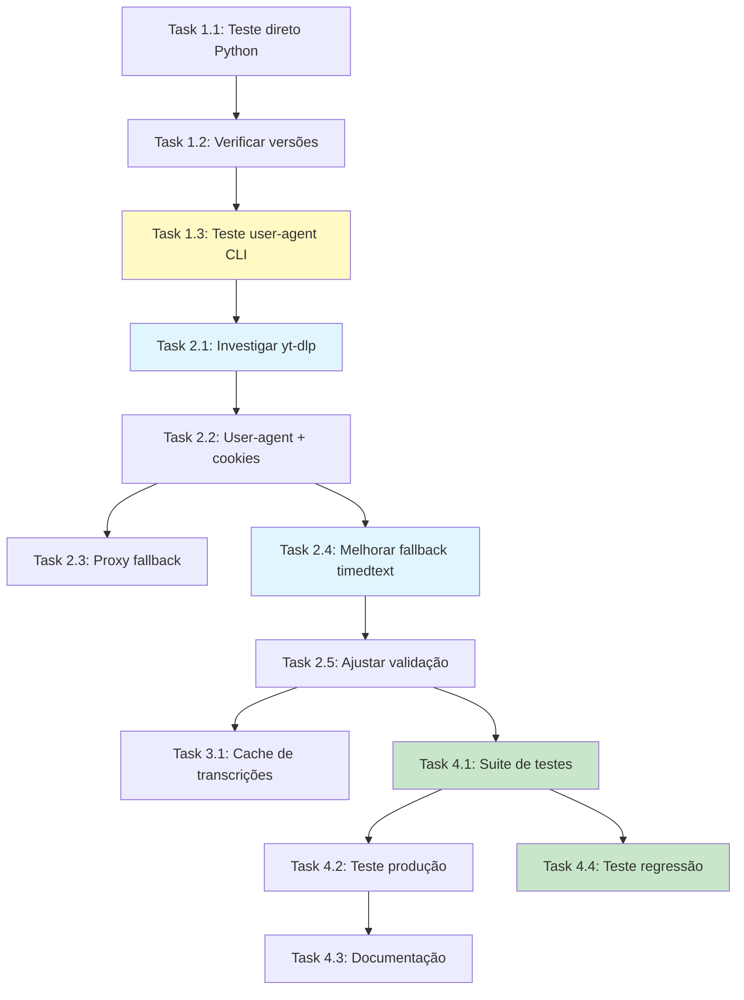

# Tasks: markitdown-youtube-fix

## Objetivo
Corrigir bloqueio do YouTube na extração de transcrições e garantir transcrições completas via MarkItDown.

## Contexto
- MarkItDown está instalado corretamente (v0.1.3)
- Todas as dependências estão presentes
- YouTube está bloqueando requests por IP (rate limit/cloud IP detection)
- Fallback timedtext também está sendo bloqueado
- Código atual tem retry logic mas não está funcionando

---

## Fase 1: Diagnóstico e Análise ✅ COMPLETO

- [x] **Task 1.1**: Testar MarkItDown diretamente via Python ✅
  - Priority: High
  - Dependencies: None
  - Files: test_markitdown_youtube.py
  - Status: COMPLETO (2025-11-03)
  - Resultado:
    - ✅ Confirmado: YouTube bloqueia /api/timedtext com HTTP 429
    - ✅ 3 tentativas foram feitas (retry 2s delay)
    - ✅ MarkItDown tem fallback funcional para HTML parsing
    - ❌ Fallback retorna apenas footer/metadata (748 chars)
  - Ver: DIAGNOSTIC_REPORT.md seção "Task 1.1"

- [x] **Task 1.2**: Verificar configuração do youtube-transcript-api ✅
  - Priority: High
  - Dependencies: Task 1.1
  - Files: apps/markitdown/requirements.txt
  - Status: COMPLETO (2025-11-03)
  - Resultado:
    - ✅ Versão instalada: 1.2.3 (correta, >= 1.2.3)
    - ✅ Retry implementado: 3 tentativas, 2s delay
    - ✅ Tratamento de erro existe
    - ✅ Problema NÃO é de configuração/versão
  - Ver: DIAGNOSTIC_REPORT.md seção "Task 1.2"

- [x] **Task 1.3**: Testar user-agent e headers via CLI ✅
  - Priority: High
  - Dependencies: Task 1.2
  - Files: test_youtube_headers.py
  - Status: COMPLETO (2025-11-03)
  - Resultado:
    - ❌ User-Agent customizado NÃO resolve
    - ❌ Headers de navegador completos NÃO resolvem
    - ❌ Cookies/session NÃO ajudam
    - ✅ Confirmado: bloqueio de IP pelo YouTube
  - Ver: DIAGNOSTIC_REPORT.md seção "Task 1.3"

**Diagnóstico Completo**: Ver `DIAGNOSTIC_REPORT.md` para análise detalhada

---

## Fase 2: Implementação de Soluções

- [x] **Task 2.1**: Investigar yt-dlp como alternativa ✅
  - Priority: High
  - Dependencies: Task 1.3
  - Files: test_ytdlp_poc.py, test_ytdlp_advanced.py
  - Status: COMPLETO (2025-11-03)
  - Resultado:
    - ❌ yt-dlp TAMBÉM sofre bloqueio HTTP 429
    - ✅ Testados 6 formatos: VTT, SRT, JSON (0% success rate)
    - ✅ Testadas 5 estratégias: basic, web, android, mediaconnect, list-subs
    - ✅ `--list-subs` funciona (lista legendas sem bloqueio)
    - ❌ Download de legendas: HTTP 429 em todas as estratégias
    - ✅ Comparação completa documentada
    - 💡 Recomendação: NÃO migrar para yt-dlp (não resolve bloqueio)
    - ⭐ Alternativa melhor: YouTube Data API v3 (oficial)
  - Ver: YTDLP_COMPARISON_REPORT.md para análise completa

- [ ] **Task 2.2**: Implementar cookies e user-agent realista
  - Priority: High
  - Dependencies: Task 2.1
  - Files: apps/api/src/services/markitdown.ts
  - Acceptance:
    - Adicionar user-agent de browser real ao Python script
    - Configurar cookies de sessão se necessário
    - Testar se resolve bloqueio básico
  - Requirements: Bypass de detecção básica

- [ ] **Task 2.3**: Implementar proxy/VPN fallback (se necessário)
  - Priority: Medium
  - Dependencies: Task 2.2
  - Files: apps/api/src/services/markitdown.ts, apps/api/src/config/constants.ts
  - Acceptance:
    - Adicionar variável de ambiente YOUTUBE_PROXY (opcional)
    - Implementar fallback para proxy se configurado
    - Documentar configuração no README
  - Requirements: Fallback para bloqueios persistentes

- [ ] **Task 2.4**: Melhorar fallback timedtext com headers corretos
  - Priority: High
  - Dependencies: Task 2.2
  - Files: apps/api/src/services/markitdown.ts (função fetchYouTubeTimedTextVtt)
  - Acceptance:
    - Adicionar headers realistas (user-agent, accept, etc.)
    - Adicionar retry logic ao fallback
    - Testar múltiplos idiomas (en, pt, es)
  - Requirements: Fallback robusto

- [ ] **Task 2.5**: Ajustar validação de transcrições
  - Priority: Medium
  - Dependencies: Task 2.4
  - Files: apps/api/src/services/markitdown.ts (função isValidYouTubeTranscript)
  - Acceptance:
    - Reduzir MIN_VALID_LENGTH de 300 para 200 (vídeos curtos)
    - Melhorar detecção de "footer only" (mais patterns)
    - Adicionar logging detalhado de validação
  - Requirements: Aceitar transcrições válidas curtas

---

## Fase 3: Alternativas Robustas

- [ ] **Task 3.1**: Implementar cache de transcrições
  - Priority: Medium
  - Dependencies: Task 2.5
  - Files: apps/api/src/services/markitdown.ts, apps/api/src/cache/ (novo)
  - Acceptance:
    - Cache de transcrições por videoId
    - TTL de 7 dias para transcrições
    - Reduzir chamadas ao YouTube
    - Implementar invalidação manual se necessário
  - Requirements: Reduzir dependência de API externa

---

## Fase 4: Testes e Validação

- [ ] **Task 4.1**: Criar suite de testes com URLs reais
  - Priority: High
  - Dependencies: Task 2.5
  - Files: ai_specs/markitdown-youtube-fix/tests/youtube-urls.test.ts
  - Acceptance:
    - Lista de 10 URLs do YouTube de diferentes tipos
    - Teste automatizado de extração
    - Validação de conteúdo mínimo
    - Taxa de sucesso > 80%
  - Requirements: Validação completa

- [ ] **Task 4.2**: Testar em ambiente de produção
  - Priority: High
  - Dependencies: Task 4.1
  - Files: Deploy scripts
  - Acceptance:
    - Deploy em staging
    - Testar com IPs de cloud (Railway/Vercel)
    - Confirmar funcionamento ou documentar limitações
  - Requirements: Validação em ambiente real

- [ ] **Task 4.3**: Documentar limitações e workarounds
  - Priority: Medium
  - Dependencies: Task 4.2
  - Files: docs/YOUTUBE_TRANSCRIPTION.md (novo), README.md
  - Acceptance:
    - Documentar bloqueios conhecidos
    - Explicar como configurar proxy
    - Listar alternativas (yt-dlp, cache)
  - Requirements: Documentação completa

- [ ] **Task 4.4**: Testar regressão (backward compatibility)
  - Priority: High
  - Dependencies: Task 4.1
  - Files: ai_specs/markitdown-youtube-fix/tests/regression.test.ts
  - Acceptance:
    - Testar URLs normais (não-YouTube) continuam funcionando
    - Testar PDFs, DOCX, PPTX, Excel não foram afetados
    - Testar extração de imagens e áudio
    - Confirmar zero breaking changes em funcionalidades existentes
  - Requirements: Garantir backward compatibility

---

## Task Dependency Diagram

---

## Resumo

**Total de Tasks**: 14
**Tempo Estimado**: 5-7 horas
**Prioridade Alta**: 8 tasks
**Bloqueadores Conhecidos**: YouTube rate limiting, cloud IP detection

**Success Metrics**:
- Taxa de sucesso > 80% em extração de transcrições
- Fallback funcionando quando MarkItDown falha
- Logs claros para debugging
- Documentação completa de limitações
<!-- ORCHESTRATOR-TASKS-SYNC START -->
## Orchestrator Task Status

- [x] **T1.1** — Testar MarkItDown diretamente via Python
  - Status: completed
  - Atualizado: 2025-11-03T08:39:57.535575+00:00
  - Assistente: Claude Code (terminal c05a8dd1-eefd-49c1-ad51-656f2cea2309) — comando: claude --dangerously-skip-permissions "Lote 1 Diagnostico Completo: Tasks 1.1, 1.2, 1.3 Task 1.1: Testar MarkItDown dire...
- [x] **T1.2** — Verificar configuração do youtube-transcript-api
  - Status: completed
  - Atualizado: 2025-11-03T08:40:03.443342+00:00
  - Assistente: Claude Code
- [x] **T1.3** — Testar user-agent e headers via CLI
  - Status: completed
  - Atualizado: 2025-11-03T08:40:10.202559+00:00
  - Assistente: Claude Code
- [x] **T2.1** — Investigar yt-dlp como alternativa
  - Status: completed
  - Atualizado: 2025-11-03T08:48:34.445865+00:00
  - Assistente: Claude Code (terminal c05a8dd1-eefd-49c1-ad51-656f2cea2309) — comando: claude --dangerously-skip-permissions "Task 2.1: Investigar yt-dlp como alternativa Priority: High Dependencies: Task 1....
<!-- ORCHESTRATOR-TASKS-SYNC END -->

