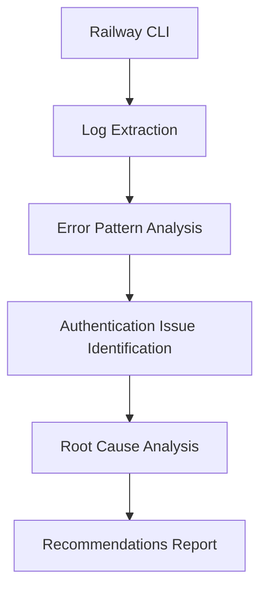
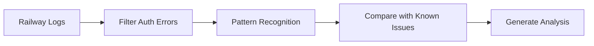
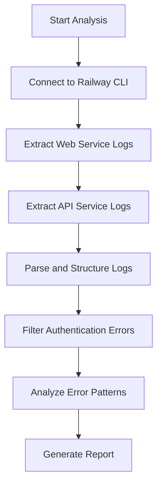
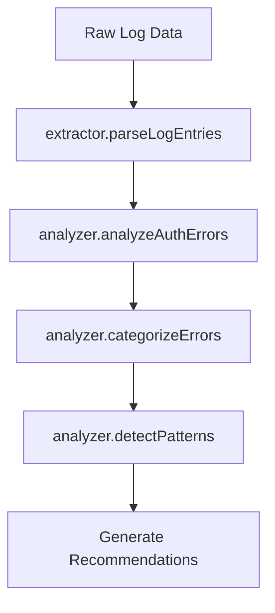

# Design: railway-log-analysis

## Overview
Design a systematic approach to analyze Railway production logs and identify authentication issues using Claude Code's analytical capabilities.

## Architecture Design
### System Architecture Diagram


### Data Flow Diagram


## Component Design
### Log Extractor Component
- Responsibilities:
  - Connect to Railway CLI
  - Fetch logs from both web and API services
  - Handle pagination and large log volumes
- Interfaces:
  - `extractLogs(service, lines, filters)`
  - `parseLogEntries(rawLogs)`
- Dependencies: Railway CLI, terminal access

### Error Analyzer Component
- Responsibilities:
  - Identify authentication-related error patterns
  - Categorize errors by type (session, login, middleware)
  - Track error frequency and timing
- Interfaces:
  - `analyzeAuthErrors(logs)`
  - `categorizeErrors(errors)`
  - `detectPatterns(errors)`

## Data Model
### Log Entry Structure
```typescript
interface LogEntry {
  timestamp: string;
  service: 'web' | 'api';
  level: 'info' | 'error' | 'debug';
  message: string;
  metadata?: Record<string, any>;
}
```

### Error Analysis Result
```typescript
interface ErrorAnalysis {
  totalErrors: number;
  authErrors: AuthError[];
  patterns: ErrorPattern[];
  recommendations: string[];
}
```

## Business Process

### Process 1: Log Collection and Analysis


### Process 2: Error Pattern Recognition


## Error Handling Strategy
- Railway CLI connection failures: Retry with exponential backoff
- Log parsing errors: Skip malformed entries, log warnings
- Large log volumes: Implement pagination and sampling
- Authentication context: Focus on session, login, middleware errors

## Testing Strategy
### Unit Tests
- `LogExtractor.test`: Test log extraction and parsing
- `ErrorAnalyzer.test`: Test error pattern recognition

### Integration Tests
- Test Railway CLI integration
- Test end-to-end analysis workflow
- Validate error categorization accuracy

## Implementation Notes
- Use terminal tool for Railway CLI access
- Implement robust error handling for CLI commands
- Focus on recent logs (last 24-48 hours)
- Cross-reference with previously fixed authentication issues