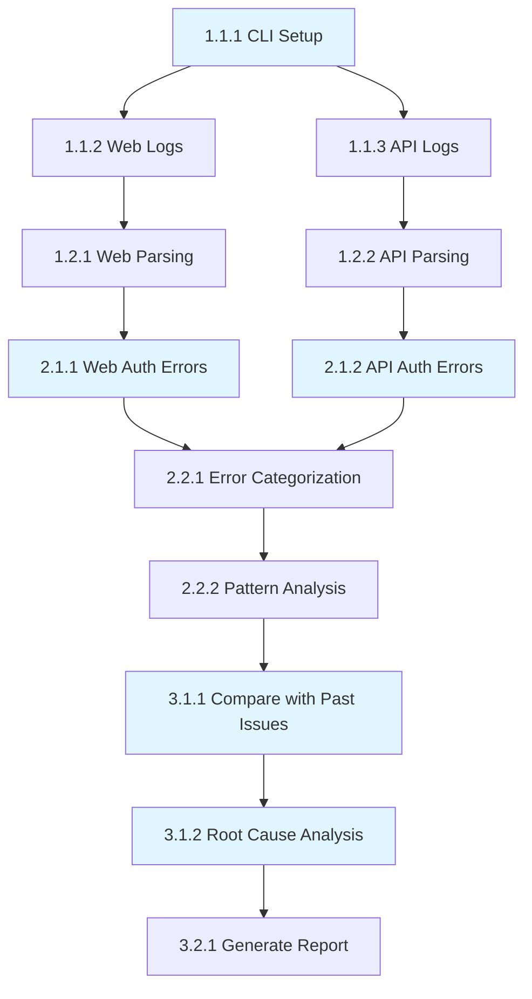

# Tasks: railway-log-analysis

## Phase 1: Log Collection
### 1.1 Railway CLI Setup and Connection
- **Task 1.1.1**: Verify Railway CLI access and authentication
  - Agent: Claude
  - Priority: High
  - Dependencies: None
  - Files: None (CLI verification)
  - Acceptance: Railway CLI responds with project status
  - Requirements: 3.2

- **Task 1.1.2**: Extract recent logs from web service
  - Agent: Claude
  - Priority: High
  - Dependencies: Task 1.1.1
  - Files: None (CLI command execution)
  - Acceptance: Successfully retrieve last 200-500 log entries from @repo/web service
  - Requirements: 2.1, 3.2

- **Task 1.1.3**: Extract recent logs from API service
  - Agent: Claude
  - Priority: High
  - Dependencies: Task 1.1.1
  - Files: None (CLI command execution)
  - Acceptance: Successfully retrieve last 200-500 log entries from @repo/api service
  - Requirements: 2.1, 3.2

### 1.2 Log Processing and Structuring
- **Task 1.2.1**: Parse and structure web service logs
  - Agent: Claude
  - Priority: Medium
  - Dependencies: Task 1.1.2
  - Files: None (in-memory processing)
  - Acceptance: Web logs parsed into structured format with timestamps, levels, and messages
  - Requirements: 3.1

- **Task 1.2.2**: Parse and structure API service logs
  - Agent: Claude
  - Priority: Medium
  - Dependencies: Task 1.1.3
  - Files: None (in-memory processing)
  - Acceptance: API logs parsed into structured format with timestamps, levels, and messages
  - Requirements: 3.1

## Phase 2: Error Analysis
### 2.1 Authentication Error Identification
- **Task 2.1.1**: Filter authentication-related errors from web logs
  - Agent: Claude
  - Priority: High
  - Dependencies: Task 1.2.1
  - Files: None (analysis processing)
  - Acceptance: Extract all entries containing auth, login, session, middleware errors from web logs
  - Requirements: 2.1, 4.1

- **Task 2.1.2**: Filter authentication-related errors from API logs
  - Agent: Claude
  - Priority: High
  - Dependencies: Task 1.2.2
  - Files: None (analysis processing)
  - Acceptance: Extract all entries containing auth, login, session, password errors from API logs
  - Requirements: 2.1, 4.1

### 2.2 Pattern Analysis
- **Task 2.2.1**: Categorize authentication errors by type
  - Agent: Claude
  - Priority: Medium
  - Dependencies: Task 2.1.1, Task 2.1.2
  - Files: None (analysis processing)
  - Acceptance: Errors categorized into session, login, middleware, database, and other auth-related types
  - Requirements: 2.1, 4.1

- **Task 2.2.2**: Identify error patterns and frequency
  - Agent: Claude
  - Priority: Medium
  - Dependencies: Task 2.2.1
  - Files: None (analysis processing)
  - Acceptance: Generate frequency analysis and identify recurring error patterns
  - Requirements: 2.1, 4.1

## Phase 3: Analysis and Reporting
### 3.1 Root Cause Analysis
- **Task 3.1.1**: Compare current errors with previously fixed issues
  - Agent: Claude
  - Priority: High
  - Dependencies: Task 2.2.2
  - Files: None (comparative analysis)
  - Acceptance: Identify which errors match previously resolved authentication issues
  - Requirements: 2.2, 4.1

- **Task 3.1.2**: Analyze middleware and session management issues
  - Agent: Claude
  - Priority: High
  - Dependencies: Task 3.1.1
  - Files: apps/web/middleware.ts, packages/lib/auth.ts, apps/api/src/routes/auth.ts
  - Acceptance: Correlate log errors with specific code sections causing authentication failures
  - Requirements: 2.2, 4.1

### 3.2 Report Generation
- **Task 3.2.1**: Generate comprehensive analysis report
  - Agent: Claude
  - Priority: Medium
  - Dependencies: Task 3.1.2
  - Files: None (report generation)
  - Acceptance: Create detailed report with error summary, patterns, root causes, and recommendations
  - Requirements: 4.1

## Dependencies Graph

## Total Tasks: 9
**Estimated Time**: 45-60 minutes
**Success Metrics**: All authentication errors identified, root causes analyzed, actionable recommendations provided