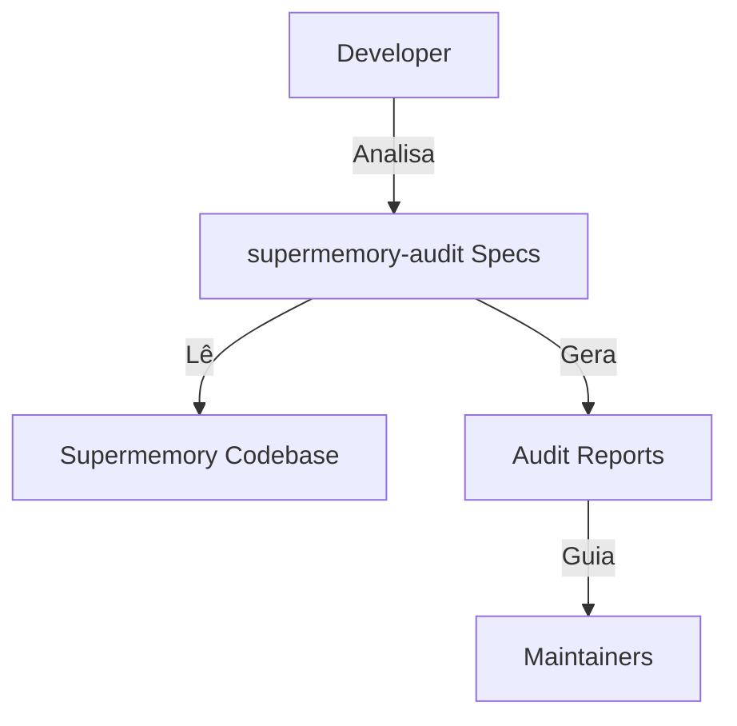
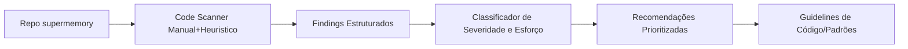
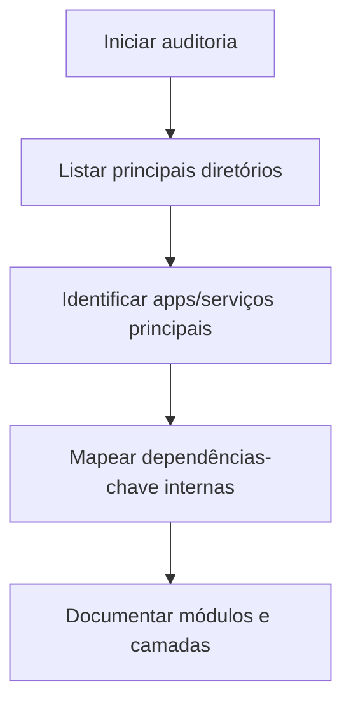
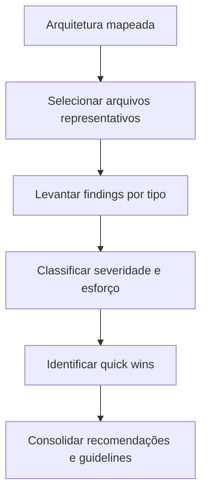

# Design Document

## Overview
Este documento define como será conduzida a auditoria de qualidade de código e padrões no projeto supermemory. O objetivo é ter um processo repetível, rastreável e leve, que produza:
- Mapa da arquitetura atual
- Análise de padrões de código e cheiros
- Recomendações priorizadas com exemplos concretos
- Diretrizes objetivas para contribuidores

Sem modificar comportamento do app nesta fase.

## Architecture Design

### System Architecture Diagram (visão de auditoria)

### Data Flow Diagram (fluxo da auditoria)

## Components and Interfaces

### 1. Arquitetura e Mapa de Módulos
- Responsabilidades:
  - Identificar principais diretórios, pacotes e camadas (front, back, libs, scripts).
  - Mapear dependências internas relevantes (quem importa quem; pontos de acoplamento forte).
- Interfaces:
  - Entrada: codebase atual.
  - Saída: seção "Mapa de Arquitetura" no relatório de auditoria com diagramas simples (quando útil) e lista de módulos.

### 2. Analisador de Padrões de Código
- Responsabilidades:
  - Percorrer arquivos representativos por módulo.
  - Identificar issues recorrentes: nomeação inconsistente, funções/componentes gigantes, duplicação, lógica de domínio onde não deveria, etc.
  - Verificar uso e configuração de linters/formatters/testes.
- Interfaces:
  - Entrada: paths dos módulos mapeados.
  - Saída: "Findings" categorizados (por tipo de problema, exemplos, caminhos).

### 3. Classificador e Priorizador
- Responsabilidades:
  - Classificar findings por severidade (Alta/Média/Baixa) e esforço estimado (Baixo/Médio/Alto).
  - Destacar quick wins (Alta relevância, baixo esforço).
- Interfaces:
  - Entrada: lista de findings.
  - Saída: tabela/lista priorizada que será base do plano de tasks futuro.

### 4. Guidelines de Código
- Responsabilidades:
  - Derivar um conjunto de convenções claras alinhadas com o estado atual desejável.
  - Evitar conflito com ferramentas já existentes (por ex: ESLint, Prettier, configs do repo).
- Interfaces:
  - Entrada: findings + práticas já detectadas no projeto.
  - Saída: seção "Guidelines" objetiva no relatório.

## Data Models

Representação lógica (para organizar o relatório), não código executável:

- Module
  - name: string
  - path: string
  - description: string

- Finding
  - id: string
  - type: enum (architecture, style, duplication, cohesion, tests, etc.)
  - severity: enum (High, Medium, Low)
  - effort: enum (Low, Medium, High)
  - location: string (caminho do arquivo + referência de linha/bloco quando possível)
  - description: string
  - recommendation: string

- Guideline
  - id: string
  - scope: enum (naming, structure, testing, components, services)
  - rule: string
  - rationale: string

Essas estruturas guiam a forma como vamos escrever o relatório e montar tasks depois.

## Business Process (Processo da Auditoria)

### Processo 1: Mapeamento de Arquitetura

### Processo 2: Análise de Código e Recomendações

## Error Handling

- Se partes do código estiverem confusas ou com responsabilidades misturadas:
  - Registrar como finding de arquitetura ou design (com exemplos específicos).
- Se ferramentas de lint/test estiverem desatualizadas ou ausentes:
  - Registrar como finding com recomendação objetiva (ex: padronizar em ESLint + config X).
- Se não houver testes em módulos críticos:
  - Classificar como High severity (confiabilidade) e recomendar estratégias de teste mínimas.

## Testing Strategy (da própria auditoria)

- Validar consistência:
  - Conferir que cada finding possui exemplo concreto e caminho de arquivo.
  - Conferir que severidade/effort fazem sentido relativo ao restante do projeto.
- Validar alinhamento com requisitos:
  - Checar se há seções cobrindo: mapa arquitetura, padrões, recomendações priorizadas, guidelines.
- Validar praticidade:
  - Garantir que recomendações sejam acionáveis (claras, sem abstrações vagas).

Does the design look good? If so, we can move on to the implementation plan.