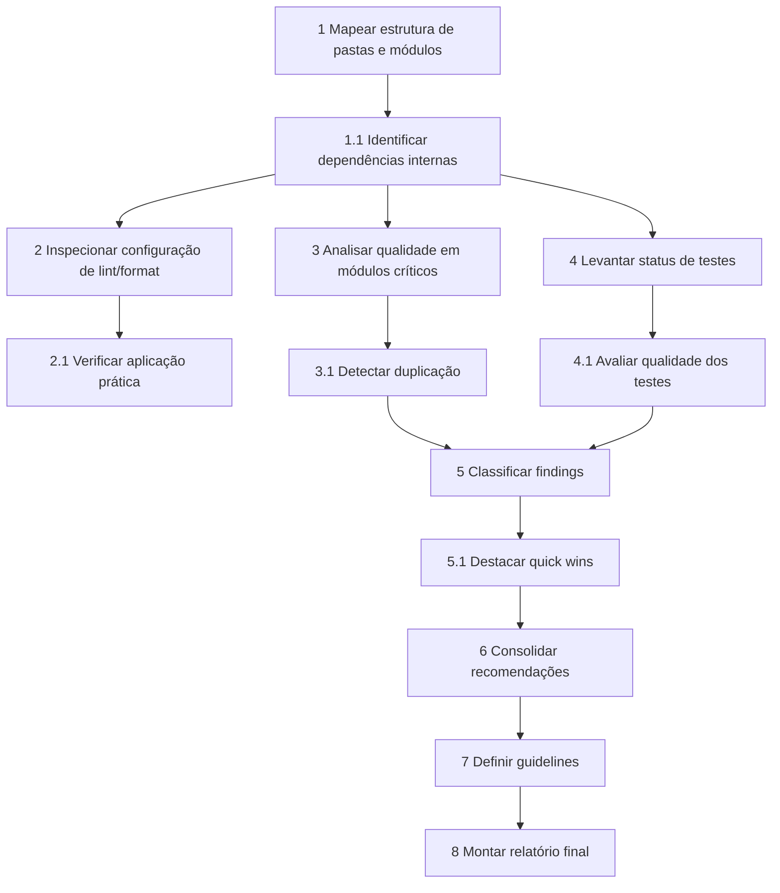

# Implementation Plan

- [ ] 1. Mapear estrutura de pastas e módulos principais
  - Listar diretórios raiz, apps, packages/libs internas, scripts relevantes.
  - Identificar fronteiras entre front-end, back-end, libs compartilhadas.
  - Registrar módulos com breve descrição.
  - _Requirements: 2.1.1, 2.1.2_

- [ ] 1.1 Identificar dependências internas e acoplamentos fortes
  - Mapear imports cruzados entre módulos principais.
  - Destacar pontos de acoplamento circular ou suspeito.
  - _Requirements: 2.1.1, 2.1.3_

- [ ] 2. Inspecionar configuração de lint, format e tooling
  - Localizar e revisar arquivos como eslint, prettier, tsconfig, etc.
  - Verificar se regras estão alinhadas ao estilo atual ou contraditórias.
  - _Requirements: 2.2.3, 3.4_

- [ ] 2.1 Verificar aplicação prática dos linters/formatters
  - Escolher amostra de arquivos e checar aderência às regras.
  - Registrar padrões quebrados recorrentes.
  - _Requirements: 2.2.1, 2.2.3_

- [ ] 3. Analisar qualidade de código em módulos críticos
  - Selecionar módulos centrais (ex: domínio, serviços principais, componentes core).
  - Identificar funções/componentes muito grandes, responsabilidades misturadas.
  - Apontar uso incorreto de lógica de negócio em camadas de UI.
  - _Requirements: 2.2.1, 2.2.2_

- [ ] 3.1 Detectar duplicação e padrões inconsistentes
  - Procurar blocos/lógicas repetidas relevantes.
  - Registrar inconsistências de nomenclatura, organização e padrões.
  - _Requirements: 2.2.1_

- [ ] 4. Levantar status de testes automatizados
  - Identificar frameworks de teste configurados.
  - Mapear onde existem testes e onde estão ausentes em módulos críticos.
  - _Requirements: 2.2.1, 3.1_

- [ ] 4.1 Avaliar qualidade e cobertura aproximada dos testes existentes
  - Inspecionar alguns testes chave para clareza, robustez e alinhamento com casos reais.
  - _Requirements: 3.1_

- [ ] 5. Classificar findings por severidade e esforço
  - Para cada finding registrado, atribuir severidade (Alta/Média/Baixa) e esforço (Baixo/Médio/Alto).
  - _Requirements: 3.1, 3.2_

- [ ] 5.1 Destacar quick wins
  - Identificar problemas de alta relevância e baixo/médio esforço para priorização imediata.
  - _Requirements: 3.2_

- [ ] 6. Consolidar recomendações priorizadas
  - Agrupar findings em recomendações práticas e acionáveis.
  - Manter referência aos arquivos e trechos específicos.
  - _Requirements: 3.3_

- [ ] 7. Definir guidelines de código e estrutura
  - Especificar convenções de nomenclatura, organização de pastas, uso de componentes/serviços.
  - Alinhar às ferramentas e padrões já adotados no projeto.
  - _Requirements: 4.1, 4.2, 4.3_

- [ ] 8. Montar relatório final da auditoria
  - Criar documento em Spec/supermemory-audit com: mapa da arquitetura, findings, recomendações, guidelines.
  - Garantir rastreabilidade entre requisitos, findings e recomendações.
  - _Requirements: 1.1, 2.1, 2.2, 3.1, 4.1_

## Tasks Dependency Diagram

<!-- ORCHESTRATOR-TASKS-SYNC START -->
## Orchestrator Task Status

- [x] **1** — Mapear estrutura de pastas e módulos principais
  - Status: completed
  - Atualizado: 2025-11-07T22:37:59.788924+00:00
  - Assistente: não atribuído
- [x] **1.1** — Identificar dependências internas e acoplamentos fortes
  - Status: completed
  - Atualizado: 2025-11-07T22:38:04.670017+00:00
  - Assistente: não atribuído
- [x] **2** — Inspecionar configuração de lint, format e tooling
  - Status: completed
  - Atualizado: 2025-11-07T22:38:09.896064+00:00
  - Assistente: não atribuído
- [x] **2.1** — Verificar aplicação prática dos linters/formatters
  - Status: completed
  - Atualizado: 2025-11-07T22:38:13.999878+00:00
  - Assistente: não atribuído
- [ ] **LoteA** — Task LoteA
  - Status: running
  - Atualizado: 2025-11-07T22:31:32.555150+00:00
  - Assistente: Claude Code (terminal 5b579c9c-29ae-41e2-9f97-731147f20420) — comando: claude --dangerously-skip-permissions "Execute Lote A da auditoria supermemory-audit conforme Spec/supermemory-audit/tas...
<!-- ORCHESTRATOR-TASKS-SYNC END -->
