# Diagramas Técnicos de Arquitetura - Kortix

> 📐 Diagramas detalhados usando C4 Model e análise de dependências
> 🗓️ Data: 16 de Janeiro de 2026

## 📋 Índice

1. [C4 Model - Context Diagram](#c4-context-diagram)
2. [C4 Model - Container Diagram](#c4-container-diagram)
3. [C4 Model - Component Diagram (Backend)](#c4-component-diagram-backend)
4. [C4 Model - Component Diagram (Frontend)](#c4-component-diagram-frontend)
5. [Deployment Diagram](#deployment-diagram)
6. [Análise de Dependências](#análise-de-dependências)
7. [Dependency Graph](#dependency-graph)
8. [Data Flow Diagrams](#data-flow-diagrams)

---

## 1. C4 Context Diagram

### Nível 1: Contexto do Sistema

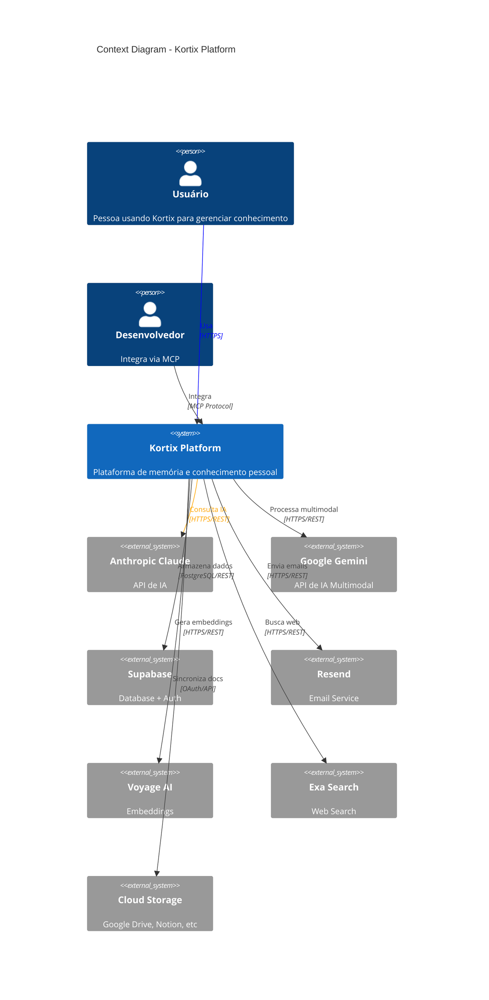

---

## 2. C4 Container Diagram

### Nível 2: Containers

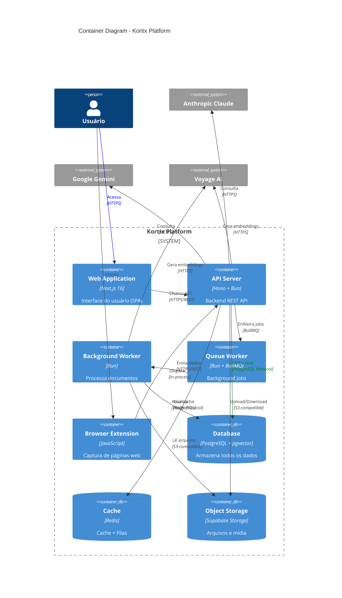

---

## 3. C4 Component Diagram (Backend)

### Nível 3: Componentes do Backend

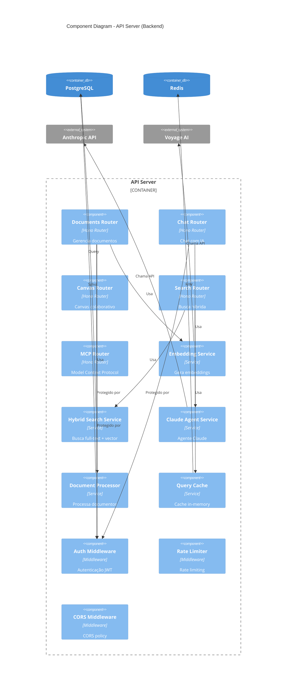

---

## 4. C4 Component Diagram (Frontend)

### Nível 3: Componentes do Frontend

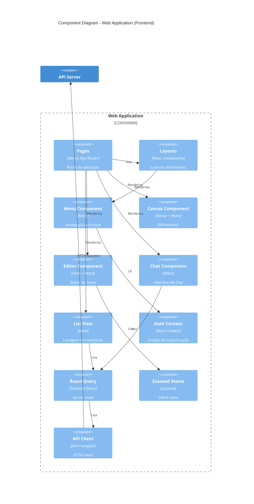

---

## 5. Deployment Diagram

### Infraestrutura de Deploy

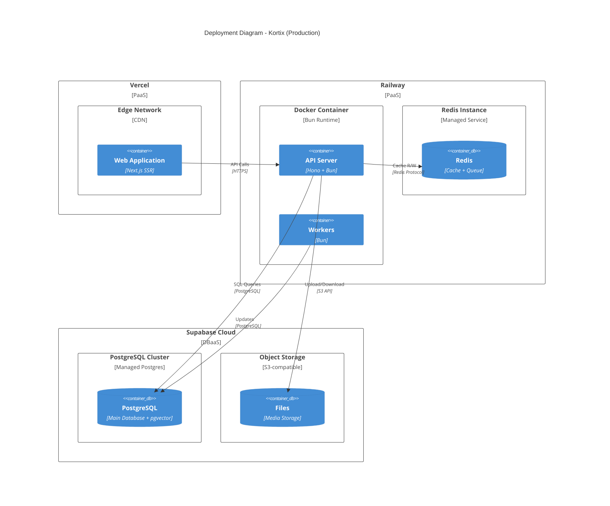

---

## 6. Análise de Dependências

### Mapa de Dependências do Monorepo

```mermaid
graph TB
    subgraph "Apps"
        WEB[apps/web]
        API[apps/api]
        EXT[apps/browser-extension]
    end

    subgraph "Shared Packages"
        UI[@repo/ui]
        LIB[@repo/lib]
        HOOKS[@repo/hooks]
        VAL[@repo/validation]
    end

    subgraph "External Dependencies"
        NEXT[next]
        REACT[react]
        HONO[hono]
        SUPABASE[@supabase/supabase-js]
        ANTHROPIC[@anthropic-ai/sdk]
        RADIX[@radix-ui/*]
        TANSTACK[@tanstack/react-query]
    end

    WEB --> UI
    WEB --> LIB
    WEB --> HOOKS
    WEB --> VAL
    WEB --> NEXT
    WEB --> REACT
    WEB --> RADIX
    WEB --> TANSTACK

    API --> LIB
    API --> VAL
    API --> HONO
    API --> SUPABASE
    API --> ANTHROPIC

    EXT --> LIB
    EXT --> UI

    UI --> REACT
    UI --> RADIX
    LIB --> ANTHROPIC
    LIB --> TANSTACK
    VAL --> HONO

    style WEB fill:#60a5fa
    style API fill:#f59e0b
    style UI fill:#a78bfa
    style LIB fill:#a78bfa
```

### Tabela de Dependências Críticas

| Package | Versão | Usado em | Razão | Alternativas |
|---------|--------|----------|-------|--------------|
| **next** | 16.1.1 | apps/web | Framework React SSR | Remix, SvelteKit |
| **hono** | 4.11.3 | apps/api | HTTP framework rápido | Express, Fastify |
| **@supabase/supabase-js** | 2.90.1 | apps/api, apps/web | Cliente PostgreSQL + Auth | Prisma + NextAuth |
| **@anthropic-ai/sdk** | 0.67.1 | apps/api, packages/lib | Claude AI | OpenAI SDK |
| **@tanstack/react-query** | 5.90.16 | apps/web | Server state management | SWR, Apollo |
| **zustand** | 5.0.9 | apps/web | Client state | Redux, Jotai |
| **zod** | 4.3.5 | apps/api, apps/web | Schema validation | Yup, Joi |
| **bullmq** | 5.66.4 | apps/api | Background jobs | Agenda, Bee-Queue |
| **tldraw** | 4.2.3 | apps/web | Canvas whiteboard | Excalidraw, Fabric.js |
| **slate** | 0.118.1 | apps/web | Rich text editor | Lexical, ProseMirror |

### Gráfico de Tamanho de Dependências

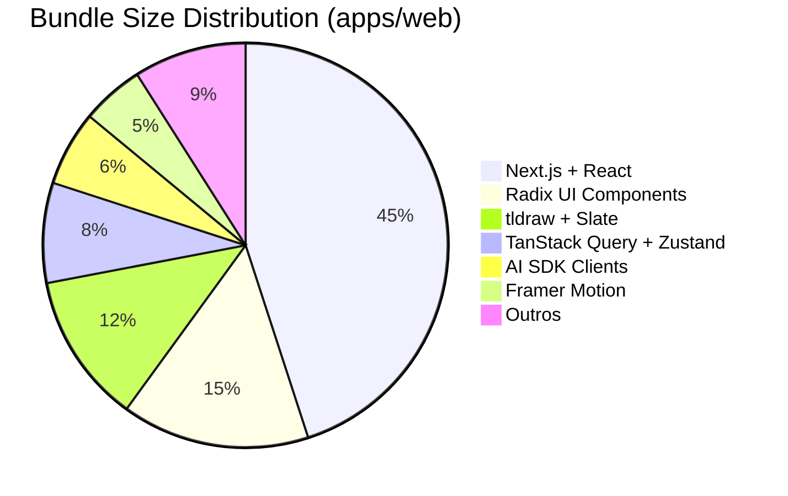

### Análise de Dependências Desatualizadas

| Package | Versão Atual | Última Versão | Status | Ação |
|---------|--------------|---------------|--------|------|
| next | 16.1.1 | 16.1.1 | ✅ Atualizado | - |
| react | 19.2.3 | 19.2.3 | ✅ Atualizado | - |
| hono | 4.11.3 | 4.11.3 | ✅ Atualizado | - |
| @supabase/supabase-js | 2.90.1 | 2.90.1 | ✅ Atualizado | - |
| typescript | 5.9.3 | 5.9.3 | ✅ Atualizado | - |

**Status Geral**: ✅ Todas as dependências críticas estão atualizadas

---

## 7. Dependency Graph

### Grafo Completo de Dependências (Simplificado)

```mermaid
graph LR
    subgraph "Frontend Stack"
        NEXTJS[Next.js 16] --> REACT19[React 19]
        NEXTJS --> TAILWIND[Tailwind CSS]
        REACT19 --> RADIX[Radix UI]
        REACT19 --> TANSTACK[TanStack Query]
        REACT19 --> ZUSTAND[Zustand]
        REACT19 --> TLDRAW[tldraw]
        REACT19 --> SLATE[Slate]
        REACT19 --> FRAMER[Framer Motion]
        NEXTJS --> NEXTINTL[next-intl]
        NEXTJS --> NEXTTHEMES[next-themes]
    end

    subgraph "Backend Stack"
        HONO[Hono] --> BUN[Bun Runtime]
        HONO --> ZOD[Zod]
        BUN --> BULLMQ[BullMQ]
        BULLMQ --> REDIS[ioredis]
        HONO --> SUPABASE_BE[Supabase JS]
        SUPABASE_BE --> POSTGRES[PostgreSQL Client]
    end

    subgraph "AI Stack"
        ANTHROPIC_SDK[@anthropic-ai/sdk]
        GEMINI_SDK[@google/generative-ai]
        AISDK[ai SDK]
        ANTHROPIC_SDK --> AISDK
        GEMINI_SDK --> AISDK
    end

    subgraph "Shared"
        TS[TypeScript 5.9]
        ZOD_SHARED[Zod]
    end

    NEXTJS -.->|usa| TS
    HONO -.->|usa| TS
    REACT19 -.->|valida| ZOD_SHARED
    HONO -.->|valida| ZOD_SHARED

    style NEXTJS fill:#60a5fa
    style HONO fill:#f59e0b
    style TS fill:#3178c6
```

---

## 8. Data Flow Diagrams

### DFD Nível 0: Context

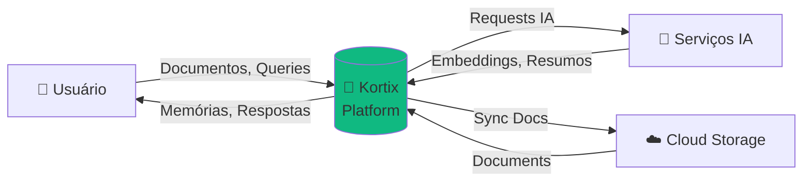

### DFD Nível 1: Principais Processos

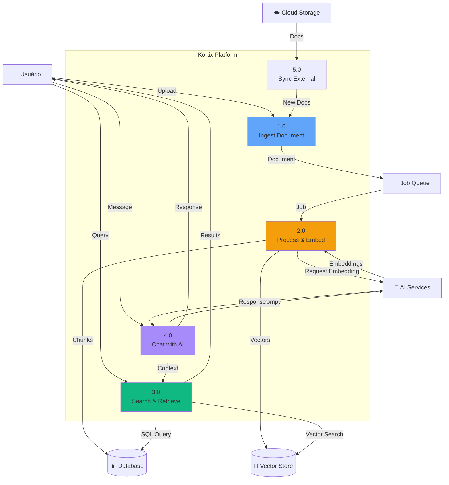

### DFD Nível 2: Processo de Busca Detalhado

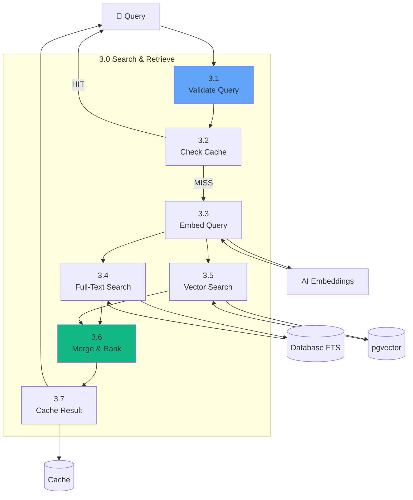

---

## 9. Análise de Riscos Arquiteturais

### Mapa de Riscos

```mermaid
quadrantChart
    title Mapa de Riscos vs Impacto
    x-axis Baixo Impacto --> Alto Impacto
    y-axis Baixa Probabilidade --> Alta Probabilidade
    quadrant-1 Mitigar Urgente
    quadrant-2 Monitorar
    quadrant-3 Aceitar
    quadrant-4 Mitigar

    Vendor Lock-in (Supabase): [0.7, 0.6]
    Rate Limiting Distribuído: [0.8, 0.5]
    Observabilidade: [0.6, 0.8]
    Testes: [0.5, 0.9]
    Escalabilidade DB: [0.9, 0.4]
    API Breaking Changes: [0.4, 0.3]
    Secrets Management: [0.7, 0.5]
    Cost Overrun (AI APIs): [0.8, 0.6]
```

### Tabela de Riscos Priorizados

| Risco | Probabilidade | Impacto | Prioridade | Mitigação |
|-------|---------------|---------|------------|-----------|
| **Falta de Observabilidade** | Alta | Alta | 🔴 Crítica | Implementar OpenTelemetry + Sentry |
| **Cobertura de Testes Baixa** | Alta | Alta | 🔴 Crítica | Plano de testes (target 70%) |
| **Cost Overrun (AI APIs)** | Média | Alta | 🟡 Alta | Budget alerts + caching agressivo |
| **Vendor Lock-in (Supabase)** | Média | Alta | 🟡 Alta | Abstrair cliente DB |
| **Rate Limiting não-distribuído** | Média | Média | 🟡 Alta | Migrar para Redis |
| **Secrets Management** | Média | Média | 🟢 Média | Vault/AWS Secrets Manager |
| **Escalabilidade DB** | Baixa | Alta | 🟢 Média | Read replicas prontas |
| **API Breaking Changes** | Baixa | Baixa | 🟢 Baixa | Versionamento de API |

---

## 10. Métricas de Qualidade

### Complexity Metrics

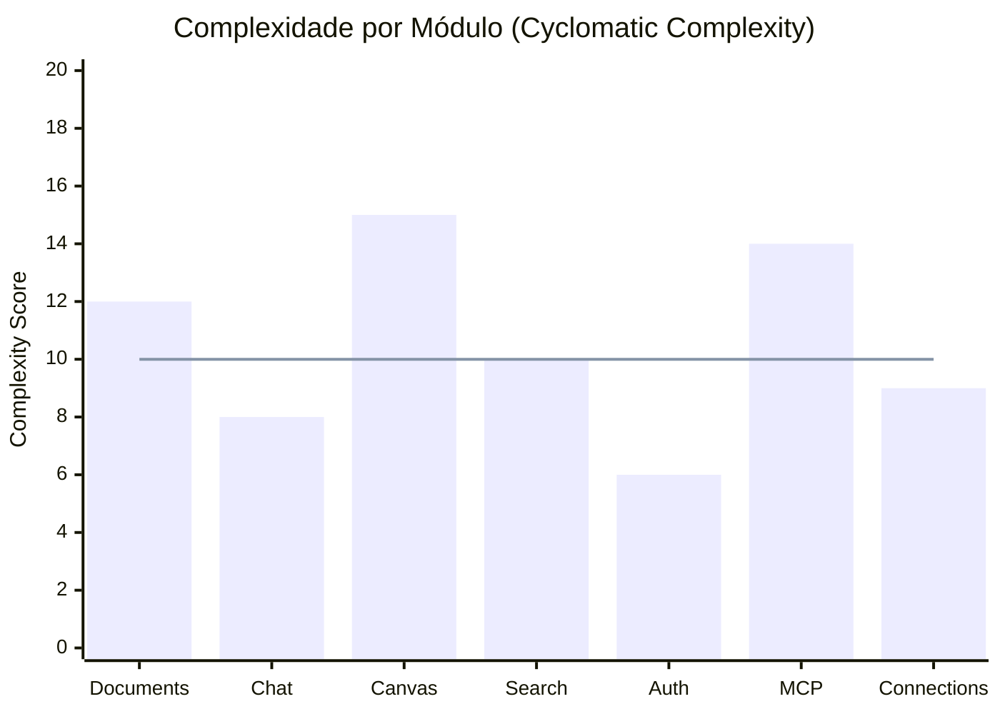

**Legenda**:
- 🟢 Baixa (< 10): Código simples e manutenível
- 🟡 Média (10-15): Aceitável, monitorar
- 🔴 Alta (> 15): Refatorar urgentemente

**Análise**:
- ⚠️ **Canvas**: Complexidade 15 (limite aceitável)
- ⚠️ **MCP**: Complexidade 14 (refatorar se crescer)
- ✅ **Demais módulos**: Dentro do padrão

### Code Coverage

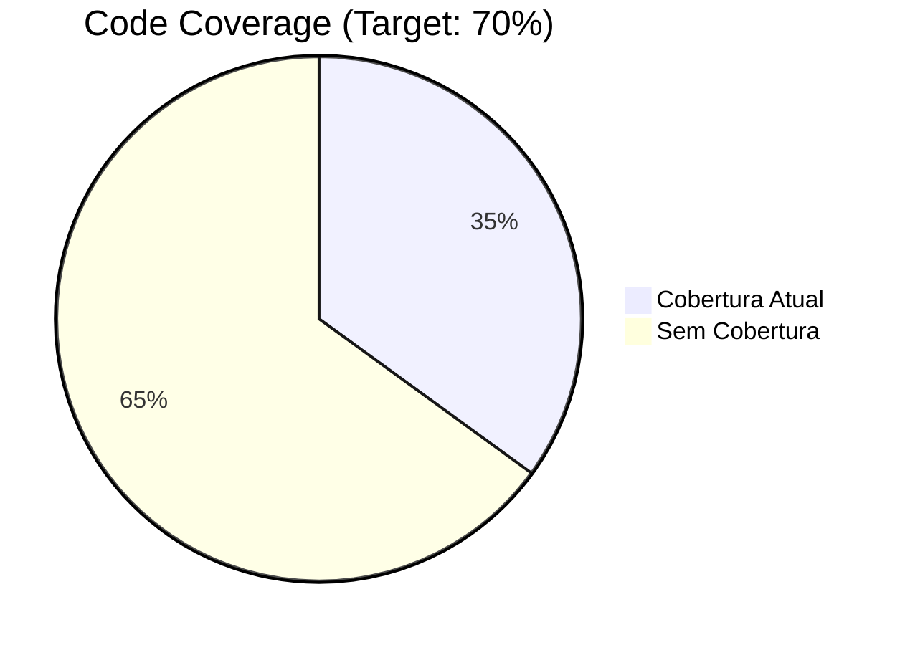

**Status**: 🔴 Crítico (35% vs 70% target)

---

## 📚 Conclusão

Esta documentação fornece uma visão técnica completa da arquitetura do Kortix, incluindo:

✅ **Diagramas C4**: Context, Container, Component
✅ **Deployment**: Infraestrutura de produção
✅ **Dependências**: Análise completa do monorepo
✅ **Data Flows**: Fluxos principais de dados
✅ **Riscos**: Mapa de riscos arquiteturais
✅ **Métricas**: Qualidade e complexidade

### Próximos Passos

1. **Implementar observabilidade** (OpenTelemetry)
2. **Aumentar cobertura de testes** (35% → 70%)
3. **Migrar rate limiting** para Redis
4. **Abstrair cliente Supabase**
5. **Implementar API versioning**

---

**Documento gerado por**: Senior Architect (Claude Sonnet 4.5)
**Data**: 16 de Janeiro de 2026
**Versão**: 1.0.0
