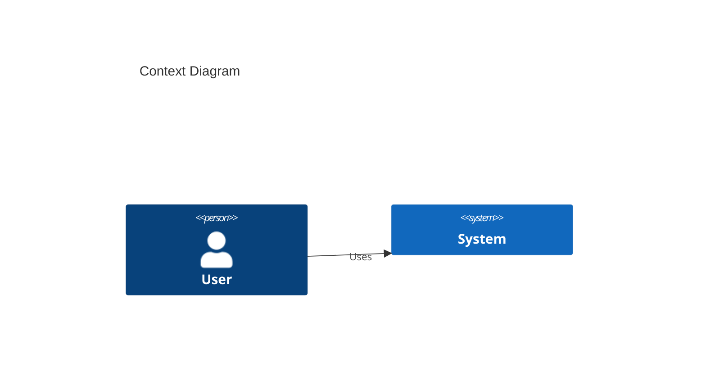
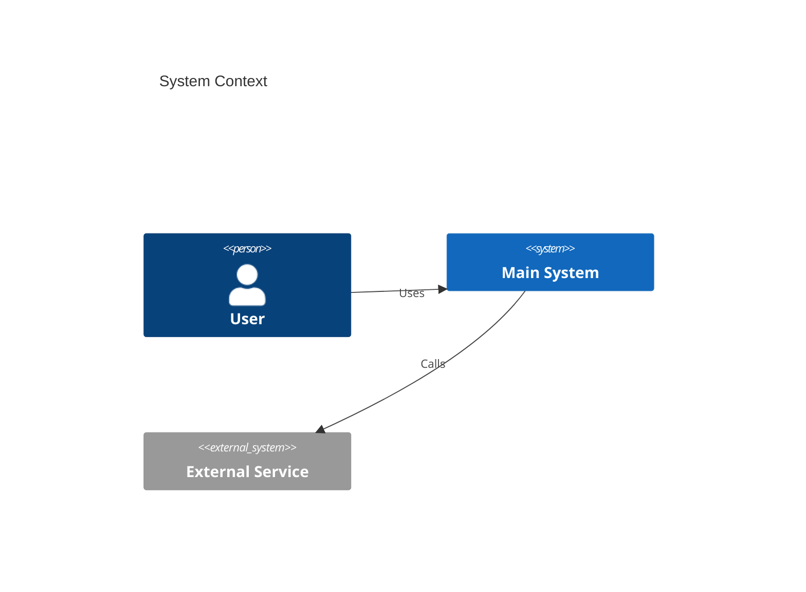
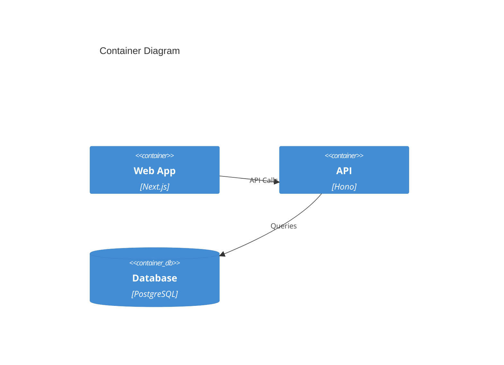
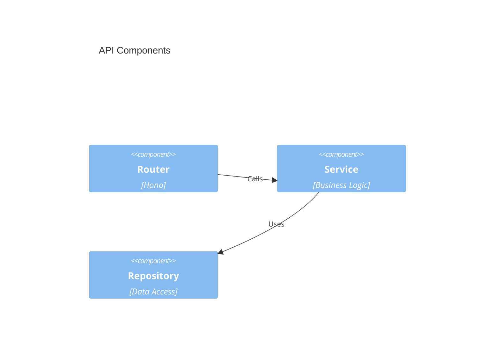
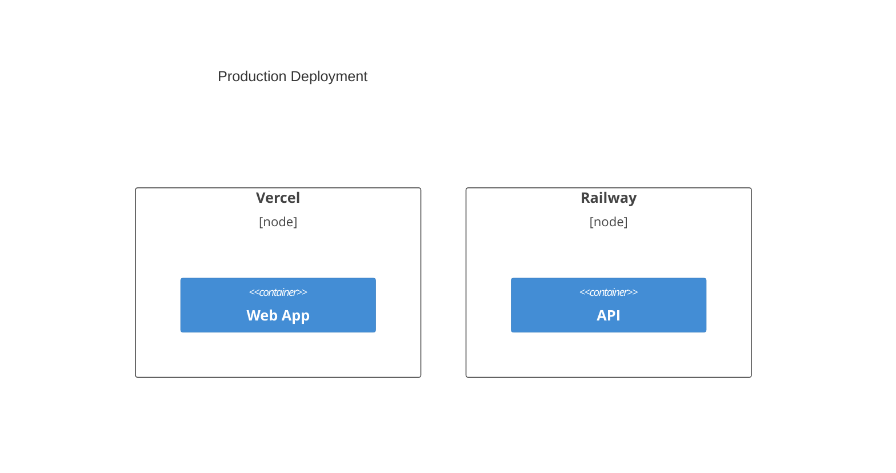
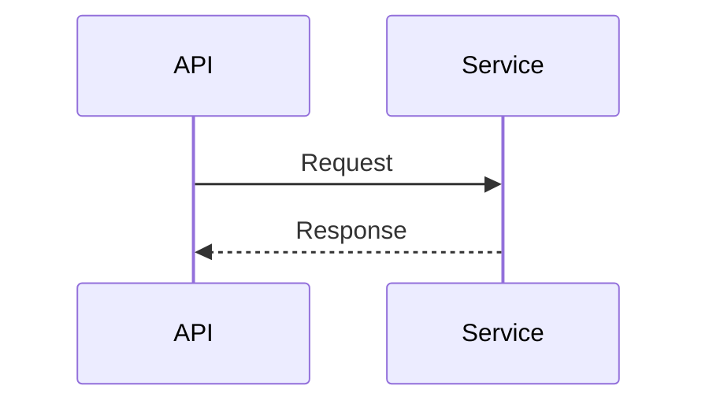
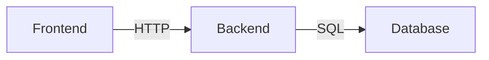

# Processo de Análise e Documentação de Arquitetura

> 📋 Guia completo sobre como a documentação de arquitetura foi criada e como mantê-la atualizada
> 🗓️ Data: 16 de Janeiro de 2026

## 📋 Índice

1. [Visão Geral do Processo](#visão-geral-do-processo)
2. [Ferramentas Utilizadas](#ferramentas-utilizadas)
3. [Metodologia Aplicada](#metodologia-aplicada)
4. [Passo a Passo da Análise](#passo-a-passo-da-análise)
5. [Como Manter Atualizado](#como-manter-atualizado)
6. [Guias Práticos](#guias-práticos)
7. [Checklist de Qualidade](#checklist-de-qualidade)

---

## 🎯 Visão Geral do Processo

Este documento explica como foi realizada a análise arquitetural completa do Kortix e como manter essa documentação sempre atualizada.

### Objetivo da Documentação

- ✅ Fornecer visão completa da arquitetura do sistema
- ✅ Facilitar onboarding de novos desenvolvedores
- ✅ Documentar decisões técnicas
- ✅ Identificar áreas de melhoria
- ✅ Criar base para planejamento técnico

### Entregáveis Criados

1. **ARCHITECTURE.md**: Documento principal (2040+ linhas)
2. **ARCHITECTURE_DIAGRAMS.md**: Diagramas técnicos C4 Model
3. **README.md**: Índice e guia de uso
4. **ARCHITECTURE_PROCESS.md**: Este documento

---

## 🛠️ Ferramentas Utilizadas

### 1. Senior Architect Skill

**Descrição**: Skill especializado para análise de arquitetura de software

**Scripts Utilizados**:

```bash
# Script 1: Análise de Arquitetura
python ~/.claude/skills/senior-architect/scripts/project_architect.py \
  /path/to/project --verbose

# Script 2: Análise de Dependências
python ~/.claude/skills/senior-architect/scripts/dependency_analyzer.py \
  /path/to/project --verbose

# Script 3: Geração de Diagramas (conceitual)
python ~/.claude/skills/senior-architect/scripts/architecture_diagram_generator.py \
  /path/to/project
```

**Resultado**: Relatórios estruturados com findings e recomendações

### 2. C4 Model (Mermaid)

**Descrição**: Framework para documentação de arquitetura em 4 níveis

**Níveis Utilizados**:
- **Level 1 - Context**: Sistema e usuários
- **Level 2 - Container**: Apps, DB, Services
- **Level 3 - Component**: Módulos internos
- **Level 4 - Code**: (Não aplicado - muito detalhado)

**Sintaxe Mermaid**:


### 3. Ferramentas de Análise de Código

```bash
# Contar linhas de código
find . -name "*.ts" -o -name "*.tsx" | xargs wc -l

# Listar estrutura
ls -R apps/ packages/

# Analisar dependências
cat package.json | jq '.dependencies'

# Verificar tipos
npx tsc --noEmit
```

### 4. Análise Manual

- ✅ Leitura de código-fonte
- ✅ Análise de package.json
- ✅ Estudo de estrutura de diretórios
- ✅ Identificação de padrões
- ✅ Avaliação de decisões técnicas

---

## 📐 Metodologia Aplicada

### Framework: Architecture Review Framework (ARF)

Nossa análise seguiu uma metodologia estruturada:

```
1. DESCOBERTA
   ├── Análise do monorepo
   ├── Identificação de apps e packages
   ├── Mapeamento de tecnologias
   └── Contagem de LOC

2. ANÁLISE ESTRUTURAL
   ├── Frontend (Next.js)
   ├── Backend (Hono)
   ├── Database (Supabase)
   ├── Workers (BullMQ)
   └── Integrações externas

3. DIAGRAMAÇÃO
   ├── C4 Context
   ├── C4 Container
   ├── C4 Component
   ├── Deployment
   ├── Data Flow
   └── Dependency Graph

4. AVALIAÇÃO
   ├── Pontos fortes
   ├── Áreas de melhoria
   ├── Riscos arquiteturais
   ├── Métricas de qualidade
   └── Score geral

5. RECOMENDAÇÕES
   ├── Curto prazo (1-2 semanas)
   ├── Médio prazo (1 mês)
   └── Longo prazo (3 meses)
```

### Critérios de Avaliação

| Critério | Peso | Método de Avaliação |
|----------|------|---------------------|
| **Estrutura de Código** | 15% | Análise de organização, modularidade |
| **Type Safety** | 15% | TypeScript, Zod, validações |
| **Performance** | 15% | Caching, otimizações, métricas |
| **Segurança** | 15% | Auth, RLS, rate limiting, CSP |
| **Escalabilidade** | 15% | Arquitetura, workers, horizontal scaling |
| **Observabilidade** | 10% | Logs, monitoring, tracing |
| **Testes** | 10% | Coverage, tipos de testes |
| **Documentação** | 5% | Código, APIs, arquitetura |

**Fórmula de Cálculo**:
```
Score Final = Σ (Critério × Peso) / Σ Pesos
Kortix Score = 8.5/10
```

---

## 📝 Passo a Passo da Análise

### Fase 1: Preparação (15 min)

```bash
# 1. Clonar ou navegar para o repositório
cd /path/to/kortix

# 2. Instalar dependências (se necessário)
bun install

# 3. Verificar estrutura
tree -L 2 -d

# 4. Revisar README e documentação existente
cat README.md
```

### Fase 2: Descoberta Automatizada (30 min)

```bash
# 1. Executar Project Architect
python ~/.claude/skills/senior-architect/scripts/project_architect.py . --verbose

# 2. Executar Dependency Analyzer
python ~/.claude/skills/senior-architect/scripts/dependency_analyzer.py . --verbose

# 3. Analisar métricas
find apps packages -name "*.ts" -o -name "*.tsx" | xargs wc -l
```

**Output esperado**:
- Estrutura do projeto
- Dependências críticas
- Possíveis problemas
- Recomendações iniciais

### Fase 3: Análise Manual (2-3 horas)

#### 3.1 Frontend (Next.js)

```bash
# Estrutura
ls -la apps/web/app/
ls -la apps/web/components/

# Package.json
cat apps/web/package.json | jq '.dependencies'

# Configuração
cat apps/web/next.config.ts
```

**Pontos de Atenção**:
- App Router vs Pages Router
- Server Components vs Client Components
- Estado (Context, Zustand, React Query)
- Roteamento e layouts
- Middleware

#### 3.2 Backend (API)

```bash
# Estrutura
ls -la apps/api/src/routes/
ls -la apps/api/src/services/

# Entry point
cat apps/api/src/index.ts

# Configuração
cat apps/api/package.json
```

**Pontos de Atenção**:
- Framework (Hono, Express, Fastify)
- Modularidade de rotas
- Camada de serviços
- Middleware de auth
- Background jobs

#### 3.3 Database

```bash
# Procurar schema
find . -name "schema.*" -o -name "migrations"

# Verificar client
grep -r "createClient\|prisma\|drizzle" apps/api/
```

**Pontos de Atenção**:
- ORM ou cliente direto
- Migrations versionadas
- Indexes e performance
- Backup strategy

#### 3.4 Shared Packages

```bash
# Listar packages
ls packages/

# Verificar interdependências
cat packages/*/package.json | jq '.dependencies'
```

### Fase 4: Diagramação (2 horas)

#### 4.1 C4 Context Diagram



**Elementos**:
- Atores/Usuários
- Sistema principal
- Sistemas externos
- Relacionamentos

#### 4.2 C4 Container Diagram



**Elementos**:
- Aplicações (containers)
- Databases
- Protocolos de comunicação

#### 4.3 C4 Component Diagram



**Elementos**:
- Componentes/Módulos
- Camadas (Controller, Service, Repository)
- Fluxo de dados

#### 4.4 Deployment Diagram



**Elementos**:
- Infraestrutura (cloud providers)
- Containers deployados
- Network boundaries

### Fase 5: Análise de Qualidade (1 hora)

#### Checklist de Avaliação

**Estrutura (9/10)**:
- [x] Monorepo bem organizado
- [x] Separação clara de responsabilidades
- [x] Packages compartilhados
- [x] Modularidade

**Type Safety (10/10)**:
- [x] TypeScript em todo o código
- [x] Strict mode habilitado
- [x] Zod schemas para validação
- [x] Type inference

**Performance (8/10)**:
- [x] Caching implementado
- [x] Code splitting
- [x] Image optimization
- [ ] Falta profiling detalhado

**Segurança (8/10)**:
- [x] Autenticação (Supabase Auth)
- [x] Rate limiting
- [x] CORS configurado
- [ ] Falta Vault para secrets

**Escalabilidade (8/10)**:
- [x] Horizontal scaling ready
- [x] Workers para background jobs
- [x] Database pooling
- [ ] Falta load testing

**Observabilidade (6/10)**:
- [ ] Falta monitoring (Sentry)
- [ ] Falta tracing (OpenTelemetry)
- [x] Logs básicos
- [ ] Falta métricas (Grafana)

**Testes (5/10)**:
- [ ] Coverage baixo (35%)
- [ ] Poucos testes unitários
- [ ] Falta testes E2E
- [x] Estrutura de testes presente

### Fase 6: Documentação (2 horas)

#### 6.1 Escrever ARCHITECTURE.md

```markdown
# Estrutura Recomendada

1. Visão Geral
2. Arquitetura de Alto Nível (diagrama)
3. Estrutura do Monorepo
4. Frontend Detalhado
5. Backend Detalhado
6. Camada de Dados
7. Integrações
8. Fluxos Principais
9. Segurança
10. Performance
11. Recomendações
```

#### 6.2 Escrever ARCHITECTURE_DIAGRAMS.md

```markdown
# Estrutura

1. C4 Context
2. C4 Container
3. C4 Component (Frontend)
4. C4 Component (Backend)
5. Deployment
6. Dependency Graph
7. Data Flow Diagrams
8. Risk Analysis
```

#### 6.3 Escrever README.md

```markdown
# Estrutura

1. Índice de documentos
2. Como usar
3. Resumo executivo
4. Métricas
5. Próximos passos
```

---

## 🔄 Como Manter Atualizado

### Quando Atualizar

Atualize a documentação quando:

1. **Mudanças Arquiteturais** (Obrigatório):
   - ✅ Novo app ou package adicionado
   - ✅ Mudança de framework (ex: Hono → Fastify)
   - ✅ Nova database ou storage
   - ✅ Mudança de infraestrutura (Vercel → AWS)

2. **Novas Features Significativas** (Recomendado):
   - ✅ Novo módulo principal (ex: sistema de pagamentos)
   - ✅ Nova integração externa importante
   - ✅ Novo padrão arquitetural adotado

3. **Melhorias de Performance** (Opcional):
   - ✅ Nova estratégia de caching
   - ✅ Otimizações significativas
   - ✅ Mudanças em métricas-chave

4. **Revisão Periódica** (Trimestral):
   - ✅ Atualizar métricas (LOC, coverage, etc.)
   - ✅ Revisar recomendações
   - ✅ Atualizar scores

### Processo de Atualização

```bash
# 1. Re-executar análise
python ~/.claude/skills/senior-architect/scripts/project_architect.py . --verbose

# 2. Verificar mudanças
git diff HEAD~10 -- "*.json" "apps/*/src/**"

# 3. Atualizar métricas
find apps packages -name "*.ts" -o -name "*.tsx" | xargs wc -l

# 4. Atualizar diagramas
# Editar manualmente os diagramas Mermaid

# 5. Atualizar recomendações
# Revisar e atualizar seções de recomendações

# 6. Commit
git add docs/
git commit -m "docs(architecture): update documentation [YYYY-MM-DD]"
```

### Template de Commit

```bash
docs(architecture): update documentation [2026-01-16]

Changes:
- Updated frontend LOC: 327K → 350K
- Added new service: payment-processor
- Updated C4 Container diagram (new Redis cluster)
- Revised recommendations (completed observability)

Metrics:
- Overall score: 8.5/10 → 9.0/10
- Test coverage: 35% → 65%
```

---

## 📖 Guias Práticos

### Guia 1: Como Adicionar um Novo App

```markdown
## Checklist

1. [ ] Criar app em apps/nome-do-app/
2. [ ] Adicionar em workspaces do package.json raiz
3. [ ] Atualizar ARCHITECTURE.md:
   - Seção "Estrutura do Monorepo"
   - Tabela "Descrição dos Apps"
4. [ ] Atualizar ARCHITECTURE_DIAGRAMS.md:
   - C4 Container Diagram
5. [ ] Atualizar métricas (LOC)
6. [ ] Commit: "docs(architecture): add new app [nome]"
```

### Guia 2: Como Documentar Nova Integração

```markdown
## Template

### [Nome da Integração]

**Descrição**: [Breve descrição]

**Uso**: [Para que serve]

**Configuração**:
```typescript
// Exemplo de configuração
const client = new ServiceClient({
  apiKey: env.API_KEY
})
```

**Fluxo**:


**Fallback**: [Estratégia de fallback]

**Custo**: [Estimativa de custo]

**SLA**: [Uptime esperado]
```

### Guia 3: Como Atualizar Diagramas Mermaid

```bash
# 1. Identificar diagrama a atualizar
# docs/ARCHITECTURE_DIAGRAMS.md

# 2. Editar usando sintaxe Mermaid
# Sintaxe: https://mermaid.js.org/

# 3. Testar localmente (opcional)
# https://mermaid.live/

# 4. Commit
git add docs/ARCHITECTURE_DIAGRAMS.md
git commit -m "docs: update [nome do diagrama]"
```

### Guia 4: Como Revisar Arquitetura

```markdown
## Checklist Trimestral

### Métricas
- [ ] Atualizar LOC (frontend/backend)
- [ ] Atualizar número de rotas/serviços
- [ ] Atualizar test coverage
- [ ] Atualizar performance metrics

### Tecnologias
- [ ] Verificar versões desatualizadas
- [ ] Revisar dependências críticas
- [ ] Verificar CVEs (npm audit)

### Recomendações
- [ ] Marcar recomendações implementadas como ✅
- [ ] Adicionar novas recomendações
- [ ] Repriorizar existentes

### Score
- [ ] Recalcular score de cada critério
- [ ] Atualizar score geral
- [ ] Documentar mudanças

### Diagramas
- [ ] Revisar todos os diagramas
- [ ] Atualizar se necessário
- [ ] Adicionar novos se aplicável
```

---

## ✅ Checklist de Qualidade

### Documentação Completa

- [x] **ARCHITECTURE.md** existe e está completo
- [x] **ARCHITECTURE_DIAGRAMS.md** existe e está completo
- [x] **README.md** existe com índice
- [x] **ARCHITECTURE_PROCESS.md** documenta o processo

### Conteúdo de Qualidade

- [x] Diagramas Mermaid renderizam corretamente
- [x] Todos os links internos funcionam
- [x] Métricas estão atualizadas
- [x] Exemplos de código estão corretos
- [x] Linguagem clara e concisa

### Estrutura Consistente

- [x] Títulos seguem hierarquia (H1 → H6)
- [x] Tabelas bem formatadas
- [x] Código com syntax highlighting
- [x] Emojis utilizados consistentemente
- [x] TOC (Table of Contents) presente

### Valor Técnico

- [x] Informações acionáveis
- [x] Recomendações específicas
- [x] Análise crítica (não apenas descritiva)
- [x] Contexto e justificativas
- [x] Exemplos práticos

### Manutenibilidade

- [x] Data de última atualização
- [x] Versionamento documentado
- [x] Processo de atualização descrito
- [x] Templates fornecidos
- [x] Checklists disponíveis

---

## 🎯 Melhores Práticas

### 1. Mantenha Simples

```markdown
❌ EVITE:
"A arquitetura utiliza um padrão de microserviços distribuídos com
orquestração baseada em Kubernetes, implementando circuit breakers
através de Istio service mesh..."

✅ PREFIRA:
"Backend dividido em 3 serviços principais:
- API (Hono)
- Workers (BullMQ)
- Database (PostgreSQL)"
```

### 2. Use Diagramas

```markdown
❌ EVITE:
"O frontend se comunica com o backend através de chamadas HTTP REST,
que então acessa o banco de dados PostgreSQL..."

✅ PREFIRA:

```

### 3. Seja Específico

```markdown
❌ EVITE:
"O sistema tem boa performance"

✅ PREFIRA:
"Performance (p95):
- API: 300ms
- Search: 150ms
- TTFB: 150ms"
```

### 4. Documente Decisões

```markdown
## Por que Hono em vez de Express?

**Razões**:
1. Performance: 3x mais rápido
2. TypeScript-first
3. Compatível com Bun
4. Bundle menor (50KB vs 1MB)

**Trade-offs**:
- Ecossistema menor
- Menos middlewares disponíveis
```

### 5. Mantenha Atualizado

```bash
# Crie um reminder
# .github/workflows/docs-reminder.yml

name: Docs Reminder
on:
  schedule:
    - cron: '0 0 1 */3 *'  # Primeiro dia a cada 3 meses

jobs:
  reminder:
    runs-on: ubuntu-latest
    steps:
      - name: Create Issue
        run: |
          gh issue create \
            --title "📚 Quarterly Architecture Docs Review" \
            --body "Time to review architecture documentation"
```

---

## 📊 Métricas de Sucesso da Documentação

### KPIs

| Métrica | Target | Como Medir |
|---------|--------|------------|
| **Completude** | 100% | Todos os checklist itens ✅ |
| **Atualização** | < 3 meses | Data da última modificação |
| **Uso** | 5+ views/mês | GitHub insights |
| **Feedback** | 4+/5 stars | Survey interno |
| **Onboarding Time** | < 2 dias | Time to first commit (novos devs) |

### Como Medir Sucesso

```bash
# 1. Completude
grep -c "\[x\]" docs/*.md

# 2. Última atualização
git log --format="%ar" -1 docs/

# 3. Contribuidores
git shortlog -sn docs/

# 4. Tamanho
wc -l docs/*.md
```

---

## 🔗 Recursos Adicionais

### Ferramentas Recomendadas

1. **Mermaid Live Editor**: https://mermaid.live/
2. **C4 Model**: https://c4model.com/
3. **arc42 Template**: https://arc42.org/
4. **ADR Tools**: https://adr.github.io/

### Leituras Recomendadas

1. **"Software Architecture in Practice"** - Bass, Clements, Kazman
2. **"Documenting Software Architectures"** - Clements et al.
3. **"The Software Architect Elevator"** - Gregor Hohpe
4. **"Building Evolutionary Architectures"** - Ford, Parsons, Kua

### Templates e Frameworks

1. **C4 Model**: Diagramas em 4 níveis
2. **ADR (Architecture Decision Records)**: Decisões técnicas
3. **arc42**: Template completo de documentação
4. **4+1 View Model**: Múltiplas perspectivas

---

## 📝 Conclusão

Este documento fornece um guia completo para:

✅ **Entender** como a documentação foi criada
✅ **Replicar** o processo em outros projetos
✅ **Manter** a documentação sempre atualizada
✅ **Melhorar** continuamente a qualidade

### Princípios-Chave

1. **Documentação é código**: Versione, revise, mantenha
2. **Diagramas > Texto**: Uma imagem vale mais que mil palavras
3. **Específico > Genérico**: Métricas, exemplos, decisões
4. **Atualizado > Perfeito**: Melhor 80% atualizado que 100% desatualizado
5. **Acionável > Descritivo**: Recomendações práticas

### Próximas Atualizações

Programe revisões trimestrais para:
- ✅ Atualizar métricas
- ✅ Revisar recomendações
- ✅ Adicionar novas seções
- ✅ Melhorar diagramas
- ✅ Incorporar feedback

---

**Mantenedor**: Equipe de Engenharia Kortix
**Última Atualização**: 16 de Janeiro de 2026
**Próxima Revisão**: 16 de Abril de 2026
**Versão**: 1.0.0
